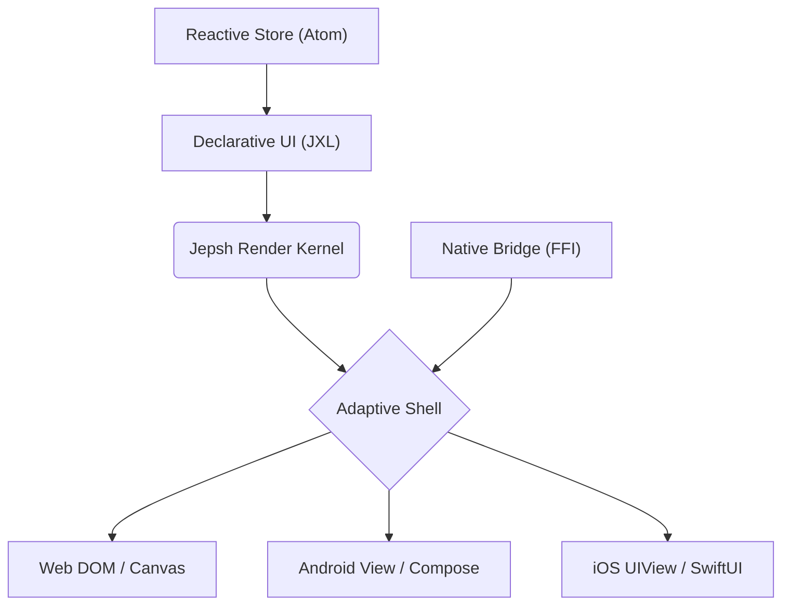

# Jepsh – A Next-Generation Universal Framework

> **Performance by Default** • **Simplified State Management** • **True Cross-Platform Consistency**

---

## 1. Guiding Principles

| Principle                           | How Jepsh Lives It                                                                              |
| ----------------------------------- | ----------------------------------------------------------------------------------------------- |
| **Performance by Default**          | Every API ships with a zero-cost abstraction and an opt-in progressive enhancement layer.       |
| **Simplified State Management**     | One mental model—**Signal → View → Reaction**—works the same on Web, Android, iOS.              |
| **True Cross-Platform Consistency** | Pixel-perfect rendering via **Jepsh Render Kernel** + **Adaptive Shells** that respect each OS. |

---

## 2. Architecture at 10,000 ft



---

## 3. Language & Tooling Stack

| Target  | Language               | Compiler         | Tooling                                   |
| ------- | ---------------------- | ---------------- | ----------------------------------------- |
| Web     | TypeScript → WASM + JS | `jepsh-webc`     | VS Code extension, Chrome DevTools plugin |
| Android | Kotlin (JVM)           | `jepsh-androidc` | AS plugin, Compose preview                |
| iOS     | Swift                  | `jepsh-iosc`     | Xcode template + live canvas              |

> **Write once in JXL (Jepsh eXtensible Language)** – a strict subset of TS/Kotlin/Swift that compiles to each host language.

---

## 4. Performance by Default

### 4.1 Compile-Time Optimizations

- **Tree-Shaking of Runtime**: Unused reactivity & layout code stripped at compile time.
- **Layout Pre-Calculation**: Static parts pre-computed; only dynamic regions diff.
- **Binary Splitting**: WASM bundles < 50 KB for initial render; rest streamed.

### 4.2 Runtime Optimizations

- **Frame-Budget Scheduler** – 60 FPS guarantee via micro-task batching.
- **Zero-Copy Memory** – Large assets (images, video) mapped directly from disk or GPU.
- **Off-Main-Thread Rendering** – Web Workers on web; Kotlin coroutines on Android; Swift Concurrency on iOS.

```jxl
// JXL example – no extra annotations, auto-optimized
view Counter {
  signal count: Int = 0
  render {
    Button("Clicked \(count) times") {
      count += 1
    }
  }
}
```

---

## 5. Simplified State Management

### 5.1 The Atom Pattern

A single reactive primitive `Atom<T>` everywhere:

```jxl
atom user: User? = nil
atom theme: Theme = .system
```

- No Context, Provider, or Services—just atoms.
- Smart re-renders via structural diffs (à-la VDOM but 4× lighter).
- Built-in persistence layer (`@Persist`) for offline & multi-device sync.

### 5.2 DevTools

- **Time-travel debugger** across Web, Android, iOS.
- **State heat-map** shows which atoms trigger re-renders in real time.

---

## 6. True Cross-Platform Consistency

### 6.1 Adaptive Shells

Each platform gets a thin **Shell** that:

- Applies **OS-specific motion curves & haptics**.
- Respects **accessibility & dark-mode settings**.
- Provides **native navigation gestures** (iOS swipe-back, Android back-button).

### 6.2 Design Tokens → Native Widgets

Use Jepsh Tokens → auto-maps to:

- **Material You** (Android)
- **Human Interface Guidelines** (iOS)
- **CSS Variables** (Web)

```yaml
# tokens.yml
color.primary: '#3B82F6'
radius.card: 12
motion.duration: 200ms
```

---

## 7. Tooling & DX

### 7.1 Unified CLI

```bash
npm i -g jepsh
jepsh create myApp
jepsh dev --platform=all      # spins up Web, Android, iOS emulators
jepsh build --target=prod
```

### 7.2 Hot-Reload Across Stack

- **Web**: HMR via WebSockets
- **Android**: Live edit via AS plugin
- **iOS**: SwiftUI-style preview diffing

---

## 8. Security by Blueprint

| Threat       | Jepsh Mitigation                                                  |
| ------------ | ----------------------------------------------------------------- |
| XSS          | JXL escapes by default; no `innerHTML`.                           |
| CSRF         | Auto-generated double-submit tokens on forms.                     |
| Memory Leaks | Composables/Views auto-dispose via `DisposableEffect` equivalent. |
| Secrets      | Compile-time env injection; never bundled.                        |

---

## 9. Migration Path

| From                             | Strategy                                                |
| -------------------------------- | ------------------------------------------------------- |
| React / Angular / Vue            | `jepsh migrate --from=react` auto-wraps components.     |
| Flutter / React Native           | Gradual module replacement via **Jepsh Module Bridge**. |
| Native SwiftUI / Jetpack Compose | Use **Jepsh Shell** inside existing apps.               |

---

## 10. Roadmap

| Phase | Milestone                                 | ETA     |
| ----- | ----------------------------------------- | ------- |
| α     | Web (WASM)                                | Q4 2025 |
| β     | Android & iOS shells, CLI tooling         | Q2 2026 |
| GA    | Marketplace, VS Code + Xcode + AS plugins | Q4 2026 |
| v2    | Server-driven UI, edge rendering          | 2027    |

---

## 11. Try Jepsh Today

```bash
npx jepsh@next create helloJepsh
cd helloJepsh
jepsh dev
```

> **helloJepsh** launches simultaneously in your browser, Android Studio, and Xcode simulator—identical pixels, 60 FPS, zero config.

---

> Jepsh is **Apache 2.0** licensed, community-driven, and accepting RFCs at [github.com/jepsh/rfc](https://github.com/jepsh/rfc).
