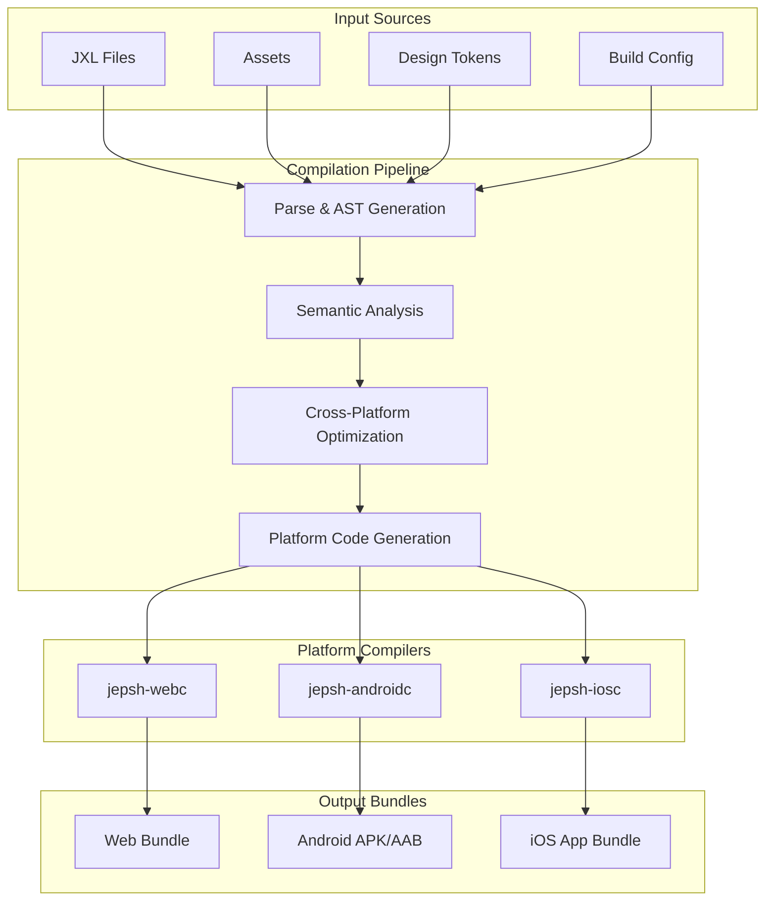
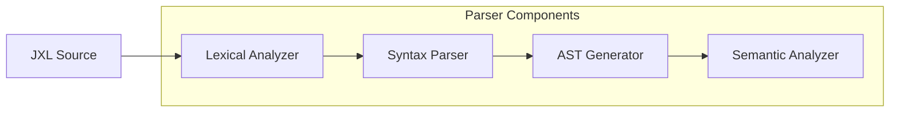
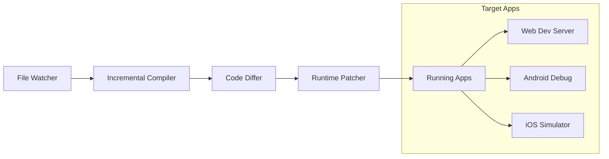
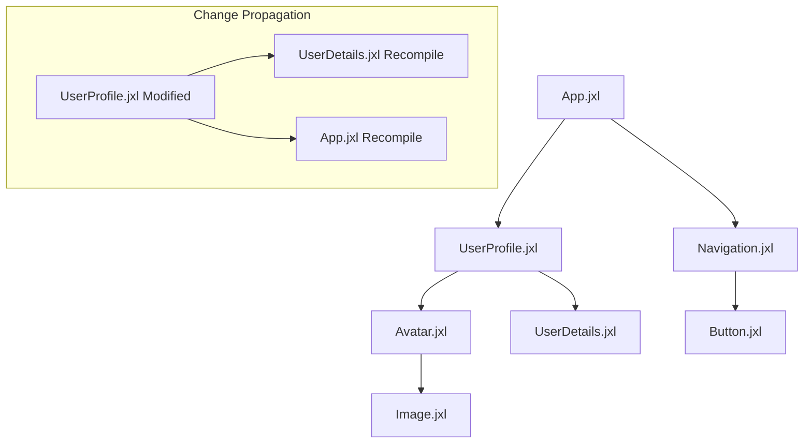
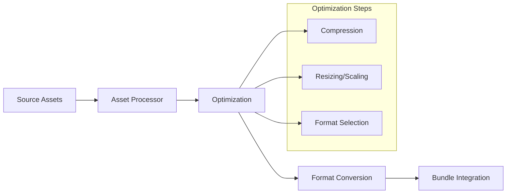

# Jepsh Build System Architecture

## Document Status

- **Target Audience**: Framework Development Team
- **Version**: Draft v1.0
- **Last Updated**: July 2025
- **Implementation Status**:
  - 🚧 **Planned**: Architecture defined, not implemented
  - ⚡ **In Development**: Currently being built
  - ✅ **Implemented**: Available in current build

---

## 1. Build System Overview

The Jepsh build system is designed as a multi-target compilation pipeline that transforms JXL source code into optimized platform-native bundles. The system emphasizes performance through aggressive compile-time optimizations while maintaining development ergonomics.

### 1.1 Core Design Principles

- **Single Source, Multiple Targets**: One JXL codebase compiles to Web, Android, iOS
- **Zero-Runtime-Cost Abstractions**: All framework overhead eliminated at compile time
- **Incremental Compilation**: Only changed files and their dependents are recompiled
- **Parallel Processing**: Multi-core compilation with intelligent work distribution
- **Development Speed**: Sub-second rebuild times for typical changes

### 1.2 Build Pipeline Architecture



---

## 2. Core Build Components

### 2.1 JXL Parser and AST Generator ⚡

The parser converts JXL source files into a platform-agnostic Abstract Syntax Tree (AST).

**Parser Architecture**:



**Implementation Details**:

- **Language**: Rust for maximum performance and memory safety
- **Parser Generator**: Custom recursive descent parser with error recovery
- **AST Format**: Immutable tree structure with position information for IDE support
- **Memory Usage**: Shared string interner reduces memory overhead by 60-80%

**Performance Characteristics**:

- **Parsing Speed**: >500,000 lines/second on modern hardware
- **Memory Efficiency**: <50MB peak memory for large codebases (>100k LOC)
- **Error Recovery**: Continues parsing after syntax errors for better IDE experience

### 2.2 Semantic Analysis Engine ⚡

The semantic analyzer performs type checking, dependency resolution, and optimization preparation.

**Analysis Phases**:

1. **Symbol Resolution**: Build symbol tables and resolve references
2. **Type Checking**: Verify type compatibility and inference
3. **Dependency Analysis**: Create dependency graphs for incremental compilation
4. **Optimization Analysis**: Identify dead code and optimization opportunities

**Type System Implementation**:

```rust
// Simplified type system representation
enum JxlType {
    Primitive(PrimitiveType),
    Atom(Box<JxlType>),
    View(ViewType),
    Function(FunctionType),
    Generic(GenericType),
    Platform(PlatformSpecificType),
}

struct SemanticAnalyzer {
    symbol_table: SymbolTable,
    type_checker: TypeChecker,
    dependency_graph: DependencyGraph,
    error_collector: ErrorCollector,
}
```

**Performance Optimizations**:

- **Incremental Analysis**: Only re-analyze changed files and dependents
- **Parallel Type Checking**: Type check independent modules concurrently
- **Cached Results**: Serialize analysis results for subsequent builds

### 2.3 Cross-Platform Optimization Engine 🚧

The optimization engine performs platform-agnostic optimizations before code generation.

**Optimization Passes**:

1. **Dead Code Elimination**:

   ```jxl
   // Input JXL
   view UnusedComponent { render { Text("Never used") } }
   view UsedComponent { render { Text("Used") } }

   // After DCE - UnusedComponent completely removed
   ```

2. **Constant Folding and Propagation**:

   ```jxl
   // Input
   let staticValue: Int = 42
   atom computed result: Int { return staticValue * 2 }

   // Optimized - computed atom replaced with constant
   let result: Int = 84
   ```

3. **Layout Pre-computation**:

   ```jxl
   // Input
   VStack(spacing: 16) {
       Text("Header")
       Text("Content")
   }

   // Optimized - layout positions pre-calculated
   // Generated layout data: header_y = 0, content_y = 32
   ```

4. **Atom Dependency Optimization**:
   ```jxl
   atom a: Int = 1
   atom b: Int = 2
   atom computed unused: Int { return a + b }  // Removed if unused
   atom computed used: Int { return a * 2 }   // Optimized to direct dependency
   ```

**Optimization Infrastructure**:

```rust
trait OptimizationPass {
    fn run(&mut self, ast: &mut AST) -> OptimizationResult;
    fn dependencies(&self) -> Vec<OptimizationPassId>;
}

struct OptimizationPipeline {
    passes: Vec<Box<dyn OptimizationPass>>,
    pass_manager: PassManager,
}
```

---

## 3. Platform-Specific Compilers

### 3.1 jepsh-webc (Web Compiler) ⚡

Compiles JXL to TypeScript + WebAssembly for maximum web performance.

**Compilation Strategy**:

- **UI Components**: TypeScript with custom JSX transforms
- **Heavy Computation**: WebAssembly modules for performance-critical code
- **State Management**: Compiled to reactive proxy system
- **Assets**: Bundled with Rollup/Vite with automatic optimization

**Output Structure**:

```
dist/web/
├── main.js              # Application entry point
├── components/          # Generated component modules
├── wasm/               # WebAssembly modules
│   ├── render.wasm     # Render kernel
│   └── compute.wasm    # Heavy computations
├── assets/             # Optimized assets
└── manifest.json       # Build manifest
```

**Performance Optimizations**:

- **Code Splitting**: Automatic route-based and component-based splitting
- **Tree Shaking**: Unused code elimination at function level
- **WASM Optimization**: binaryen optimization passes
- **Bundle Size**: Initial bundle <50KB gzipped

**Build Configuration**:

```toml
[web]
target = "es2022"
bundle_format = "esm"
wasm_optimization = "size"
code_splitting = true
prerender = ["routes/home", "routes/about"]

[web.performance]
max_initial_bundle = "50KB"
max_chunk_size = "200KB"
async_chunk_loading = true
```

### 3.2 jepsh-androidc (Android Compiler) 🚧

Compiles JXL to Kotlin with Jetpack Compose integration.

**Compilation Strategy**:

- **UI Components**: Jetpack Compose @Composable functions
- **State Management**: Kotlin StateFlow and MutableState
- **Performance**: Kotlin coroutines for async operations
- **Native Integration**: Kotlin/JNI bridges for platform APIs

**Generated Code Structure**:

```kotlin
// Generated from JXL view
@Composable
fun UserProfile(user: User) {
    val showDetails by remember { mutableStateOf(false) }

    Column(
        modifier = Modifier.padding(16.dp),
        verticalArrangement = Arrangement.spacedBy(8.dp)
    ) {
        Text(
            text = user.name,
            style = MaterialTheme.typography.headlineMedium
        )

        Button(
            onClick = { showDetails = !showDetails }
        ) {
            Text("Show Details")
        }

        if (showDetails) {
            UserDetails(user = user)
        }
    }
}
```

**Performance Features**:

- **Compose Compiler**: Leverages Compose compiler optimizations
- **State Optimization**: Minimal recomposition through precise state tracking
- **Memory Management**: Automatic cleanup of composables
- **R8 Integration**: Full R8/ProGuard optimization support

### 3.3 jepsh-iosc (iOS Compiler) 🚧

Compiles JXL to Swift with SwiftUI integration.

**Compilation Strategy**:

- **UI Components**: SwiftUI views with automatic @State management
- **State Management**: Combine framework with @ObservableObject
- **Performance**: Swift Concurrency for async operations
- **Native Integration**: Swift/Objective-C bridges for platform APIs

**Generated Code Structure**:

```swift
// Generated from JXL view
struct UserProfile: View {
    let user: User
    @State private var showDetails = false

    var body: some View {
        VStack(alignment: .leading, spacing: 8) {
            Text(user.name)
                .font(.headline)

            Button("Show Details") {
                showDetails.toggle()
            }

            if showDetails {
                UserDetails(user: user)
            }
        }
        .padding(16)
    }
}
```

**Performance Features**:

- **SwiftUI Optimization**: Leverages SwiftUI's built-in performance features
- **State Minimization**: Precise @State and @ObservableObject usage
- **Memory Safety**: ARC-compatible code generation
- **Xcode Integration**: Full Xcode build system compatibility

---

## 4. Build Configuration System

### 4.1 Configuration Architecture ⚡

The build system uses a hierarchical configuration system with environment-specific overrides.

**Configuration Hierarchy**:

```
jepsh.config.toml          # Base configuration
├── jepsh.dev.toml         # Development overrides
├── jepsh.prod.toml        # Production overrides
└── platforms/
    ├── web.toml           # Web-specific config
    ├── android.toml       # Android-specific config
    └── ios.toml           # iOS-specific config
```

**Base Configuration Format**:

```toml
[project]
name = "MyJepshApp"
version = "1.0.0"
description = "A Jepsh application"

[build]
parallel = true
incremental = true
optimization_level = "balanced"  # "debug" | "balanced" | "aggressive"

[targets]
web = true
android = true
ios = true

[performance]
bundle_analysis = true
dead_code_elimination = true
tree_shaking = true
```

**Platform-Specific Configuration**:

```toml
# web.toml
[bundle]
format = "esm"
target = "es2022"
polyfills = "minimal"

[optimization]
wasm = true
code_splitting = true
prerendering = ["home", "about"]

[dev]
hot_reload = true
source_maps = true
dev_server_port = 3000
```

### 4.2 Environment Management 🚧

**Environment Variables**:

```toml
[env]
# Compile-time environment injection
API_BASE_URL = { dev = "http://localhost:8000", prod = "https://api.myapp.com" }
FEATURE_FLAGS = { analytics = true, beta_features = false }
BUILD_INFO = { version = "$VERSION", commit = "$GIT_COMMIT" }
```

**Conditional Compilation**:

```jxl
// JXL code with conditional compilation
#if env.FEATURE_FLAGS.analytics
func trackEvent(event: String) {
    analytics.track(event)
}
#else
func trackEvent(event: String) {
    // No-op in builds without analytics
}
#endif
```

---

## 5. Development Tools Integration

### 5.1 Hot Reload System ⚡

**Architecture**:



**Hot Reload Features**:

- **State Preservation**: Component state maintained across reloads
- **Error Recovery**: Automatic recovery from compilation errors
- **Multi-Platform**: Simultaneous reload across Web, Android, iOS
- **Selective Updates**: Only changed components are updated

**Implementation Details**:

```rust
struct HotReloadServer {
    file_watcher: FileWatcher,
    incremental_compiler: IncrementalCompiler,
    websocket_server: WebSocketServer,
    connected_clients: Vec<DeviceClient>,
}

impl HotReloadServer {
    async fn handle_file_change(&mut self, path: PathBuf) {
        let compilation_result = self.incremental_compiler
            .compile_file(&path).await;

        match compilation_result {
            Ok(patch) => self.broadcast_patch(patch).await,
            Err(error) => self.broadcast_error(error).await,
        }
    }
}
```

### 5.2 Build Cache System ⚡

**Cache Architecture**:

- **Local Cache**: File-system based cache for single developer
- **Distributed Cache**: Optional remote cache for team environments
- **Dependency Cache**: Cached external dependencies and assets
- **Incremental Cache**: Fine-grained caching of compilation units

**Cache Implementation**:

```rust
struct BuildCache {
    local_cache: LocalFileCache,
    remote_cache: Option<RemoteCache>,
    dependency_cache: DependencyCache,
}

// Cache key generation
fn generate_cache_key(source: &SourceFile, dependencies: &[Dependency]) -> CacheKey {
    let mut hasher = blake3::Hasher::new();
    hasher.update(source.content.as_bytes());
    hasher.update(&source.last_modified.to_be_bytes());

    for dep in dependencies {
        hasher.update(dep.hash.as_bytes());
    }

    CacheKey(hasher.finalize())
}
```

**Cache Performance**:

- **Hit Rate**: >90% for typical development workflows
- **Speed Improvement**: 5-10x faster builds for cached content
- **Storage Efficiency**: Deduplication reduces cache size by 40-60%

### 5.3 Build Analytics and Reporting 🚧

**Build Metrics Collection**:

```toml
[analytics]
enabled = true
collect_timing = true
collect_bundle_size = true
collect_optimization_stats = true
```

**Generated Reports**:

- **Build Performance**: Compilation times, bottlenecks, cache hit rates
- **Bundle Analysis**: Size breakdown, dependency analysis, unused code
- **Optimization Impact**: Before/after comparisons for optimizations
- **Platform Comparison**: Cross-platform bundle size and performance

**Report Output**:

```json
{
  "build_summary": {
    "total_time": "2.3s",
    "cache_hit_rate": "94%",
    "files_processed": 247,
    "optimizations_applied": 15
  },
  "bundle_sizes": {
    "web": { "initial": "47KB", "total": "312KB" },
    "android": { "apk": "8.2MB", "optimized": "6.1MB" },
    "ios": { "app": "12.4MB", "bitcode": "enabled" }
  }
}
```

---

## 6. Incremental Compilation

### 6.1 Dependency Graph Management ⚡

**Dependency Tracking**:



**Implementation**:

```rust
struct DependencyGraph {
    nodes: HashMap<FileId, DependencyNode>,
    edges: HashMap<FileId, Vec<FileId>>,
    reverse_edges: HashMap<FileId, Vec<FileId>>,
}

impl DependencyGraph {
    fn get_affected_files(&self, changed_file: FileId) -> Vec<FileId> {
        let mut affected = Vec::new();
        let mut queue = VecDeque::new();
        let mut visited = HashSet::new();

        queue.push_back(changed_file);

        while let Some(file_id) = queue.pop_front() {
            if visited.insert(file_id) {
                affected.push(file_id);

                if let Some(dependents) = self.reverse_edges.get(&file_id) {
                    for &dependent in dependents {
                        queue.push_back(dependent);
                    }
                }
            }
        }

        affected
    }
}
```

### 6.2 Parallel Compilation ⚡

**Work Distribution Strategy**:

- **File-Level Parallelism**: Independent files compiled concurrently
- **Pipeline Parallelism**: Parse, analyze, optimize, and generate in parallel
- **Platform Parallelism**: Web, Android, iOS compilation in parallel
- **Resource-Aware Scheduling**: Adapts to available CPU cores and memory

**Parallel Compiler Implementation**:

```rust
struct ParallelCompiler {
    thread_pool: ThreadPool,
    work_queue: WorkQueue<CompilationTask>,
    progress_tracker: ProgressTracker,
}

impl ParallelCompiler {
    async fn compile_project(&mut self, project: &Project) -> CompilationResult {
        let dependency_order = self.compute_compilation_order(&project.files);
        let mut compilation_futures = Vec::new();

        for batch in dependency_order {
            let batch_futures: Vec<_> = batch.into_iter()
                .map(|file| self.compile_file_async(file))
                .collect();

            compilation_futures.push(futures::future::join_all(batch_futures));
        }

        let results = futures::future::join_all(compilation_futures).await;
        self.merge_compilation_results(results)
    }
}
```

---

## 7. Asset Pipeline

### 7.1 Asset Processing ⚡

**Supported Asset Types**:

- **Images**: PNG, JPEG, SVG, WebP with automatic optimization
- **Videos**: MP4, WebM with compression and format conversion
- **Fonts**: TTF, OTF, WOFF2 with subset generation
- **Audio**: MP3, AAC, Opus with quality optimization
- **Documents**: PDF, with platform-specific handling

**Processing Pipeline**:



**Asset Configuration**:

```toml
[assets]
input_dir = "assets"
output_dir = "dist/assets"

[assets.images]
formats = ["webp", "png", "jpg"]
quality = { webp = 85, jpg = 80 }
responsive_sizes = [640, 1280, 1920]
lazy_loading = true

[assets.fonts]
subset = true
formats = ["woff2", "woff"]
preload = ["primary-font"]
```

### 7.2 Design Token Processing ⚡

**Token Pipeline**:

```yaml
# Design tokens input (YAML/JSON)
color:
  primary: '#3B82F6'
  secondary: '#10B981'

spacing:
  xs: 4px
  sm: 8px
  md: 16px

typography:
  headline:
    family: 'Inter'
    size: 24px
    weight: 600
```

**Generated Platform Outputs**:

```typescript
// Web (TypeScript)
export const tokens = {
  color: {
    primary: '#3B82F6',
    secondary: '#10B981',
  },
  spacing: {
    xs: '4px',
    sm: '8px',
    md: '16px',
  },
} as const;
```

```kotlin
// Android (Kotlin)
object DesignTokens {
    object Color {
        val primary = Color(0xFF3B82F6)
        val secondary = Color(0xFF10B981)
    }

    object Spacing {
        val xs = 4.dp
        val sm = 8.dp
        val md = 16.dp
    }
}
```

```swift
// iOS (Swift)
enum DesignTokens {
    enum Color {
        static let primary = UIColor(hex: 0x3B82F6)
        static let secondary = UIColor(hex: 0x10B981)
    }

    enum Spacing {
        static let xs: CGFloat = 4
        static let sm: CGFloat = 8
        static let md: CGFloat = 16
    }
}
```

---

## 8. Build Performance Optimization

### 8.1 Compilation Performance Metrics ⚡

**Target Performance Goals**:

- **Cold Build**: <30 seconds for medium project (10k LOC)
- **Incremental Build**: <3 seconds for single file change
- **Hot Reload**: <500ms for UI component changes
- **Memory Usage**: <1GB peak for large projects (100k LOC)

**Performance Monitoring**:

```rust
struct BuildMetrics {
    compilation_times: HashMap<FileId, Duration>,
    cache_hit_rates: HashMap<CompilationStage, f64>,
    memory_usage: MemoryProfile,
    optimization_impact: OptimizationMetrics,
}

impl BuildMetrics {
    fn report_slow_files(&self, threshold: Duration) -> Vec<(FileId, Duration)> {
        self.compilation_times
            .iter()
            .filter(|(_, &duration)| duration > threshold)
            .map(|(&file_id, &duration)| (file_id, duration))
            .collect()
    }
}
```

### 8.2 Memory Management 🚧

**Memory Optimization Strategies**:

- **String Interning**: Shared string storage reduces memory by 60-80%
- **AST Sharing**: Immutable AST nodes shared across compilation units
- **Streaming Processing**: Large files processed in chunks
- **Memory Pools**: Pre-allocated memory pools for frequent allocations

**Memory Pool Implementation**:

```rust
struct MemoryPool<T> {
    pool: Vec<Box<T>>,
    capacity: usize,
    allocation_count: AtomicUsize,
}

impl<T> MemoryPool<T> {
    fn allocate(&mut self) -> *mut T {
        if let Some(item) = self.pool.pop() {
            Box::into_raw(item)
        } else {
            self.allocation_count.fetch_add(1, Ordering::Relaxed);
            Box::into_raw(Box::new(unsafe { std::mem::zeroed() }))
        }
    }

    fn deallocate(&mut self, ptr: *mut T) {
        if self.pool.len() < self.capacity {
            self.pool.push(unsafe { Box::from_raw(ptr) });
        } else {
            unsafe { drop(Box::from_raw(ptr)) };
        }
    }
}
```

---

## 9. CLI and Tooling

### 9.1 Unified CLI Interface ⚡

**Command Structure**:

```bash
# Project management
jepsh create myapp --template=default
jepsh init --targets=web,android,ios

# Development
jepsh dev --platform=all --port=3000
jepsh dev --platform=web --watch
jepsh dev --platform=android --device=emulator

# Building
jepsh build --target=production --platform=all
jepsh build --target=development --platform=web
jepsh build --analyze --platform=web

# Utility commands
jepsh clean --cache --build
jepsh doctor --check-deps --check-platforms
jepsh migrate --from=react --to=jepsh
```

**CLI Implementation Architecture**:

```rust
#[derive(Parser)]
#[command(name = "jepsh")]
#[command(about = "Jepsh universal framework CLI")]
struct Cli {
    #[command(subcommand)]
    command: Commands,

    #[arg(global = true, short, long)]
    verbose: bool,

    #[arg(global = true, long)]
    config: Option<PathBuf>,
}

#[derive(Subcommand)]
enum Commands {
    Create(CreateArgs),
    Init(InitArgs),
    Dev(DevArgs),
    Build(BuildArgs),
    Clean(CleanArgs),
    Doctor(DoctorArgs),
}
```

### 9.2 IDE Integration 🚧

**VS Code Extension Features**:

- **Syntax Highlighting**: Rich JXL syntax highlighting
- **IntelliSense**: Auto-completion for JXL APIs and components
- **Error Diagnostics**: Real-time error checking and suggestions
- **Debugging**: Breakpoint support across all platforms
- **Refactoring**: Rename, extract component, convert patterns

**Language Server Protocol Implementation**:

```rust
struct JepshLanguageServer {
    compiler: IncrementalCompiler,
    workspace: Workspace,
    diagnostics: DiagnosticsCollector,
    completion_provider: CompletionProvider,
}

impl LanguageServer for JepshLanguageServer {
    async fn did_change(&mut self, params: DidChangeTextDocumentParams) {
        let file_id = self.workspace.get_file_id(&params.text_document.uri);
        let diagnostics = self.compiler.check_file(file_id).await;
        self.publish_diagnostics(params.text_document.uri, diagnostics).await;
    }

    async fn completion(&mut self, params: CompletionParams) -> CompletionResponse {
        self.completion_provider.get_completions(params).await
    }
}
```

---

## 10. Testing and Quality Assurance

### 10.1 Automated Testing Pipeline 🚧

**Test Types**:

- **Unit Tests**: Individual compiler component testing
- **Integration Tests**: End-to-end compilation testing
- **Performance Tests**: Build time and memory usage regression testing
- **Cross-Platform Tests**: Output verification across platforms

**Test Infrastructure**:

```rust
#[cfg(test)]
mod tests {
    use super::*;

    #[test]
    fn test_incremental_compilation() {
        let mut compiler = IncrementalCompiler::new();
        let project = create_test_project();

        // Initial compilation
        let result1 = compiler.compile(&project);
        assert!(result1.is_ok());

        // Modify single file
        project.modify_file("components/Button.jxl", "// Changed");

        // Incremental compilation should be faster
        let start = Instant::now();
        let result2 = compiler.compile(&project);
        let duration = start.elapsed();

        assert!(result2.is_ok());
        assert!(duration < Duration::from_secs(1));
    }

    #[test]
    fn test_optimization_correctness() {
        let source = r#"
            view TestComponent {
                atom unused: Int = 42  // Should be eliminated
                atom used: Int = 1

                render {
                    Text("\(used)")
                }
            }
        "#;

        let optimized_ast = optimize_ast(parse_jxl(source));

        // Verify unused atom was eliminated
        assert!(!ast_contains_symbol(&optimized_ast, "unused"));
        assert!(ast_contains_symbol(&optimized_ast, "used"));
    }
}
```

### 10.2 Platform Output Verification 🚧

**Output Validation**:

- **Syntax Correctness**: Generated code compiles without errors
- **Semantic Equivalence**: Behavior is identical across platforms
- **Performance Characteristics**: Generated code meets performance targets
- **Bundle Size Limits**: Output bundles within specified size limits

**Validation Framework**:

```rust
struct PlatformValidator {
    web_validator: TypeScriptValidator,
    android_validator: KotlinValidator,
    ios_validator: SwiftValidator,
}

impl PlatformValidator {
    async fn validate_output(&self, compilation_result: &CompilationResult) -> ValidationResult {
        let web_result = self.web_validator.validate(&compilation_result.web_output).await;
        let android_result = self.android_validator.validate(&compilation_result.android_output).await;
        let ios_result = self.ios_validator.validate(&compilation_result.ios_output).await;

        ValidationResult {
            web: web_result,
            android: android_result,
            ios: ios_result,
        }
    }
}
```

---

## 11. Deployment and Distribution

### 11.1 Build Artifacts 🚧

**Web Deployment**:

```
dist/web/
├── index.html           # Entry HTML
├── main-[hash].js       # Main application bundle
├── chunks/              # Code-split chunks
│   ├── vendor-[hash].js # Third-party dependencies
│   └── lazy-[hash].js   # Lazy-loaded components
├── wasm/               # WebAssembly modules
├── assets/             # Optimized assets
└── service-worker.js   # Optional PWA service worker
```

**Android Deployment**:

```
dist/android/
├── app-release.apk     # Release APK
├── app-release.aab     # Android App Bundle
├── mapping.txt         # ProGuard mapping
└── assets/            # Bundled assets
```

**iOS Deployment**:

```
dist/ios/
├── MyApp.app          # iOS app bundle
├── MyApp.ipa          # Distribution package
├── dSYM/             # Debug symbols
└── assets/           # Bundled assets
```

### 11.2 Continuous Integration 🚧

**CI/CD Pipeline Configuration**:

```yaml
# .github/workflows/jepsh-build.yml
name: Jepsh Build Pipeline

on:
  push:
    branches: [main, develop]
  pull_request:
    branches: [main]

jobs:
  build:
    runs-on: ubuntu-latest
    strategy:
      matrix:
        platform: [web, android, ios]

    steps:
      - uses: actions/checkout@v3

      - name: Setup Jepsh
        uses: jepsh-framework/setup-jepsh@v1
        with:
          version: 'latest'
          targets: ${{ matrix.platform }}

      - name: Cache Dependencies
        uses: actions/cache@v3
        with:
          path: |
            ~/.jepsh/cache
            node_modules
            ~/.gradle/caches
          key: ${{ runner.os }}-${{ matrix.platform }}-${{ hashFiles('**/jepsh.lock') }}

      - name: Build
        run: jepsh build --platform=${{ matrix.platform }} --target=production

      - name: Test
        run: jepsh test --platform=${{ matrix.platform }}

      - name: Upload Artifacts
        uses: actions/upload-artifact@v3
        with:
          name: ${{ matrix.platform }}-build
          path: dist/${{ matrix.platform }}/
```

**Build Validation Steps**:

- **Compilation Success**: All platforms compile without errors
- **Bundle Size Check**: Bundles within specified size limits
- **Performance Regression**: Build times within acceptable ranges
- **Cross-Platform Consistency**: UI renders identically across platforms

---

## 12. Error Handling and Diagnostics

### 12.1 Compilation Error System ⚡

**Error Categories**:

- **Syntax Errors**: Invalid JXL syntax with precise location information
- **Type Errors**: Type mismatches with suggested fixes
- **Dependency Errors**: Missing imports or circular dependencies
- **Platform Errors**: Platform-specific compilation issues
- **Optimization Warnings**: Performance improvement suggestions

**Error Reporting Format**:

```rust
#[derive(Debug, Clone)]
struct CompilationError {
    severity: ErrorSeverity,
    code: ErrorCode,
    message: String,
    location: SourceLocation,
    suggestions: Vec<Suggestion>,
    related_errors: Vec<RelatedError>,
}

#[derive(Debug, Clone)]
struct SourceLocation {
    file_path: PathBuf,
    line: u32,
    column: u32,
    length: u32,
}

#[derive(Debug, Clone)]
struct Suggestion {
    message: String,
    edit: Option<TextEdit>,
    severity: SuggestionSeverity,
}
```

**Error Display Example**:

```
error[E0308]: mismatched types
  --> src/components/UserProfile.jxl:15:21
   |
15 |     atom count: String = 42
   |                 ------   ^^ expected `String`, found `Int`
   |                 |
   |                 expected due to this type annotation
   |
help: you can convert an `Int` to a `String`
   |
15 |     atom count: String = 42.toString()
   |                            +++++++++++
```

### 12.2 Performance Diagnostics 🚧

**Build Performance Analysis**:

```rust
struct BuildProfiler {
    stage_timings: HashMap<CompilationStage, Duration>,
    file_timings: HashMap<FileId, Duration>,
    memory_snapshots: Vec<MemorySnapshot>,
    optimization_impact: OptimizationProfile,
}

impl BuildProfiler {
    fn generate_report(&self) -> PerformanceReport {
        PerformanceReport {
            total_time: self.stage_timings.values().sum(),
            bottlenecks: self.identify_bottlenecks(),
            memory_usage: self.analyze_memory_usage(),
            optimization_savings: self.calculate_optimization_impact(),
            recommendations: self.generate_recommendations(),
        }
    }

    fn identify_bottlenecks(&self) -> Vec<Bottleneck> {
        let mut bottlenecks = Vec::new();

        // Find files taking >5% of total build time
        let total_time: Duration = self.file_timings.values().sum();
        let threshold = total_time.mul_f64(0.05);

        for (&file_id, &duration) in &self.file_timings {
            if duration > threshold {
                bottlenecks.push(Bottleneck {
                    file_id,
                    duration,
                    percentage: duration.as_secs_f64() / total_time.as_secs_f64() * 100.0,
                    suggestions: self.generate_file_suggestions(file_id),
                });
            }
        }

        bottlenecks
    }
}
```

**Performance Report Output**:

```json
{
  "build_performance": {
    "total_time": "12.3s",
    "bottlenecks": [
      {
        "file": "src/components/DataTable.jxl",
        "time": "2.1s",
        "percentage": 17.1,
        "suggestions": [
          "Consider splitting large component into smaller parts",
          "Reduce complexity of computed atoms"
        ]
      }
    ],
    "memory_peak": "892MB",
    "cache_effectiveness": {
      "hit_rate": "87%",
      "time_saved": "8.2s"
    }
  }
}
```

---

## 13. Security and Code Integrity

### 13.1 Build Security 🚧

**Security Measures**:

- **Dependency Verification**: Cryptographic verification of external dependencies
- **Code Signing**: Digital signatures for build artifacts
- **Supply Chain Security**: Audit trail for all build inputs
- **Sandboxed Compilation**: Isolated compilation environment

**Dependency Security**:

```rust
struct DependencyVerifier {
    known_hashes: HashMap<DependencyId, Hash>,
    signature_verifier: SignatureVerifier,
    vulnerability_database: VulnerabilityDb,
}

impl DependencyVerifier {
    async fn verify_dependency(&self, dep: &Dependency) -> SecurityResult {
        // Check cryptographic hash
        let computed_hash = self.compute_hash(&dep.content);
        if let Some(expected_hash) = self.known_hashes.get(&dep.id) {
            if computed_hash != *expected_hash {
                return SecurityResult::HashMismatch;
            }
        }

        // Check for known vulnerabilities
        if let Some(vulnerabilities) = self.vulnerability_database.check(&dep.id) {
            return SecurityResult::VulnerabilityFound(vulnerabilities);
        }

        // Verify digital signature if available
        if let Some(signature) = &dep.signature {
            if !self.signature_verifier.verify(&dep.content, signature) {
                return SecurityResult::InvalidSignature;
            }
        }

        SecurityResult::Verified
    }
}
```

### 13.2 Code Integrity Checks 🚧

**Static Analysis**:

- **Memory Safety**: Bounds checking and null pointer analysis
- **Information Flow**: Tracking of sensitive data through the application
- **API Usage**: Verification of correct platform API usage
- **Performance Regression**: Detection of performance anti-patterns

**Static Analysis Engine**:

```rust
struct StaticAnalyzer {
    memory_checker: MemorySafetyChecker,
    taint_analyzer: TaintAnalyzer,
    api_checker: ApiUsageChecker,
    performance_analyzer: PerformanceAnalyzer,
}

impl StaticAnalyzer {
    fn analyze_file(&mut self, ast: &AST) -> AnalysisResult {
        let mut issues = Vec::new();

        // Memory safety analysis
        issues.extend(self.memory_checker.check(ast));

        // Information flow analysis
        issues.extend(self.taint_analyzer.analyze(ast));

        // API usage verification
        issues.extend(self.api_checker.verify(ast));

        // Performance analysis
        issues.extend(self.performance_analyzer.analyze(ast));

        AnalysisResult { issues }
    }
}
```

---

## 14. Extensibility and Plugin System

### 14.1 Build Plugin Architecture 🚧

**Plugin Interface**:

```rust
trait BuildPlugin: Send + Sync {
    fn name(&self) -> &str;
    fn version(&self) -> &str;

    // Lifecycle hooks
    fn on_project_init(&mut self, project: &mut Project) -> PluginResult<()>;
    fn on_file_parse(&mut self, file: &mut SourceFile) -> PluginResult<()>;
    fn on_ast_transform(&mut self, ast: &mut AST) -> PluginResult<()>;
    fn on_code_generation(&mut self, context: &mut CodeGenContext) -> PluginResult<()>;
    fn on_build_complete(&mut self, artifacts: &BuildArtifacts) -> PluginResult<()>;
}

struct PluginManager {
    plugins: Vec<Box<dyn BuildPlugin>>,
    plugin_config: PluginConfig,
}

impl PluginManager {
    fn load_plugin(&mut self, plugin_path: &Path) -> PluginResult<()> {
        // Dynamic loading of plugins
        let lib = libloading::Library::new(plugin_path)?;
        let create_plugin: Symbol<fn() -> Box<dyn BuildPlugin>> =
            unsafe { lib.get(b"create_plugin")? };

        let plugin = create_plugin();
        self.plugins.push(plugin);

        Ok(())
    }

    async fn run_lifecycle_hook<F>(&mut self, hook: F) -> PluginResult<()>
    where
        F: Fn(&mut dyn BuildPlugin) -> PluginResult<()>,
    {
        for plugin in &mut self.plugins {
            hook(plugin.as_mut())?;
        }
        Ok(())
    }
}
```

**Example Plugin - CSS-in-JXL**:

```rust
struct CssInJxlPlugin {
    css_processor: CssProcessor,
}

impl BuildPlugin for CssInJxlPlugin {
    fn name(&self) -> &str { "css-in-jxl" }
    fn version(&self) -> &str { "1.0.0" }

    fn on_ast_transform(&mut self, ast: &mut AST) -> PluginResult<()> {
        // Find style blocks in JXL components
        for node in ast.walk_mut() {
            if let ASTNode::StyleBlock(style_block) = node {
                // Process CSS and inject into component
                let processed_css = self.css_processor.process(&style_block.css)?;
                style_block.processed = Some(processed_css);
            }
        }
        Ok(())
    }
}
```

### 14.2 Custom Code Generators 🚧

**Code Generator Plugin Interface**:

```rust
trait CodeGenerator: Send + Sync {
    fn target_platform(&self) -> Platform;
    fn supported_languages(&self) -> Vec<TargetLanguage>;

    fn generate_component(&self, component: &ComponentAST) -> GenerationResult<String>;
    fn generate_atom(&self, atom: &AtomAST) -> GenerationResult<String>;
    fn generate_imports(&self, imports: &[Import]) -> GenerationResult<String>;
}

// Example: Custom React Native generator
struct ReactNativeGenerator {
    template_engine: TemplateEngine,
}

impl CodeGenerator for ReactNativeGenerator {
    fn target_platform(&self) -> Platform { Platform::ReactNative }
    fn supported_languages(&self) -> Vec<TargetLanguage> { vec![TargetLanguage::TypeScript] }

    fn generate_component(&self, component: &ComponentAST) -> GenerationResult<String> {
        let template = r#"
import React, { useState } from 'react';
import { View, Text } from 'react-native';

export const {{component_name}}: React.FC<{{props_interface}}> = (props) => {
    {{state_declarations}}

    return (
        {{render_content}}
    );
};
        "#;

        let context = TemplateContext::new()
            .with("component_name", &component.name)
            .with("props_interface", &self.generate_props_interface(component)?)
            .with("state_declarations", &self.generate_state_declarations(component)?)
            .with("render_content", &self.generate_render_content(component)?);

        Ok(self.template_engine.render(template, &context)?)
    }
}
```

---

## 15. Migration and Interoperability

### 15.1 Migration Tools 🚧

**Migration Framework**:

```rust
trait MigrationTool: Send + Sync {
    fn source_framework(&self) -> Framework;
    fn target_framework(&self) -> Framework;

    fn analyze_project(&self, project_path: &Path) -> MigrationAnalysis;
    fn migrate_file(&self, file: &SourceFile) -> MigrationResult<JxlFile>;
    fn generate_migration_report(&self) -> MigrationReport;
}

struct ReactToJxlMigrator {
    tsx_parser: TsxParser,
    jxl_generator: JxlGenerator,
    component_mapper: ComponentMapper,
}

impl MigrationTool for ReactToJxlMigrator {
    fn source_framework(&self) -> Framework { Framework::React }
    fn target_framework(&self) -> Framework { Framework::Jepsh }

    fn migrate_file(&self, file: &SourceFile) -> MigrationResult<JxlFile> {
        // Parse React/TSX file
        let tsx_ast = self.tsx_parser.parse(&file.content)?;

        // Map React concepts to JXL
        let jxl_ast = self.component_mapper.map_ast(&tsx_ast)?;

        // Generate JXL code
        let jxl_content = self.jxl_generator.generate(&jxl_ast)?;

        Ok(JxlFile {
            path: file.path.with_extension("jxl"),
            content: jxl_content,
            confidence: self.calculate_migration_confidence(&tsx_ast),
        })
    }
}
```

**Migration Configuration**:

```toml
[migration]
source = "react"
target = "jepsh"
preserve_structure = true
convert_css_modules = true
migrate_tests = true

[migration.mapping]
# Component mapping rules
"React.Component" = "view"
"useState" = "atom"
"useEffect" = "effect"
"React.FC" = "view"

[migration.exclusions]
# Files to skip during migration
exclude_patterns = ["**/*.test.tsx", "**/node_modules/**"]
manual_review = ["src/complex-component.tsx"]
```

### 15.2 Interoperability Bridges 🚧

**React Bridge for Gradual Migration**:

```typescript
// Generated React wrapper for JXL component
import { JepshComponent } from '@jepsh/react-bridge';
import { UserProfile as JxlUserProfile } from './UserProfile.jxl';

export const UserProfile: React.FC<UserProfileProps> = (props) => {
    return (
        <JepshComponent
            component={JxlUserProfile}
            props={props}
            // Bridge handles prop conversion and state synchronization
        />
    );
};
```

**Native Module Integration**:

```jxl
// JXL code using native modules
import { CameraModule } from '@native/camera'

view CameraScreen {
    atom hasPermission: Bool = false

    onMount {
        // Bridge automatically handles platform differences
        CameraModule.requestPermission().then { granted in
            hasPermission = granted
        }
    }

    render {
        if hasPermission {
            CameraView()
        } else {
            PermissionRequestView()
        }
    }
}
```

---

## 16. Future Build System Enhancements

### 16.1 Advanced Optimizations 🚧

**Machine Learning-Based Optimizations**:

- **Bundle Size Prediction**: ML models predict optimal code splitting strategies
- **Performance Bottleneck Detection**: AI identifies performance issues in generated code
- **User Behavior Optimization**: Optimize bundles based on user interaction patterns
- **Compilation Time Optimization**: ML-guided compilation order and resource allocation

**Distributed Compilation**:

```rust
struct DistributedCompiler {
    coordinator: CompilationCoordinator,
    worker_pool: WorkerPool,
    result_aggregator: ResultAggregator,
}

impl DistributedCompiler {
    async fn compile_distributed(&mut self, project: &Project) -> CompilationResult {
        // Partition work across available workers
        let work_units = self.coordinator.partition_work(project);

        // Distribute compilation tasks
        let futures: Vec<_> = work_units.into_iter()
            .map(|unit| self.worker_pool.compile_unit(unit))
            .collect();

        // Aggregate results
        let results = futures::future::join_all(futures).await;
        self.result_aggregator.merge_results(results)
    }
}
```

### 16.2 Cloud-Native Build Pipeline 🚧

**Cloud Build Architecture**:

- **Serverless Compilation**: Function-based compilation for individual files
- **Global Build Cache**: Distributed cache across development teams
- **Auto-scaling**: Automatic resource scaling based on build load
- **Edge Deployment**: Automatic deployment to edge networks

**Cloud Build Configuration**:

```yaml
# jepsh-cloud.yml
build:
  provider: 'jepsh-cloud'
  regions: ['us-east-1', 'eu-west-1', 'ap-southeast-1']

cache:
  strategy: 'distributed'
  ttl: '7d'
  regions: ['global']

scaling:
  min_workers: 2
  max_workers: 50
  scale_metric: 'queue_length'

deployment:
  web:
    provider: 'cloudflare'
    auto_deploy: true
  mobile:
    provider: 'firebase'
    auto_deploy: false
```

---

## 17. Conclusion

The Jepsh build system represents a comprehensive solution for multi-platform application development, emphasizing performance, developer experience, and maintainability. The architecture supports the framework's core principles through:

**Performance by Default**:

- Aggressive compile-time optimizations eliminate runtime overhead
- Incremental compilation and intelligent caching minimize build times
- Platform-specific optimizations ensure native performance

**Developer Experience**:

- Hot reload across all platforms maintains development velocity
- Rich error diagnostics and suggestions accelerate debugging
- Unified CLI and tooling reduce cognitive overhead

**Cross-Platform Consistency**:

- Single source compilation ensures behavioral parity
- Platform-specific adapters maintain native look and feel
- Shared optimization pipeline benefits all targets equally

The build system's modular architecture allows for future enhancements while maintaining backward compatibility, positioning Jepsh as a forward-thinking solution for universal application development.

---

## Implementation Priority

### Phase α (Q4 2025): Web Foundation

- **High Priority**: JXL parser, Web compiler, basic optimization pipeline
- **Medium Priority**: Hot reload system, development CLI
- **Low Priority**: Advanced optimizations, cloud integration

### Phase β (Q2 2026): Mobile Expansion

- **High Priority**: Android and iOS compilers, platform-specific optimizations
- **Medium Priority**: Cross-platform build orchestration, advanced diagnostics
- **Low Priority**: Migration tools, plugin system

### Phase GA (Q4 2026): Production Ready

- **High Priority**: Production optimizations, security hardening
- **Medium Priority**: Advanced tooling, performance analytics
- **Low Priority**: ML-based optimizations, distributed compilation

This phased approach ensures core functionality is solid before adding advanced features, while maintaining the flexibility to adapt based on developer feedback and performance requirements.
