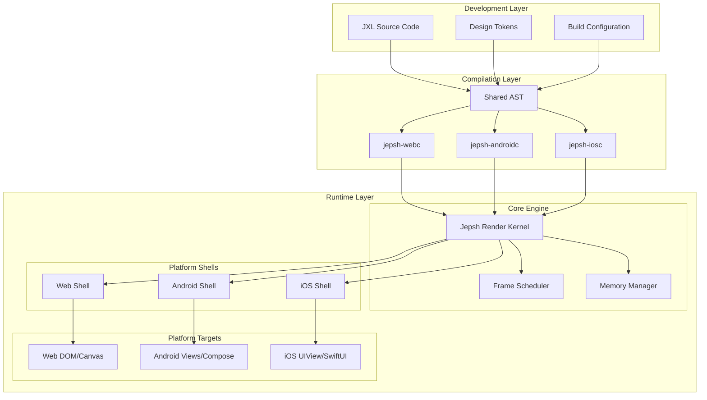
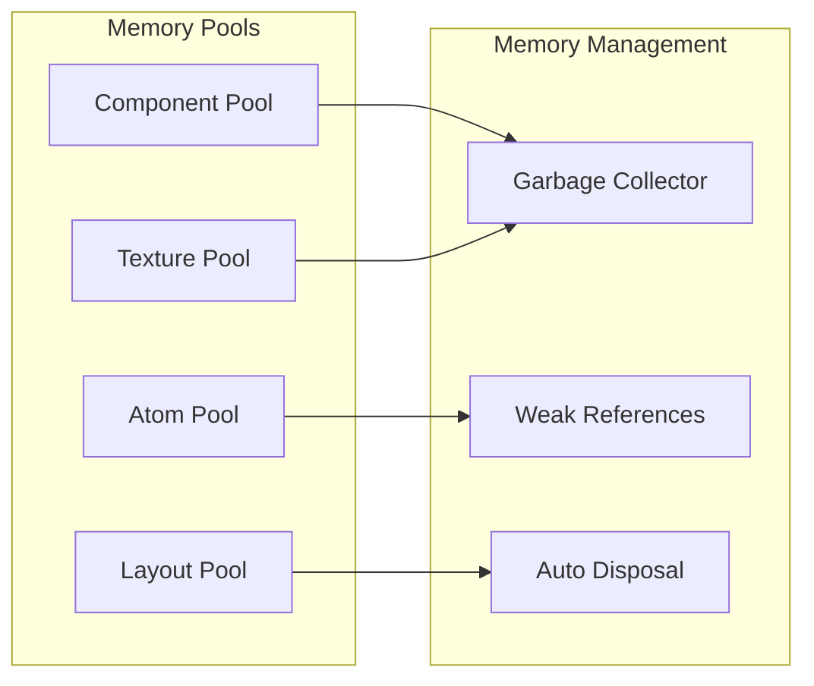
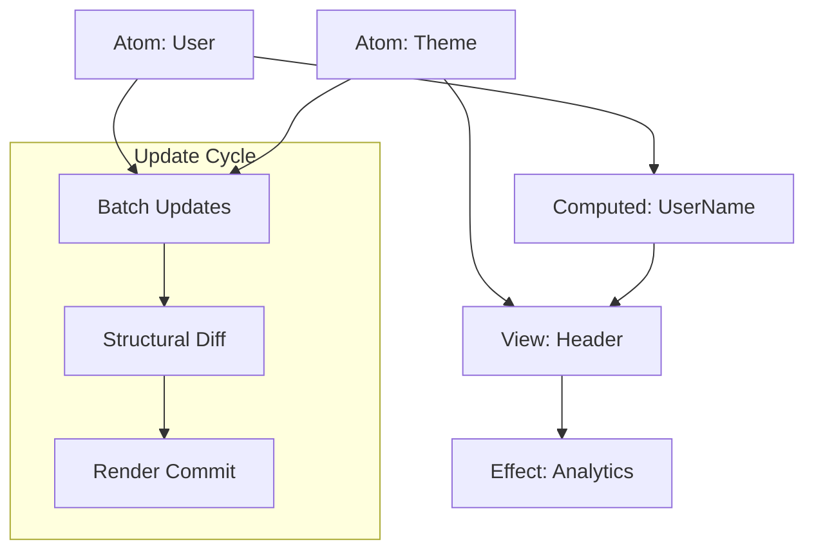
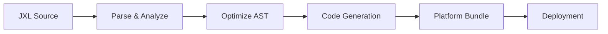

# Jepsh Framework - Architecture Overview

## Document Status

- **Target Audience**: Framework Development Team
- **Version**: Draft v1.0
- **Last Updated**: July 2025
- **Status Indicators**:
  - 🚧 **Planned**: Not yet implemented (post-α)
  - ⚡ **In Development**: Currently being built (α phase)
  - ✅ **Implemented**: Available in current build

---

## 1. Executive Summary

Jepsh is a next-generation universal framework designed around three core principles: Performance by Default, Simplified State Management, and True Cross-Platform Consistency. The architecture employs a multi-layered approach with a custom domain-specific language (JXL), a high-performance render kernel, and adaptive platform shells.

### Key Architectural Decisions

- **Language-First Approach**: JXL as the primary development interface
- **Kernel-Shell Architecture**: Separation of rendering logic from platform adaptation
- **Zero-Cost Abstractions**: Compile-time optimizations over runtime flexibility
- **Reactive-First State**: Atom-based reactivity as the foundational primitive

---

## 2. System Architecture Overview



---

## 3. Architectural Layers

### 3.1 Language Layer (JXL)

**Status**: ⚡ In Development

The JXL (Jepsh eXtensible Language) serves as the unified development interface across all platforms.

**Key Components**:

- **Syntax Parser**: Converts JXL syntax to platform-agnostic AST
- **Type System**: Shared type definitions with platform-specific mappings
- **Reactive Primitives**: Built-in `atom`, `signal`, and `computed` constructs
- **Component Model**: Declarative UI component definitions

**Performance Characteristics**:

- Zero-cost abstractions through compile-time transformation
- Static analysis for dead code elimination
- Automatic memory layout optimization

### 3.2 Compilation Layer

**Status**: ⚡ In Development (Web), 🚧 Planned (Mobile)

Platform-specific compilers that transform JXL AST into optimized native code.

**Shared Infrastructure**:

- **AST Generator**: Common intermediate representation
- **Optimization Pipeline**: Cross-platform performance optimizations
- **Code Generation**: Platform-specific output generation

**Platform Compilers**:

- **jepsh-webc**: TypeScript + WASM generation
- **jepsh-androidc**: Kotlin bytecode generation
- **jepsh-iosc**: Swift native compilation

### 3.3 Runtime Layer

**Status**: ⚡ In Development (Core), 🚧 Planned (Shells)

The runtime layer consists of the core engine and platform-specific shells.

**Core Engine**:

- **Jepsh Render Kernel**: Cross-platform rendering abstraction
- **Frame Scheduler**: 60 FPS guarantee system
- **Memory Manager**: Zero-copy memory optimization
- **Reactive Store**: Atom-based state management

**Adaptive Shells**:

- **Web Shell**: DOM/Canvas integration with WebWorker support
- **Android Shell**: View/Compose integration with Kotlin coroutines
- **iOS Shell**: UIView/SwiftUI integration with Swift Concurrency

---

## 4. Performance Architecture

### 4.1 Compile-Time Performance

- **Tree Shaking**: Unused reactivity and layout code elimination
- **Layout Pre-Calculation**: Static layout computation at build time
- **Binary Splitting**: Modular WASM bundles (<50KB initial)
- **Dead Code Elimination**: Aggressive unused code removal

### 4.2 Runtime Performance

- **Frame-Budget Scheduler**: Micro-task batching for 60 FPS
- **Zero-Copy Memory**: Direct GPU/disk memory mapping
- **Off-Main-Thread Rendering**: Worker-based rendering pipeline
- **Structural Diffing**: Lightweight VDOM alternative (4× performance improvement)

### 4.3 Memory Architecture



---

## 5. Cross-Platform Consistency

### 5.1 Render Kernel Abstraction

The Jepsh Render Kernel provides a unified rendering API that abstracts platform differences while maintaining native performance.

**Core Abstractions**:

- **Layout Engine**: Flexbox-based layout with platform-specific optimizations
- **Paint System**: Vector and raster graphics abstraction
- **Event System**: Unified gesture and input handling
- **Animation Engine**: Hardware-accelerated animations

### 5.2 Adaptive Shell Interface

Each platform shell implements a standardized interface for kernel integration:

```typescript
interface AdaptiveShell {
  render(tree: RenderTree): void;
  handleEvent(event: UnifiedEvent): void;
  scheduleUpdate(callback: FrameCallback): void;
  allocateTexture(spec: TextureSpec): TextureHandle;
}
```

### 5.3 Design Token System

Platform-agnostic design tokens automatically map to native styling systems:

- **Web**: CSS Custom Properties
- **Android**: Material Design tokens
- **iOS**: Human Interface Guidelines values

---

## 6. State Management Architecture

### 6.1 Atom System

The reactive store is built on a single primitive: `Atom<T>`

**Core Features**:

- **Structural Sharing**: Immutable updates with minimal memory allocation
- **Dependency Tracking**: Automatic subscription management
- **Batched Updates**: Multiple atom changes processed in single frame
- **Persistence Layer**: Built-in offline and multi-device sync

### 6.2 Reactivity Graph



---

## 7. Threading and Concurrency

### 7.1 Threading Model

- **Main Thread**: UI updates and user interaction only
- **Render Thread**: Layout calculation and paint operations
- **Compute Thread**: State updates and business logic
- **I/O Thread**: Network requests and file operations

### 7.2 Platform-Specific Concurrency

- **Web**: Web Workers with SharedArrayBuffer
- **Android**: Kotlin Coroutines with structured concurrency
- **iOS**: Swift Concurrency with async/await

---

## 8. Security Architecture

### 8.1 Compile-Time Security

- **XSS Prevention**: Automatic escaping in JXL templates
- **Secret Management**: Environment variable injection without bundling
- **Type Safety**: Static analysis for memory safety

### 8.2 Runtime Security

- **Memory Protection**: Bounds checking in WASM/native code
- **CSRF Protection**: Auto-generated double-submit tokens
- **Resource Cleanup**: Automatic disposal of composables/views

---

## 9. Development and Debugging

### 9.1 Development Tools

- **Hot Reload**: Cross-platform development server
- **Time-Travel Debugger**: State inspection across platforms
- **Performance Profiler**: Frame timing and memory analysis
- **State Heat-Map**: Real-time reactivity visualization

### 9.2 Build Pipeline



---

## 10. Implementation Timeline

### Phase α (Q4 2025): Web Foundation

- ✅ JXL parser and basic AST
- ⚡ jepsh-webc compiler
- ⚡ Core render kernel (Web)
- ⚡ Basic reactive store
- 🚧 Web shell implementation

### Phase β (Q2 2026): Mobile Expansion

- 🚧 jepsh-androidc and jepsh-iosc compilers
- 🚧 Android and iOS shells
- 🚧 Cross-platform tooling
- 🚧 Performance optimization suite

### Phase GA (Q4 2026): Production Ready

- 🚧 Complete platform parity
- 🚧 Advanced debugging tools
- 🚧 Comprehensive documentation
- 🚧 Community ecosystem

---

## 11. Related Documents

- **[JXL Language Specification](../specs/jxl.md)** - Detailed language syntax and semantics
- **[Render Kernel Architecture](./render-kernel.md)** - Core rendering system design
- **[Adaptive Shell Specifications](../specs/adaptive-shell.md)** - Platform integration interfaces
  <!-- - **[Performance Optimization Guide](#)** - Detailed performance strategies -->
  <!-- - **[State Management System](#)** - Reactive store implementation -->
  <!-- - **[Build System Architecture](#)** - Compilation and tooling pipeline -->
