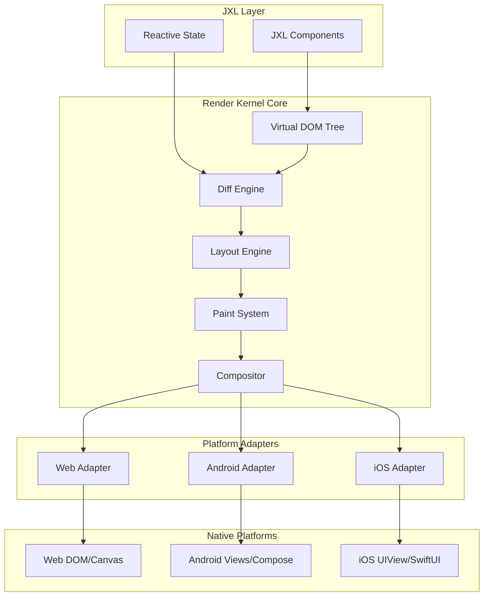
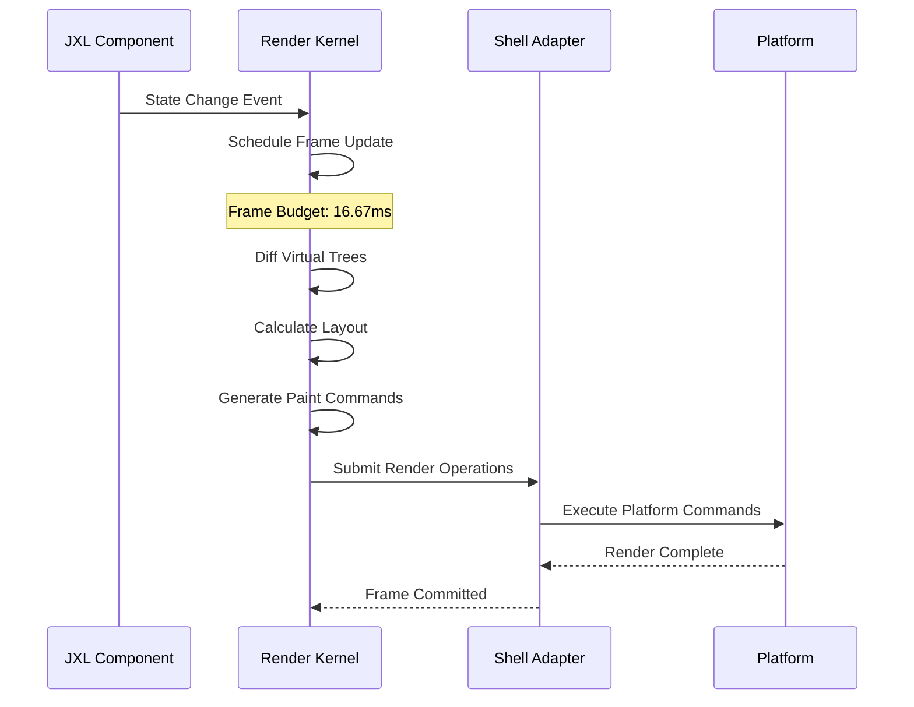
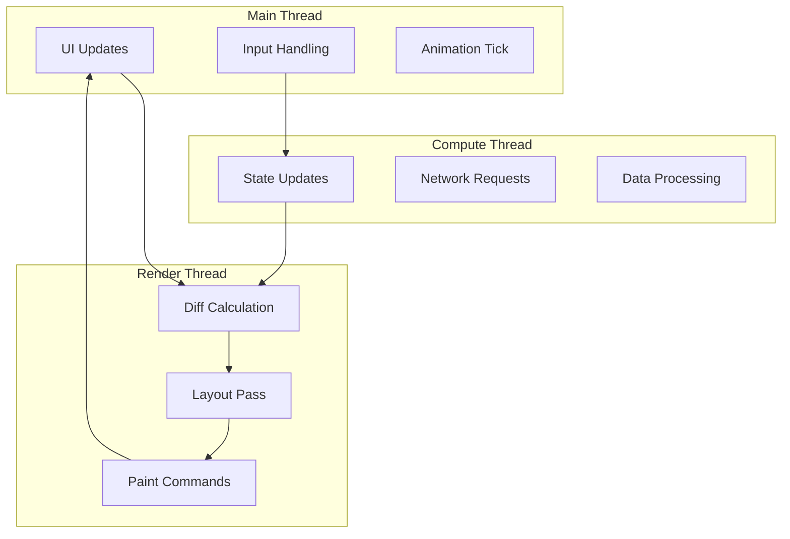

# Jepsh Render Kernel Architecture

## Document Status

- **Target Audience**: Framework Development Team
- **Version**: Draft v1.0
- **Last Updated**: July 2025
- **Implementation Status**:
  - 🚧 **Planned**: Architecture defined, not implemented
  - ⚡ **In Development**: Currently being built
  - ✅ **Implemented**: Available in current build

---

## 1. Render Kernel Overview

The Jepsh Render Kernel is a high-performance, cross-platform rendering engine that serves as the core abstraction layer between JXL components and platform-native UI systems. It provides unified rendering semantics while maintaining native performance characteristics on each target platform.

### 1.1 Design Principles

- **Platform Abstraction**: Hide platform differences behind a unified API
- **Zero-Copy Rendering**: Minimize memory allocations and data copying
- **Frame-Budget Scheduling**: Guarantee 60 FPS through intelligent work scheduling
- **Incremental Rendering**: Only update changed UI regions

### 1.2 Architecture Goals

- **Performance**: Match or exceed native platform performance
- **Consistency**: Identical visual output across all platforms
- **Flexibility**: Support both immediate and retained mode rendering
- **Scalability**: Handle complex UIs with thousands of components

---

## 2. System Architecture

### 2.1 High-Level Architecture ⚡



### 2.2 Core Components

#### Virtual DOM Tree ⚡

**Purpose**: Platform-agnostic representation of UI hierarchy
**Implementation**: Lightweight node structure with minimal memory footprint

```typescript
interface VirtualNode {
  type: ComponentType;
  props: Record<string, any>;
  children: VirtualNode[];
  key?: string;
  ref?: NodeRef;

  // Performance optimization fields
  isStatic: boolean; // Never changes
  lastRenderHash: number; // For skip detection
  layoutCache?: LayoutResult; // Cached layout calculations
}
```

#### Diff Engine ⚡

**Purpose**: Minimal change detection between render cycles
**Algorithm**: Modified React-style reconciliation with performance enhancements

```typescript
interface DiffResult {
  operations: RenderOperation[];
  affectedRegions: Rectangle[];
  priority: RenderPriority;
}

enum RenderOperation {
  CREATE_NODE,
  UPDATE_PROPS,
  MOVE_NODE,
  DELETE_NODE,
  UPDATE_TEXT,
  BATCH_UPDATE,
}
```

#### Layout Engine ⚡

**Purpose**: Cross-platform layout calculation
**Algorithm**: Optimized Flexbox implementation with custom extensions

#### Paint System 🚧

**Purpose**: Convert layout results to drawing commands
**Implementation**: Platform-agnostic graphics primitives

#### Compositor 🚧

**Purpose**: Optimize and batch drawing operations for each platform

---

## 3. Rendering Pipeline

### 3.1 Frame Rendering Cycle ⚡



### 3.2 Performance Budget Allocation ⚡

**Total Frame Budget: 16.67ms (60 FPS)**

| Phase            | Budget | Description              |
| ---------------- | ------ | ------------------------ |
| Diff Calculation | 2ms    | Virtual tree comparison  |
| Layout Pass      | 6ms    | Flexbox calculations     |
| Paint Generation | 4ms    | Drawing command creation |
| Platform Commit  | 3ms    | Native UI updates        |
| Buffer           | 1.67ms | Safety margin            |

### 3.3 Render Priority System ⚡

```typescript
enum RenderPriority {
  IMMEDIATE = 0, // User interactions, animations
  HIGH = 1, // Visible content updates
  NORMAL = 2, // Standard component updates
  LOW = 3, // Background prefetching
  IDLE = 4, // Cleanup, optimization
}

class FrameScheduler {
  private taskQueue: PriorityQueue<RenderTask>;
  private frameDeadline: number;

  scheduleWork(task: RenderTask, priority: RenderPriority): void {
    this.taskQueue.enqueue(task, priority);
    this.requestFrame();
  }

  private executeFrame(): void {
    this.frameDeadline = performance.now() + 16.67;

    while (this.hasTimeRemaining() && !this.taskQueue.isEmpty()) {
      const task = this.taskQueue.dequeue();
      task.execute();
    }

    if (!this.taskQueue.isEmpty()) {
      this.requestFrame(); // Continue in next frame
    }
  }
}
```

---

## 4. Layout Engine

### 4.1 Layout Algorithm ⚡

The layout engine implements an optimized Flexbox algorithm with caching and incremental updates.

```typescript
interface LayoutNode {
  // Input properties
  style: LayoutStyle;
  children: LayoutNode[];

  // Computed properties
  computedStyle: ComputedStyle;
  layout: LayoutResult;

  // Optimization fields
  isDirty: boolean;
  lastStyleHash: number;
  hasStaticLayout: boolean;
}

interface LayoutResult {
  x: number;
  y: number;
  width: number;
  height: number;
  baseline: number;

  // For debugging and tools
  debugInfo?: LayoutDebugInfo;
}
```

### 4.2 Layout Phases ⚡

#### Phase 1: Style Resolution

```typescript
class StyleResolver {
  resolveStyle(node: VirtualNode, parentStyle: ComputedStyle): ComputedStyle {
    // 1. Apply inherited properties
    const inherited = this.inheritProperties(parentStyle);

    // 2. Apply component styles
    const componentStyle = this.resolveComponentStyle(node.type);

    // 3. Apply inline styles
    const inlineStyle = node.props.style || {};

    // 4. Apply design tokens
    const tokenStyle = this.resolveDesignTokens(inlineStyle);

    return this.combineStyles(inherited, componentStyle, tokenStyle, inlineStyle);
  }
}
```

#### Phase 2: Layout Calculation

```typescript
class FlexboxLayout {
  computeLayout(node: LayoutNode, availableWidth: number, availableHeight: number): LayoutResult {
    // Skip computation if layout is cached and valid
    if (!node.isDirty && node.layout) {
      return node.layout;
    }

    // Main layout algorithm
    const result = this.flexboxAlgorithm(node, availableWidth, availableHeight);

    // Cache result
    node.layout = result;
    node.isDirty = false;

    return result;
  }

  private flexboxAlgorithm(
    node: LayoutNode,
    availableWidth: number,
    availableHeight: number
  ): LayoutResult {
    // 1. Determine main and cross axis
    const isRow = node.style.flexDirection === 'row';

    // 2. Calculate sizes of flex items
    const itemSizes = this.calculateFlexItemSizes(
      node.children,
      availableWidth,
      availableHeight,
      isRow
    );

    // 3. Position items along main axis
    const mainAxisPositions = this.positionMainAxis(node, itemSizes);

    // 4. Position items along cross axis
    const crossAxisPositions = this.positionCrossAxis(node, itemSizes);

    // 5. Combine positions and return result
    return this.combinePositions(mainAxisPositions, crossAxisPositions);
  }
}
```

### 4.3 Layout Optimizations ⚡

#### Static Layout Detection

```typescript
class LayoutOptimizer {
  analyzeStaticLayout(node: LayoutNode): boolean {
    // Check if layout will never change
    const hasStaticSize = this.hasFixedDimensions(node.style);
    const hasStaticChildren = node.children.every((child) => this.analyzeStaticLayout(child));
    const hasNoFlexGrow = node.style.flexGrow === 0;

    if (hasStaticSize && hasStaticChildren && hasNoFlexGrow) {
      node.hasStaticLayout = true;
      return true;
    }

    return false;
  }
}
```

#### Layout Caching

```typescript
class LayoutCache {
  private cache = new WeakMap<LayoutNode, Map<string, LayoutResult>>();

  getCachedLayout(node: LayoutNode, constraints: LayoutConstraints): LayoutResult | null {
    const nodeCache = this.cache.get(node);
    if (!nodeCache) return null;

    const key = this.constraintsToKey(constraints);
    return nodeCache.get(key) || null;
  }

  setCachedLayout(node: LayoutNode, constraints: LayoutConstraints, result: LayoutResult): void {
    let nodeCache = this.cache.get(node);
    if (!nodeCache) {
      nodeCache = new Map();
      this.cache.set(node, nodeCache);
    }

    const key = this.constraintsToKey(constraints);
    nodeCache.set(key, result);
  }
}
```

---

## 5. Paint System

### 5.1 Paint Commands 🚧

The paint system converts layout results into platform-agnostic drawing commands.

```typescript
interface PaintCommand {
  type: PaintCommandType;
  bounds: Rectangle;
  style: PaintStyle;
  priority: number;
}

enum PaintCommandType {
  FILL_RECT,
  STROKE_RECT,
  DRAW_TEXT,
  DRAW_IMAGE,
  DRAW_PATH,
  CLIP_RECT,
  SAVE_STATE,
  RESTORE_STATE,
  TRANSFORM,
  COMPOSITE_LAYER,
}

interface PaintStyle {
  fillColor?: Color;
  strokeColor?: Color;
  strokeWidth?: number;
  opacity?: number;
  filter?: FilterEffect[];
  transform?: Transform;
}
```

### 5.2 Paint Optimization 🚧

#### Command Batching

```typescript
class PaintBatcher {
  private commandQueue: PaintCommand[] = [];
  private currentBatch: PaintBatch | null = null;

  addCommand(command: PaintCommand): void {
    // Try to batch with previous command
    if (this.canBatch(command)) {
      this.currentBatch!.commands.push(command);
    } else {
      // Finish current batch and start new one
      if (this.currentBatch) {
        this.commandQueue.push(this.finalizeBatch(this.currentBatch));
      }
      this.currentBatch = this.createBatch(command);
    }
  }

  private canBatch(command: PaintCommand): boolean {
    if (!this.currentBatch) return false;

    // Batch similar commands with compatible styles
    const lastCommand = this.currentBatch.commands[this.currentBatch.commands.length - 1];
    return (
      command.type === lastCommand.type && this.stylesCompatible(command.style, lastCommand.style)
    );
  }
}
```

#### Layer Management

```typescript
class LayerManager {
  private layers: Map<number, PaintLayer> = new Map();

  createLayer(id: number, properties: LayerProperties): PaintLayer {
    const layer = new PaintLayer(id, properties);
    this.layers.set(id, layer);
    return layer;
  }

  compositeLayer(layer: PaintLayer, commands: PaintCommand[]): CompositeResult {
    // Create offscreen surface for layer
    const surface = this.createOffscreenSurface(layer.bounds);

    // Render commands to surface
    this.renderToSurface(surface, commands);

    // Apply layer effects (opacity, filters, etc.)
    this.applyLayerEffects(surface, layer.properties);

    return {
      surface,
      bounds: layer.bounds,
      needsComposite: true,
    };
  }
}
```

---

## 6. Memory Management

### 6.1 Object Pooling ⚡

```typescript
class ObjectPool<T> {
  private available: T[] = [];
  private active = new Set<T>();
  private factory: () => T;
  private reset: (obj: T) => void;

  constructor(factory: () => T, reset: (obj: T) => void, initialSize = 10) {
    this.factory = factory;
    this.reset = reset;

    // Pre-populate pool
    for (let i = 0; i < initialSize; i++) {
      this.available.push(factory());
    }
  }

  acquire(): T {
    let obj = this.available.pop();
    if (!obj) {
      obj = this.factory();
    }

    this.active.add(obj);
    return obj;
  }

  release(obj: T): void {
    if (this.active.has(obj)) {
      this.active.delete(obj);
      this.reset(obj);
      this.available.push(obj);
    }
  }
}

// Usage for VirtualNodes
const virtualNodePool = new ObjectPool(
  () => ({}) as VirtualNode,
  (node) => {
    node.type = null;
    node.props = {};
    node.children = [];
    node.key = undefined;
  }
);
```

### 6.2 Memory-Mapped Textures ⚡

```typescript
class TextureManager {
  private textureCache = new Map<string, Texture>();
  private memoryMappedTextures = new WeakMap<Texture, MemoryMapping>();

  loadTexture(url: string): Promise<Texture> {
    // Check cache first
    if (this.textureCache.has(url)) {
      return Promise.resolve(this.textureCache.get(url)!);
    }

    // Load and memory-map texture
    return this.loadAndMapTexture(url);
  }

  private async loadAndMapTexture(url: string): Promise<Texture> {
    // Load texture data
    const response = await fetch(url);
    const arrayBuffer = await response.arrayBuffer();

    // Create memory mapping for zero-copy access
    const mapping = this.createMemoryMapping(arrayBuffer);

    // Create platform-specific texture
    const texture = await this.createPlatformTexture(mapping);

    // Cache results
    this.textureCache.set(url, texture);
    this.memoryMappedTextures.set(texture, mapping);

    return texture;
  }
}
```

### 6.3 Automatic Cleanup ⚡

```typescript
class ResourceManager {
  private cleanupTasks = new Set<CleanupTask>();
  private gcObserver: FinalizationRegistry<CleanupTask>;

  constructor() {
    this.gcObserver = new FinalizationRegistry((cleanupTask) => {
      cleanupTask.cleanup();
      this.cleanupTasks.delete(cleanupTask);
    });
  }

  trackResource<T extends object>(resource: T, cleanup: () => void): void {
    const task = { cleanup };
    this.cleanupTasks.add(task);
    this.gcObserver.register(resource, task);
  }

  // Manual cleanup for critical resources
  cleanup(): void {
    for (const task of this.cleanupTasks) {
      task.cleanup();
    }
    this.cleanupTasks.clear();
  }
}
```

---

## 7. Threading and Concurrency

### 7.1 Multi-Threading Architecture ⚡



### 7.2 Work Scheduling ⚡

```typescript
class WorkScheduler {
  private mainThreadTasks = new TaskQueue();
  private renderThreadTasks = new TaskQueue();
  private computeThreadTasks = new TaskQueue();

  scheduleWork(task: RenderTask, thread: ThreadType): void {
    switch (thread) {
      case ThreadType.MAIN:
        this.mainThreadTasks.enqueue(task);
        this.requestMainThreadWork();
        break;

      case ThreadType.RENDER:
        this.renderThreadTasks.enqueue(task);
        this.postMessageToRenderThread({ type: 'WORK_AVAILABLE' });
        break;

      case ThreadType.COMPUTE:
        this.computeThreadTasks.enqueue(task);
        this.postMessageToComputeThread({ type: 'WORK_AVAILABLE' });
        break;
    }
  }

  private async executeRenderWork(): Promise<void> {
    const startTime = performance.now();
    const timeLimit = 16.67; // 60 FPS budget

    while (performance.now() - startTime < timeLimit) {
      const task = this.renderThreadTasks.dequeue();
      if (!task) break;

      await task.execute();
    }

    // Communicate results back to main thread
    this.postMessageToMainThread({
      type: 'RENDER_COMPLETE',
      renderData: this.collectRenderResults(),
    });
  }
}
```

### 7.3 Platform-Specific Threading 🚧

#### Web Workers

```typescript
// Main thread
class WebRenderKernel {
  private renderWorker: Worker;
  private computeWorker: Worker;

  constructor() {
    this.renderWorker = new Worker('/render-worker.js');
    this.computeWorker = new Worker('/compute-worker.js');

    this.setupWorkerCommunication();
  }

  private setupWorkerCommunication(): void {
    this.renderWorker.onmessage = (event) => {
      const { type, data } = event.data;

      switch (type) {
        case 'RENDER_COMPLETE':
          this.handleRenderComplete(data);
          break;
        case 'LAYOUT_RESULT':
          this.handleLayoutResult(data);
          break;
      }
    };
  }
}

// Render worker
self.onmessage = (event) => {
  const { type, data } = event.data;

  switch (type) {
    case 'DIFF_TREES':
      const diffResult = performDiff(data.oldTree, data.newTree);
      self.postMessage({ type: 'DIFF_COMPLETE', data: diffResult });
      break;

    case 'CALCULATE_LAYOUT':
      const layoutResult = calculateLayout(data.nodes, data.constraints);
      self.postMessage({ type: 'LAYOUT_COMPLETE', data: layoutResult });
      break;
  }
};
```

#### Android Coroutines

```kotlin
// Kotlin coroutine-based threading
class AndroidRenderKernel {
    private val renderScope = CoroutineScope(Dispatchers.Default)
    private val mainScope = CoroutineScope(Dispatchers.Main)

    fun scheduleRender(tree: VirtualTree) {
        renderScope.launch {
            // Background processing
            val diffResult = calculateDiff(tree)
            val layoutResult = calculateLayout(diffResult)
            val paintCommands = generatePaintCommands(layoutResult)

            // Switch to main thread for UI updates
            mainScope.launch {
                commitToNativeViews(paintCommands)
            }
        }
    }
}
```

#### iOS Swift Concurrency

```swift
// Swift async/await threading
class IOSRenderKernel {
    @MainActor
    func scheduleRender(tree: VirtualTree) async {
        // Background processing
        let (diffResult, layoutResult, paintCommands) = await withTaskGroup(of: RenderData.self) { group in
            group.addTask { await self.calculateDiff(tree) }
            group.addTask { await self.calculateLayout(diffResult) }
            group.addTask { await self.generatePaintCommands(layoutResult) }

            // Collect results
            var results: [RenderData] = []
            for await result in group {
                results.append(result)
            }
            return (results[0], results[1], results[2])
        }

        // Commit on main thread
        await commitToNativeViews(paintCommands)
    }
}
```

---

## 8. Platform Adapters

### 8.1 Adapter Interface 🚧

```typescript
interface PlatformAdapter {
  // Core rendering methods
  createSurface(bounds: Rectangle): RenderSurface;
  commitRenderOperations(operations: RenderOperation[]): void;

  // Event handling
  registerEventHandler(type: EventType, handler: EventHandler): void;
  synthesizeEvent(event: SyntheticEvent): void;

  // Resource management
  loadTexture(source: TextureSource): Promise<PlatformTexture>;
  createFont(descriptor: FontDescriptor): PlatformFont;

  // Performance optimization
  enableHardwareAcceleration(): boolean;
  getPerformanceMetrics(): PerformanceMetrics;
}
```

### 8.2 Web Adapter ⚡

```typescript
class WebPlatformAdapter implements PlatformAdapter {
  private canvas: HTMLCanvasElement;
  private context: CanvasRenderingContext2D | WebGLRenderingContext;
  private useWebGL: boolean;

  constructor(container: HTMLElement, options: WebAdapterOptions) {
    this.canvas = document.createElement('canvas');
    this.useWebGL = options.enableWebGL && this.supportsWebGL();

    if (this.useWebGL) {
      this.context = this.canvas.getContext('webgl2') || this.canvas.getContext('webgl');
    } else {
      this.context = this.canvas.getContext('2d');
    }

    container.appendChild(this.canvas);
  }

  commitRenderOperations(operations: RenderOperation[]): void {
    if (this.useWebGL) {
      this.commitWebGLOperations(operations);
    } else {
      this.commitCanvas2DOperations(operations);
    }
  }

  private commitCanvas2DOperations(operations: RenderOperation[]): void {
    const ctx = this.context as CanvasRenderingContext2D;

    for (const op of operations) {
      switch (op.type) {
        case RenderOpType.FILL_RECT:
          ctx.fillStyle = op.style.fillColor;
          ctx.fillRect(op.bounds.x, op.bounds.y, op.bounds.width, op.bounds.height);
          break;

        case RenderOpType.DRAW_TEXT:
          ctx.font = op.style.font;
          ctx.fillStyle = op.style.textColor;
          ctx.fillText(op.text, op.bounds.x, op.bounds.y);
          break;
      }
    }
  }

  private commitWebGLOperations(operations: RenderOperation[]): void {
    const gl = this.context as WebGLRenderingContext;

    // Batch operations into draw calls
    const batches = this.batchOperations(operations);

    for (const batch of batches) {
      this.executeWebGLBatch(gl, batch);
    }
  }
}
```

### 8.3 Android Adapter 🚧

```kotlin
class AndroidPlatformAdapter(
    private val context: Context,
    private val container: ViewGroup
) : PlatformAdapter {

    private val viewCache = mutableMapOf<String, View>()
    private val layoutCache = mutableMapOf<String, LayoutParams>()

    override fun commitRenderOperations(operations: List<RenderOperation>) {
        // Convert render operations to Android View operations
        val viewOperations = operations.map { convertToViewOperation(it) }

        // Apply operations to view hierarchy
        container.post {
            applyViewOperations(viewOperations)
        }
    }

    private fun convertToViewOperation(op: RenderOperation): ViewOperation {
        return when (op.type) {
            RenderOpType.CREATE_VIEW -> {
                val view = createAndroidView(op.componentType)
                viewCache[op.id] = view
                ViewOperation.Add(view, op.layoutParams)
            }

            RenderOpType.UPDATE_PROPS -> {
                val view = viewCache[op.id]!!
                ViewOperation.Update(view, op.props)
            }

            RenderOpType.REMOVE_VIEW -> {
                val view = viewCache.remove(op.id)!!
                ViewOperation.Remove(view)
            }
        }
    }

    private fun createAndroidView(componentType: ComponentType): View {
        return when (componentType) {
            ComponentType.TEXT -> TextView(context)
            ComponentType.BUTTON -> Button(context)
            ComponentType.IMAGE -> ImageView(context)
            ComponentType.CONTAINER -> LinearLayout(context)
            else -> View(context)
        }
    }
}
```

### 8.4 iOS Adapter 🚧

```swift
class IOSPlatformAdapter: PlatformAdapter {
    private let containerView: UIView
    private var viewCache: [String: UIView] = [:]
    private var constraintCache: [String: [NSLayoutConstraint]] = [:]

    init(containerView: UIView) {
        self.containerView = containerView
    }

    func commitRenderOperations(_ operations: [RenderOperation]) {
        // Convert render operations to UIView operations
        let viewOperations = operations.map { convertToViewOperation($0) }

        // Apply operations on main queue
        DispatchQueue.main.async {
            self.applyViewOperations(viewOperations)
        }
    }

    private func convertToViewOperation(_ op: RenderOperation) -> ViewOperation {
        switch op.type {
        case .createView:
            let view = createIOSView(op.componentType)
            viewCache[op.id] = view
            return ViewOperation.add(view: view, constraints: op.layoutConstraints)

        case .updateProps:
            let view = viewCache[op.id]!
            return ViewOperation.update(view: view, props: op.props)

        case .removeView:
            let view = viewCache.removeValue(forKey: op.id)!
            return ViewOperation.remove(view: view)
        }
    }

    private func createIOSView(_ componentType: ComponentType) -> UIView {
        switch componentType {
        case .text:
            return UILabel()
        case .button:
            return UIButton(type: .system)
        case .image:
            return UIImageView()
        case .container:
            return UIView()
        default:
            return UIView()
        }
    }
}
```

---

## 9. Performance Monitoring

### 9.1 Performance Metrics ⚡

```typescript
interface PerformanceMetrics {
  frameRate: number;
  renderTime: number;
  layoutTime: number;
  paintTime: number;
  memoryUsage: MemoryUsage;

  // Detailed breakdown
  virtualTreeSize: number;
  diffOperations: number;
  layoutNodes: number;
  paintCommands: number;
}

class PerformanceMonitor {
  private metrics: PerformanceMetrics;
  private samples: PerformanceSample[] = [];
  private maxSamples = 60; // 1 second at 60 FPS

  startFrame(): void {
    this.currentSample = {
      startTime: performance.now(),
      frameStart: performance.now(),
    };
  }

  markPhase(phase: RenderPhase): void {
    const now = performance.now();
    this.currentSample.phases[phase] = now - this.currentSample.phaseStart;
    this.currentSample.phaseStart = now;
  }

  endFrame(): void {
    const now = performance.now();
    this.currentSample.totalTime = now - this.currentSample.frameStart;

    this.samples.push(this.currentSample);
    if (this.samples.length > this.maxSamples) {
      this.samples.shift();
    }

    this.updateMetrics();
  }

  private updateMetrics(): void {
    // Calculate rolling averages
    const recentSamples = this.samples.slice(-30); // Last 0.5 seconds

    this.metrics = {
      frameRate: 1000 / this.average(recentSamples.map((s) => s.totalTime)),
      renderTime: this.average(recentSamples.map((s) => s.phases.render || 0)),
      layoutTime: this.average(recentSamples.map((s) => s.phases.layout || 0)),
      paintTime: this.average(recentSamples.map((s) => s.phases.paint || 0)),
      memoryUsage: this.getCurrentMemoryUsage(),
    };
  }
}
```

### 9.2 Performance Debugging ⚡

```typescript
class RenderDebugger {
  private enabled = false;
  private overlay: DebugOverlay;

  enable(): void {
    this.enabled = true;
    this.overlay = new DebugOverlay();
    this.startProfiling();
  }

  private startProfiling(): void {
    const originalDiff = RenderKernel.prototype.diff;
    const originalLayout = RenderKernel.prototype.calculateLayout;
    const originalPaint = RenderKernel.prototype.generatePaintCommands;

    // Instrument diff phase
    RenderKernel.prototype.diff = function (oldTree, newTree) {
      const start = performance.now();
      const result = originalDiff.call(this, oldTree, newTree);
      const end = performance.now();

      this.debugger.recordPhase('diff', end - start, {
        nodesCompared: this.countNodes(oldTree) + this.countNodes(newTree),
        operationsGenerated: result.operations.length,
      });

      return result;
    };

    // Instrument layout phase
    RenderKernel.prototype.calculateLayout = function (nodes, constraints) {
      const start = performance.now();
      const result = originalLayout.call(this, nodes, constraints);
      const end = performance.now();

      this.debugger.recordPhase('layout', end - start, {
        nodesLayouted: nodes.length,
        cacheMisses: this.layoutCache.misses,
        cacheHits: this.layoutCache.hits,
      });

      return result;
    };

    // Instrument paint phase
    RenderKernel.prototype.generatePaintCommands = function (layoutResult) {
      const start = performance.now();
      const result = originalPaint.call(this, layoutResult);
      const end = performance.now();

      this.debugger.recordPhase('paint', end - start, {
        commandsGenerated: result.length,
        layersCreated: this.layerManager.activeLayerCount,
      });

      return result;
    };
  }

  visualizeRenderTree(tree: VirtualNode): void {
    if (!this.enabled) return;

    const visualization = this.createTreeVisualization(tree);
    this.overlay.showVisualization(visualization);
  }

  highlightPerformanceBottlenecks(): void {
    const bottlenecks = this.identifyBottlenecks();

    for (const bottleneck of bottlenecks) {
      this.overlay.highlightNode(bottleneck.nodeId, {
        color: this.getBottleneckColor(bottleneck.severity),
        message: bottleneck.description,
      });
    }
  }
}
```

---

## 10. Error Handling and Recovery

### 10.1 Render Error Boundaries 🚧

```typescript
class RenderErrorBoundary {
  private fallbackRenderer: FallbackRenderer;
  private errorReporting: ErrorReporter;

  catchRenderError(error: RenderError, context: RenderContext): RenderResult {
    // Log error with context
    this.errorReporting.logError(error, {
      componentStack: context.componentStack,
      virtualTree: context.virtualTree,
      platform: context.platform,
    });

    // Attempt graceful recovery
    const recoveryStrategy = this.selectRecoveryStrategy(error);

    switch (recoveryStrategy) {
      case RecoveryStrategy.RETRY:
        return this.retryRender(context);

      case RecoveryStrategy.FALLBACK:
        return this.fallbackRenderer.render(context);

      case RecoveryStrategy.SKIP:
        return this.skipFailedComponent(context);

      case RecoveryStrategy.CRASH:
        throw error; // Let app-level error handling take over
    }
  }

  private selectRecoveryStrategy(error: RenderError): RecoveryStrategy {
    if (error instanceof LayoutError && error.isRecoverable) {
      return RecoveryStrategy.RETRY;
    }

    if (error instanceof PaintError) {
      return RecoveryStrategy.FALLBACK;
    }

    if (error instanceof ComponentError && !error.isCritical) {
      return RecoveryStrategy.SKIP;
    }

    return RecoveryStrategy.CRASH;
  }
}
```

### 10.2 Memory Leak Detection ⚡

```typescript
class MemoryLeakDetector {
  private componentRegistry = new WeakMap<Component, ComponentMetadata>();
  private allocationTracker: AllocationTracker;

  trackComponent(component: Component): void {
    const metadata = {
      createdAt: Date.now(),
      renderCount: 0,
      memoryFootprint: this.calculateMemoryFootprint(component),
    };

    this.componentRegistry.set(component, metadata);
    this.allocationTracker.trackAllocation(component);
  }

  detectLeaks(): MemoryLeak[] {
    const leaks: MemoryLeak[] = [];
    const currentTime = Date.now();

    // Force garbage collection for accurate measurement
    if (global.gc) {
      global.gc();
    }

    // Check for components that should have been garbage collected
    for (const [component, metadata] of this.componentRegistry) {
      const age = currentTime - metadata.createdAt;

      // If component is older than threshold and hasn't been accessed recently
      if (age > this.LEAK_THRESHOLD && metadata.lastAccess < currentTime - this.ACCESS_THRESHOLD) {
        leaks.push({
          component,
          age,
          memoryFootprint: metadata.memoryFootprint,
          suspectedCause: this.analyzeLeak(component, metadata),
        });
      }
    }

    return leaks;
  }

  private analyzeLeak(component: Component, metadata: ComponentMetadata): LeakCause {
    // Check for common leak patterns
    if (this.hasCircularReferences(component)) {
      return LeakCause.CIRCULAR_REFERENCE;
    }

    if (this.hasUnreleasedEventListeners(component)) {
      return LeakCause.EVENT_LISTENERS;
    }

    if (this.hasActiveTimers(component)) {
      return LeakCause.ACTIVE_TIMERS;
    }

    return LeakCause.UNKNOWN;
  }
}
```

---

## 11. Testing and Validation

### 11.1 Render Testing Framework 🚧

```typescript
class RenderTester {
  private renderKernel: RenderKernel;
  private mockPlatformAdapter: MockPlatformAdapter;

  constructor() {
    this.mockPlatformAdapter = new MockPlatformAdapter();
    this.renderKernel = new RenderKernel(this.mockPlatformAdapter);
  }

  async testRender(component: Component, props: any): Promise<RenderTestResult> {
    // Set up test environment
    this.mockPlatformAdapter.reset();

    // Render component
    const startTime = performance.now();
    const renderResult = await this.renderKernel.render(component, props);
    const endTime = performance.now();

    // Collect results
    return {
      renderTime: endTime - startTime,
      virtualTree: renderResult.virtualTree,
      renderOperations: this.mockPlatformAdapter.getCapturedOperations(),
      memoryUsage: this.getMemoryUsage(),
      errors: this.mockPlatformAdapter.getErrors(),
    };
  }

  assertRenderOutput(expected: ExpectedRenderOutput, actual: RenderTestResult): void {
    // Validate virtual tree structure
    this.assertTreeStructure(expected.tree, actual.virtualTree);

    // Validate render operations
    this.assertRenderOperations(expected.operations, actual.renderOperations);

    // Validate performance characteristics
    this.assertPerformance(expected.performance, actual);
  }

  private assertTreeStructure(expected: VirtualNode, actual: VirtualNode): void {
    expect(actual.type).toBe(expected.type);
    expect(actual.props).toEqual(expected.props);
    expect(actual.children.length).toBe(expected.children.length);

    for (let i = 0; i < expected.children.length; i++) {
      this.assertTreeStructure(expected.children[i], actual.children[i]);
    }
  }
}
```

### 11.2 Performance Regression Testing ⚡

```typescript
class PerformanceRegressionTester {
  private benchmarks: Map<string, PerformanceBenchmark> = new Map();
  private baselineResults: Map<string, BenchmarkResult> = new Map();

  registerBenchmark(name: string, benchmark: PerformanceBenchmark): void {
    this.benchmarks.set(name, benchmark);
  }

  async runBenchmarks(): Promise<BenchmarkReport> {
    const results = new Map<string, BenchmarkResult>();

    for (const [name, benchmark] of this.benchmarks) {
      console.log(`Running benchmark: ${name}`);

      const result = await this.runSingleBenchmark(benchmark);
      results.set(name, result);

      // Check for regressions
      const baseline = this.baselineResults.get(name);
      if (baseline) {
        this.checkForRegression(name, baseline, result);
      }
    }

    return {
      results,
      regressions: this.detectedRegressions,
    };
  }

  private async runSingleBenchmark(benchmark: PerformanceBenchmark): Promise<BenchmarkResult> {
    const iterations = 100;
    const times: number[] = [];

    // Warm up
    for (let i = 0; i < 10; i++) {
      await benchmark.run();
    }

    // Measure performance
    for (let i = 0; i < iterations; i++) {
      const start = performance.now();
      await benchmark.run();
      const end = performance.now();
      times.push(end - start);
    }

    return {
      mean: this.calculateMean(times),
      median: this.calculateMedian(times),
      p95: this.calculatePercentile(times, 95),
      standardDeviation: this.calculateStandardDeviation(times),
      memoryUsage: this.getCurrentMemoryUsage(),
    };
  }

  private checkForRegression(
    name: string,
    baseline: BenchmarkResult,
    current: BenchmarkResult
  ): void {
    const regressionThreshold = 1.1; // 10% slower is considered a regression

    if (current.mean > baseline.mean * regressionThreshold) {
      this.detectedRegressions.push({
        benchmark: name,
        baselineMean: baseline.mean,
        currentMean: current.mean,
        regression: ((current.mean - baseline.mean) / baseline.mean) * 100,
      });
    }
  }
}
```

---

## 12. Future Enhancements

### 12.1 GPU Acceleration 🚧

```typescript
class GPUAcceleration {
  private device: GPUDevice;
  private commandEncoder: GPUCommandEncoder;
  private renderPipeline: GPURenderPipeline;

  async initialize(): Promise<void> {
    const adapter = await navigator.gpu.requestAdapter();
    this.device = await adapter!.requestDevice();

    // Create render pipeline for UI rendering
    this.renderPipeline = this.device.createRenderPipeline({
      layout: 'auto',
      vertex: {
        module: this.device.createShaderModule({
          code: this.getVertexShaderCode(),
        }),
        entryPoint: 'main',
      },
      fragment: {
        module: this.device.createShaderModule({
          code: this.getFragmentShaderCode(),
        }),
        entryPoint: 'main',
        targets: [
          {
            format: 'bgra8unorm',
          },
        ],
      },
    });
  }

  renderWithGPU(renderCommands: PaintCommand[]): void {
    this.commandEncoder = this.device.createCommandEncoder();

    // Convert paint commands to GPU operations
    const gpuCommands = this.convertToGPUCommands(renderCommands);

    // Submit to GPU
    const passEncoder = this.commandEncoder.beginRenderPass({
      colorAttachments: [
        {
          view: this.getCurrentTextureView(),
          loadOp: 'clear',
          storeOp: 'store',
        },
      ],
    });

    passEncoder.setPipeline(this.renderPipeline);

    for (const command of gpuCommands) {
      this.executeGPUCommand(passEncoder, command);
    }

    passEncoder.end();
    this.device.queue.submit([this.commandEncoder.finish()]);
  }
}
```

### 12.2 Server-Side Rendering 🚧

```typescript
class ServerSideRenderer {
  private renderKernel: RenderKernel;
  private headlessAdapter: HeadlessPlatformAdapter;

  constructor() {
    this.headlessAdapter = new HeadlessPlatformAdapter();
    this.renderKernel = new RenderKernel(this.headlessAdapter);
  }

  async renderToString(component: Component, props: any): Promise<SSRResult> {
    // Render component tree
    const renderResult = await this.renderKernel.render(component, props);

    // Serialize to platform-specific markup
    const html = this.serializeToHTML(renderResult.virtualTree);
    const css = this.extractCSS(renderResult.styles);
    const initialData = this.serializeInitialData(renderResult.atoms);

    return {
      html,
      css,
      initialData,
      hydrationScript: this.generateHydrationScript(renderResult),
    };
  }

  private serializeToHTML(tree: VirtualNode): string {
    // Convert virtual tree to HTML string
    const serializer = new HTMLSerializer();
    return serializer.serialize(tree);
  }

  private generateHydrationScript(renderResult: RenderResult): string {
    // Generate client-side script to hydrate the rendered content
    return `
            window.__JEPSH_INITIAL_STATE__ = ${JSON.stringify(renderResult.atoms)};
            window.__JEPSH_RENDER_TREE__ = ${JSON.stringify(renderResult.virtualTree)};
        `;
  }
}
```

### 12.3 Advanced Animation System 🚧

```typescript
class AnimationEngine {
  private activeAnimations = new Set<Animation>();
  private animationFrameRequested = false;

  createAnimation(
    target: VirtualNode,
    property: string,
    from: any,
    to: any,
    options: AnimationOptions
  ): Animation {
    const animation = new Animation({
      target,
      property,
      from,
      to,
      duration: options.duration || 300,
      easing: options.easing || 'ease-out',
      onUpdate: (value) => this.updateProperty(target, property, value),
      onComplete: options.onComplete,
    });

    this.activeAnimations.add(animation);
    this.requestAnimationFrame();

    return animation;
  }

  private requestAnimationFrame(): void {
    if (this.animationFrameRequested) return;

    this.animationFrameRequested = true;
    requestAnimationFrame(() => {
      this.updateAnimations();
      this.animationFrameRequested = false;

      if (this.activeAnimations.size > 0) {
        this.requestAnimationFrame();
      }
    });
  }

  private updateAnimations(): void {
    const currentTime = performance.now();
    const completedAnimations: Animation[] = [];

    for (const animation of this.activeAnimations) {
      const progress = Math.min((currentTime - animation.startTime) / animation.duration, 1);
      const easedProgress = this.applyEasing(progress, animation.easing);

      const currentValue = this.interpolateValue(animation.from, animation.to, easedProgress);

      animation.onUpdate(currentValue);

      if (progress >= 1) {
        completedAnimations.push(animation);
      }
    }

    // Clean up completed animations
    for (const animation of completedAnimations) {
      this.activeAnimations.delete(animation);
      animation.onComplete?.();
    }
  }
}
```

---

## 13. Documentation and Developer Experience

### 13.1 Render Kernel Inspector 🚧

```typescript
class RenderKernelInspector {
  private devToolsConnection: DevToolsConnection;
  private inspectionData: InspectionData;

  enableInspection(): void {
    // Connect to browser dev tools
    this.devToolsConnection = new DevToolsConnection();

    // Register custom panels
    this.devToolsConnection.registerPanel('Jepsh Render Tree', {
      onActivate: () => this.showRenderTree(),
      onUpdate: () => this.updateRenderTree(),
    });

    this.devToolsConnection.registerPanel('Performance Profile', {
      onActivate: () => this.showPerformanceProfile(),
      onUpdate: () => this.updatePerformanceProfile(),
    });
  }

  private showRenderTree(): void {
    const treeData = this.buildTreeInspectionData();
    this.devToolsConnection.updatePanel('Jepsh Render Tree', {
      type: 'tree',
      data: treeData,
    });
  }

  private buildTreeInspectionData(): TreeInspectionData {
    return {
      nodes: this.inspectionData.virtualTree.map((node) => ({
        id: node.id,
        type: node.type,
        props: node.props,
        children: node.children.map((child) => child.id),
        renderTime: node.renderTime,
        memoryUsage: node.memoryUsage,
      })),
      selectedNode: this.inspectionData.selectedNodeId,
    };
  }
}
```

---

## 14. Conclusion

The Jepsh Render Kernel provides a sophisticated, high-performance foundation for cross-platform UI rendering. Its multi-layered architecture ensures optimal performance while maintaining development simplicity and platform consistency.

### Key Architectural Benefits:

1. **Performance Isolation**: Critical rendering logic isolated from platform-specific concerns
2. **Scalable Threading**: Work distributed across multiple threads for optimal frame rates
3. **Memory Efficiency**: Advanced memory management with pooling and zero-copy operations
4. **Developer Experience**: Comprehensive debugging and profiling tools
5. **Future-Proof**: Extensible architecture supporting emerging technologies

### Implementation Priorities:

1. **Phase α**: Core rendering pipeline with Web support
2. **Phase β**: Mobile platform adapters and advanced optimizations
3. **Phase GA**: Full feature parity and production-ready tooling

This architecture document provides the technical foundation for implementing the Render Kernel. The next document will detail the Adaptive Shell specifications that integrate the kernel with each target platform.
