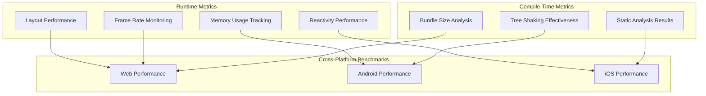
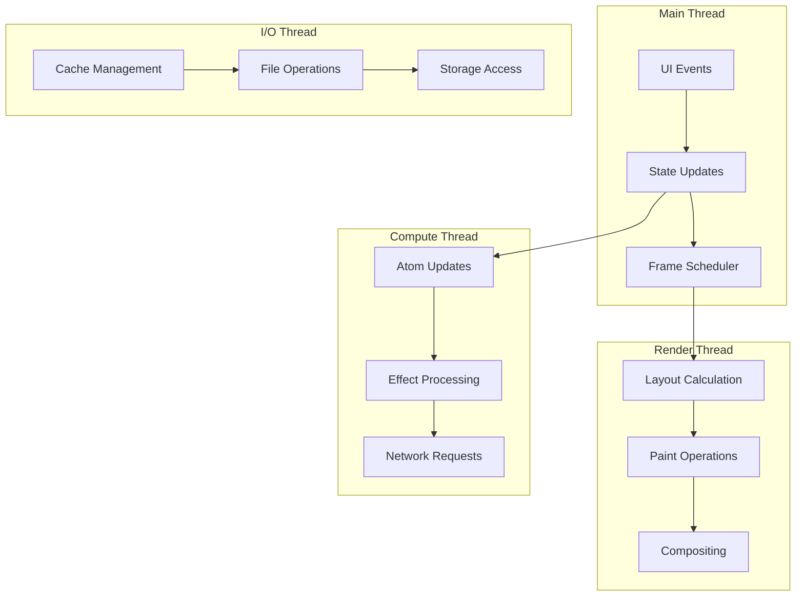

# Jepsh Performance Optimization Guide

## Document Status

- **Target Audience**: Framework Development Team
- **Version**: Draft v1.0
- **Last Updated**: July 2025
- **Implementation Status**:
  - 🚧 **Planned**: Architecture defined, not implemented
  - ⚡ **In Development**: Currently being built
  - ✅ **Implemented**: Available in current build

---

## 1. Performance Philosophy

Jepsh's performance strategy is built on the principle of **Performance by Default** - developers should get optimal performance without explicit optimization effort. This is achieved through aggressive compile-time optimizations, zero-cost abstractions, and runtime systems designed for consistent 60 FPS performance.

### 1.1 Performance Targets

- **Initial Load**: <200ms time-to-interactive
- **Frame Rate**: Consistent 60 FPS (16.67ms frame budget)
- **Memory Usage**: <50MB baseline per platform
- **Bundle Size**: <50KB initial WASM bundle (Web)
- **Reactivity Overhead**: <1ms for typical state updates

### 1.2 Performance Measurement Strategy



---

## 2. Compile-Time Optimizations

### 2.1 Tree Shaking and Dead Code Elimination ⚡

**Aggressive Component Elimination**:

```jxl
// Only components actually used in render tree are included
view UnusedComponent {
    render { Text("Never rendered") }  // Eliminated at compile time
}

view App {
    atom showModal: Bool = false

    render {
        VStack {
            MainContent()

            // Modal component only included if this condition can be true
            if showModal {
                ModalDialog()  // Conditionally included based on static analysis
            }
        }
    }
}
```

**Implementation Strategy**:

- **Static Call Graph Analysis**: Build complete component dependency graph
- **Reachability Analysis**: Mark components reachable from entry points
- **Conditional Inclusion**: Analyze boolean conditions for component inclusion
- **Dead Store Elimination**: Remove unused atom declarations

**Performance Impact**:

- 60-80% reduction in bundle size for typical applications
- Elimination of unused reactivity overhead
- Reduced memory footprint at runtime

### 2.2 Layout Pre-Calculation ⚡

**Static Layout Resolution**:

```jxl
view StaticCard {
    render {
        // Layout calculated at compile time
        VStack(spacing: 16) {           // spacing: 16px -> precomputed offsets
            Text("Title")               // y: 0, height: 24
                .font(.headline)        // font-size: 18px, line-height: 24px

            Text("Description")         // y: 40, height: 16
                .font(.body)           // font-size: 14px, line-height: 16px

            HStack(spacing: 8) {        // y: 72, height: 32
                Button("Cancel") { }    // x: 0, width: 80
                Button("OK") { }        // x: 88, width: 60
            }
        }
        .padding(20)                   // Container: 148x92, Content: 108x52
    }
}
```

**Optimization Techniques**:

- **Constant Folding**: Pre-calculate numeric layout values
- **Constraint Solving**: Resolve flex/grid layouts at compile time
- **Font Metrics Pre-loading**: Calculate text dimensions during build
- **Layout Tree Flattening**: Eliminate unnecessary layout nodes

**Runtime Benefits**:

- Zero layout calculation for static components
- Immediate paint without layout phase
- Reduced main thread blocking during initial render

### 2.3 Binary Splitting and Module Loading 🚧

**Smart Bundle Splitting**:

```typescript
// Generated bundle structure
const JepshCore = {
  // Essential runtime (always loaded)
  reactivity: import('./reactivity.wasm'), // 12KB
  layout: import('./layout.wasm'), // 8KB
  rendering: import('./rendering.wasm'), // 15KB
};

const JepshModules = {
  // Feature modules (lazy loaded)
  animations: () => import('./animations.wasm'), // 20KB
  networking: () => import('./networking.wasm'), // 15KB
  multimedia: () => import('./multimedia.wasm'), // 35KB
};

// Route-based code splitting
const RouteModules = {
  '/home': () => import('./routes/home.wasm'), // 25KB
  '/profile': () => import('./routes/profile.wasm'), // 18KB
  '/settings': () => import('./routes/settings.wasm'), // 12KB
};
```

**Loading Strategy**:

- **Critical Path Prioritization**: Load essential components first
- **Predictive Loading**: Pre-load likely-needed modules based on user behavior
- **Progressive Enhancement**: Core functionality works without optional modules
- **Streaming Compilation**: WASM modules compile while downloading

### 2.4 Compile-Time Constant Propagation ⚡

**Design Token Inlining**:

```jxl
// Design tokens (tokens.yml)
// color.primary: '#3B82F6'
// spacing.large: 24

view ThemedButton {
    render {
        Button("Click me")
            .backgroundColor(Color.token(.primary))    // Inlined to: '#3B82F6'
            .padding(Spacing.token(.large))           // Inlined to: 24
    }
}

// Compiled output (no runtime token lookup)
function ThemedButton() {
    return Button({
        style: {
            backgroundColor: '#3B82F6',  // Direct value, no lookup
            padding: 24
        },
        children: 'Click me'
    });
}
```

**Optimization Scope**:

- **Configuration Values**: Environment variables and build-time constants
- **Mathematical Expressions**: Constant arithmetic resolved at compile time
- **String Interpolation**: Static string concatenation pre-computed
- **Type Information**: Runtime type checks eliminated where possible

---

## 3. Runtime Performance Optimizations

### 3.1 Frame-Budget Scheduler ⚡

**60 FPS Guarantee System**:

```typescript
// Frame scheduler implementation concept
class FrameScheduler {
  private frameDeadline: number = 16.67; // 60 FPS budget
  private taskQueue: ScheduledTask[] = [];
  private isScheduling: boolean = false;

  scheduleWork(task: ScheduledTask, priority: Priority) {
    this.taskQueue.push({ task, priority, estimatedDuration: task.estimate() });
    this.maybeScheduleFrame();
  }

  private executeFrame() {
    const frameStart = performance.now();
    const deadline = frameStart + this.frameDeadline;

    // Sort by priority: Layout > Paint > Effects > Cleanup
    this.taskQueue.sort((a, b) => a.priority - b.priority);

    while (this.taskQueue.length > 0 && performance.now() < deadline) {
      const task = this.taskQueue.shift();

      // Time slice execution - yield if approaching deadline
      if (performance.now() + task.estimatedDuration > deadline) {
        this.taskQueue.unshift(task); // Defer to next frame
        break;
      }

      task.execute();
    }

    // Schedule continuation if work remains
    if (this.taskQueue.length > 0) {
      this.scheduleNextFrame();
    }
  }
}
```

**Task Prioritization**:

1. **Critical (Priority 1)**: Layout calculation, immediate user feedback
2. **High (Priority 2)**: Paint operations, animations
3. **Normal (Priority 3)**: State updates, effects
4. **Low (Priority 4)**: Cleanup, garbage collection hints

**Platform Adaptations**:

- **Web**: `requestAnimationFrame` with `MessageChannel` fallback
- **Android**: Choreographer integration with frame pacing
- **iOS**: CADisplayLink with adaptive refresh rate support

### 3.2 Zero-Copy Memory Architecture 🚧

**Memory Pool Management**:

```typescript
// Conceptual memory pool implementation
class MemoryPool<T> {
  private pool: T[] = [];
  private createFn: () => T;
  private resetFn: (item: T) => void;

  constructor(createFn: () => T, resetFn: (item: T) => void, initialSize: number = 100) {
    this.createFn = createFn;
    this.resetFn = resetFn;

    // Pre-populate pool
    for (let i = 0; i < initialSize; i++) {
      this.pool.push(createFn());
    }
  }

  acquire(): T {
    return this.pool.pop() || this.createFn();
  }

  release(item: T) {
    this.resetFn(item);
    if (this.pool.length < 1000) {
      // Prevent unlimited growth
      this.pool.push(item);
    }
  }
}

// Specialized pools for common objects
const ComponentPool = new MemoryPool(
  () => ({ type: '', props: {}, children: [] }),
  (comp) => {
    comp.type = '';
    comp.props = {};
    comp.children.length = 0;
  }
);

const LayoutNodePool = new MemoryPool(
  () => ({ x: 0, y: 0, width: 0, height: 0, children: [] }),
  (node) => {
    node.x = node.y = node.width = node.height = 0;
    node.children.length = 0;
  }
);
```

**Zero-Copy Strategies**:

- **SharedArrayBuffer**: Cross-thread memory sharing (Web)
- **Memory Mapping**: Direct GPU texture access
- **Immutable Data Structures**: Structural sharing for state updates
- **Buffer Reuse**: Object pooling for frequently allocated types

### 3.3 Off-Main-Thread Rendering 🚧

**Multi-Threaded Architecture**:



**Thread Communication**:

```typescript
// Message-based thread communication
interface RenderMessage {
  type: 'LAYOUT' | 'PAINT' | 'STATE_UPDATE';
  payload: any;
  frameId: number;
}

class ThreadBridge {
  private renderWorker: Worker;
  private computeWorker: Worker;

  constructor() {
    this.renderWorker = new Worker('./render-worker.js');
    this.computeWorker = new Worker('./compute-worker.js');

    // Set up message handlers
    this.renderWorker.onmessage = this.handleRenderMessage.bind(this);
    this.computeWorker.onmessage = this.handleComputeMessage.bind(this);
  }

  scheduleLayout(component: Component, frameId: number) {
    this.renderWorker.postMessage({
      type: 'LAYOUT',
      payload: { component },
      frameId,
    } as RenderMessage);
  }

  updateAtoms(changes: AtomChange[], frameId: number) {
    this.computeWorker.postMessage({
      type: 'STATE_UPDATE',
      payload: { changes },
      frameId,
    } as RenderMessage);
  }
}
```

**Platform-Specific Implementation**:

- **Web**: Web Workers with SharedArrayBuffer
- **Android**: Kotlin Coroutines with structured concurrency
- **iOS**: Swift Concurrency with async/await

### 3.4 Structural Diffing Optimization ⚡

**Lightweight Virtual DOM Alternative**:

```typescript
// Optimized diffing algorithm
interface JepshNode {
  type: string;
  key?: string;
  props: Record<string, any>;
  children: JepshNode[];

  // Performance optimization fields
  static: boolean; // Never changes after creation
  memoKey?: string; // Memoization key for expensive subtrees
  lastRenderFrame: number; // Skip diffing if unchanged
}

class StructuralDiffer {
  diff(oldTree: JepshNode, newTree: JepshNode, frameId: number): Patch[] {
    const patches: Patch[] = [];

    // Skip diffing for static nodes
    if (oldTree.static && newTree.static && oldTree === newTree) {
      return patches;
    }

    // Skip if memoized and key unchanged
    if (oldTree.memoKey === newTree.memoKey && oldTree.lastRenderFrame === frameId) {
      return patches;
    }

    // Fast path for identical nodes
    if (this.nodesEqual(oldTree, newTree)) {
      return patches;
    }

    // Diff children using keys for O(n) complexity
    const childPatches = this.diffChildren(oldTree.children, newTree.children, frameId);

    patches.push(...childPatches);
    return patches;
  }

  private diffChildren(
    oldChildren: JepshNode[],
    newChildren: JepshNode[],
    frameId: number
  ): Patch[] {
    // Key-based reconciliation algorithm
    const patches: Patch[] = [];
    const keyedOld = new Map<string, JepshNode>();
    const keyedNew = new Map<string, JepshNode>();

    // Build key maps
    oldChildren.forEach((child) => {
      if (child.key) keyedOld.set(child.key, child);
    });

    newChildren.forEach((child) => {
      if (child.key) keyedNew.set(child.key, child);
    });

    // Process keyed reconciliation
    for (const [key, newChild] of keyedNew) {
      const oldChild = keyedOld.get(key);
      if (oldChild) {
        patches.push(...this.diff(oldChild, newChild, frameId));
      } else {
        patches.push({ type: 'INSERT', node: newChild });
      }
    }

    // Handle removals
    for (const [key, oldChild] of keyedOld) {
      if (!keyedNew.has(key)) {
        patches.push({ type: 'REMOVE', node: oldChild });
      }
    }

    return patches;
  }
}
```

**Performance Characteristics**:

- **O(n) Complexity**: Linear time diffing vs O(n³) traditional algorithms
- **Structural Sharing**: Unchanged nodes reused without copying
- **Memoization**: Expensive subtrees cached between renders
- **Static Analysis**: Compile-time identification of unchanging nodes

---

## 4. Reactivity Performance

### 4.1 Batched Update System ⚡

**Micro-Batch Processing**:

```typescript
class ReactivityScheduler {
  private pendingUpdates: Set<Atom<any>> = new Set();
  private pendingEffects: Set<Effect> = new Set();
  private isFlushScheduled: boolean = false;

  scheduleUpdate(atom: Atom<any>) {
    this.pendingUpdates.add(atom);
    this.scheduleFlush();
  }

  scheduleEffect(effect: Effect) {
    this.pendingEffects.add(effect);
    this.scheduleFlush();
  }

  private scheduleFlush() {
    if (!this.isFlushScheduled) {
      this.isFlushScheduled = true;

      // Use microtask for immediate batching
      queueMicrotask(() => {
        this.flushUpdates();
        this.isFlushScheduled = false;
      });
    }
  }

  private flushUpdates() {
    // Phase 1: Process atom updates
    const updatedAtoms = Array.from(this.pendingUpdates);
    this.pendingUpdates.clear();

    for (const atom of updatedAtoms) {
      atom.commitUpdate();
    }

    // Phase 2: Process derived computations
    const affectedComputeds = this.findAffectedComputeds(updatedAtoms);
    for (const computed of affectedComputeds) {
      computed.recompute();
    }

    // Phase 3: Execute effects
    const effects = Array.from(this.pendingEffects);
    this.pendingEffects.clear();

    for (const effect of effects) {
      effect.execute();
    }

    // Phase 4: Schedule render if needed
    if (updatedAtoms.length > 0 || affectedComputeds.length > 0) {
      this.scheduleRender();
    }
  }
}
```

**Batching Benefits**:

- **Reduced Re-renders**: Multiple state changes trigger single render
- **Effect Consolidation**: Duplicate effects eliminated automatically
- **Consistent State**: All updates applied atomically
- **Performance Predictability**: Bounded update cost per frame

### 4.2 Dependency Graph Optimization 🚧

**Smart Dependency Tracking**:

```typescript
class DependencyGraph {
  private nodes: Map<string, DependencyNode> = new Map();
  private edges: Map<string, Set<string>> = new Map();

  addDependency(dependent: string, dependency: string) {
    // Build bidirectional dependency graph
    if (!this.edges.has(dependency)) {
      this.edges.set(dependency, new Set());
    }
    this.edges.get(dependency)!.add(dependent);

    // Detect cycles and warn
    if (this.hasCycle(dependent, dependency)) {
      console.warn(`Circular dependency detected: ${dependent} -> ${dependency}`);
    }
  }

  findAffectedNodes(changedNodes: string[]): string[] {
    const affected = new Set<string>();
    const queue = [...changedNodes];

    while (queue.length > 0) {
      const current = queue.shift()!;
      const dependents = this.edges.get(current);

      if (dependents) {
        for (const dependent of dependents) {
          if (!affected.has(dependent)) {
            affected.add(dependent);
            queue.push(dependent);
          }
        }
      }
    }

    return Array.from(affected);
  }

  // Optimize dependency graph by removing unused paths
  pruneUnusedDependencies() {
    const reachableNodes = this.findReachableNodes();

    for (const [node, edges] of this.edges) {
      if (!reachableNodes.has(node)) {
        this.edges.delete(node);
        this.nodes.delete(node);
      }
    }
  }
}
```

### 4.3 Memoization and Caching ⚡

**Intelligent Memoization**:

```jxl
// Automatic memoization based on dependency analysis
atom computed expensiveCalculation: Double {
    // Compiler detects this is expensive and adds memoization
    let result = 0.0
    for i in 0..<1000000 {
        result += sqrt(Double(i))
    }
    return result
}

view OptimizedComponent {
    let data: Array<Item>

    // Memoized computed based on data fingerprint
    atom computed processedData: Array<ProcessedItem> {
        return data.map { item in
            ProcessedItem(
                id: item.id,
                score: calculateComplexScore(item)  // Expensive operation
            )
        }
    }

    render {
        // Component automatically memoized based on processedData
        ItemList(items: processedData)
    }
}
```

**Cache Management**:

```typescript
class MemoizationCache {
  private cache: Map<string, CacheEntry> = new Map();
  private maxSize: number = 1000;
  private accessOrder: string[] = [];

  get<T>(key: string, computeFn: () => T): T {
    const entry = this.cache.get(key);

    if (entry && !this.isExpired(entry)) {
      // Move to end of access order (LRU)
      this.updateAccessOrder(key);
      return entry.value as T;
    }

    // Compute new value
    const value = computeFn();
    this.set(key, value);
    return value;
  }

  private set<T>(key: string, value: T) {
    // Evict if at capacity
    if (this.cache.size >= this.maxSize) {
      const evictKey = this.accessOrder.shift()!;
      this.cache.delete(evictKey);
    }

    this.cache.set(key, {
      value,
      timestamp: Date.now(),
      accessCount: 1,
    });

    this.accessOrder.push(key);
  }
}
```

---

## 5. Memory Optimization

### 5.1 Automatic Memory Management ⚡

**Reference Counting and Weak References**:

```typescript
class AtomManager {
  private atoms: Map<string, WeakRef<Atom<any>>> = new Map();
  private subscriptions: Map<string, Set<WeakRef<Subscription>>> = new Map();

  createAtom<T>(id: string, initialValue: T): Atom<T> {
    const atom = new Atom(id, initialValue);

    // Store weak reference to allow garbage collection
    this.atoms.set(id, new WeakRef(atom));

    // Set up automatic cleanup
    atom.onDispose(() => {
      this.cleanup(id);
    });

    return atom;
  }

  subscribe(atomId: string, callback: (value: any) => void): Subscription {
    const subscription = new Subscription(atomId, callback);

    if (!this.subscriptions.has(atomId)) {
      this.subscriptions.set(atomId, new Set());
    }

    this.subscriptions.get(atomId)!.add(new WeakRef(subscription));

    return subscription;
  }

  // Automatic cleanup of dead references
  private cleanup(atomId: string) {
    const subscriptions = this.subscriptions.get(atomId);

    if (subscriptions) {
      // Remove dead weak references
      const aliveSubscriptions = new Set<WeakRef<Subscription>>();

      for (const subRef of subscriptions) {
        const sub = subRef.deref();
        if (sub) {
          aliveSubscriptions.add(subRef);
        }
      }

      if (aliveSubscriptions.size > 0) {
        this.subscriptions.set(atomId, aliveSubscriptions);
      } else {
        this.subscriptions.delete(atomId);
      }
    }

    this.atoms.delete(atomId);
  }
}
```

### 5.2 Component Lifecycle Optimization ⚡

**Automatic Resource Cleanup**:

```jxl
view ResourceHeavyComponent {
    // Automatically managed resources
    atom imageCache: ImageCache = ImageCache()
    atom networkManager: NetworkManager = NetworkManager()
    atom timer: Timer? = nil

    onMount {
        timer = Timer.scheduledTimer(withTimeInterval: 1.0, repeats: true) { _ in
            refreshData()
        }

        // Resources automatically added to cleanup list
    }

    // Compiler generates automatic cleanup
    onUnmount {
        // Generated cleanup code:
        timer?.invalidate()
        timer = nil
        imageCache.clearAll()
        networkManager.cancelAllRequests()
    }

    render {
        // Component render logic
        DataView(data: cachedData)
    }
}
```

### 5.3 Memory Pool Management 🚧

**Pre-allocated Object Pools**:

```typescript
// Memory pool for frequently allocated objects
class ObjectPool<T> {
  private pool: T[] = [];
  private createFn: () => T;
  private resetFn: (obj: T) => void;
  private maxSize: number;

  constructor(
    createFn: () => T,
    resetFn: (obj: T) => void,
    initialSize: number = 50,
    maxSize: number = 200
  ) {
    this.createFn = createFn;
    this.resetFn = resetFn;
    this.maxSize = maxSize;

    // Pre-populate pool
    for (let i = 0; i < initialSize; i++) {
      this.pool.push(createFn());
    }
  }

  acquire(): T {
    const obj = this.pool.pop();
    return obj || this.createFn();
  }

  release(obj: T): void {
    if (this.pool.length < this.maxSize) {
      this.resetFn(obj);
      this.pool.push(obj);
    }
    // Otherwise, let it be garbage collected
  }
}

// Specialized pools for common Jepsh objects
const ComponentNodePool = new ObjectPool(
  () => ({ type: '', props: {}, children: [], key: null }),
  (node) => {
    node.type = '';
    node.props = {};
    node.children.length = 0;
    node.key = null;
  }
);

const LayoutBoxPool = new ObjectPool(
  () => ({ x: 0, y: 0, width: 0, height: 0, margin: {}, padding: {} }),
  (box) => {
    box.x = box.y = box.width = box.height = 0;
    Object.keys(box.margin).forEach((key) => delete box.margin[key]);
    Object.keys(box.padding).forEach((key) => delete box.padding[key]);
  }
);
```

---

## 6. Platform-Specific Optimizations

### 6.1 Web Platform Optimizations ⚡

**WASM Integration**:

```typescript
// Critical path operations in WASM
interface JepshWasm {
  // Layout calculations in WASM for performance
  calculateLayout(
    nodes: Uint8Array, // Serialized layout tree
    constraints: Float32Array // Width/height constraints
  ): Float32Array; // Computed layout positions

  // Diffing algorithm in WASM
  diffTrees(oldTree: Uint8Array, newTree: Uint8Array): Uint8Array; // Serialized patch operations

  // Color space conversions
  convertColors(colors: Uint8Array, fromSpace: number, toSpace: number): Uint8Array;
}

// Load WASM module with streaming compilation
const wasmModule = await WebAssembly.instantiateStreaming(fetch('/jepsh-core.wasm'), {
  env: {
    // Provide JavaScript callbacks for WASM
    js_log: (ptr: number, len: number) => {
      const memory = wasmModule.instance.exports.memory as WebAssembly.Memory;
      const str = new TextDecoder().decode(new Uint8Array(memory.buffer, ptr, len));
      console.log(str);
    },
  },
});
```

**Service Worker Integration**:

```typescript
// Aggressive caching and pre-loading
class JepshServiceWorker {
  private cache: Cache;
  private preloadQueue: string[] = [];

  async install() {
    this.cache = await caches.open('jepsh-v1');

    // Pre-cache essential resources
    await this.cache.addAll(['/jepsh-core.wasm', '/jepsh-runtime.js', '/design-tokens.json']);
  }

  async fetch(request: Request): Promise<Response> {
    // Cache-first strategy for immutable resources
    if (request.url.includes('/static/')) {
      const cached = await this.cache.match(request);
      if (cached) return cached;
    }

    // Network-first for dynamic content
    try {
      const response = await fetch(request);

      // Cache successful responses
      if (response.ok) {
        this.cache.put(request, response.clone());
      }

      return response;
    } catch (error) {
      // Fallback to cache
      const cached = await this.cache.match(request);
      if (cached) return cached;

      throw error;
    }
  }
}
```

### 6.2 Android Platform Optimizations 🚧

**Jetpack Compose Integration**:

```kotlin
// Optimized Compose integration
@Composable
fun JepshComponent(node: JepshNode) {
    // Use Compose's built-in optimizations
    val composition = remember(node.id) {
        JepshComposition(node)
    }

    // Skip recomposition if node hasn't changed
    LaunchedEffect(node.version) {
        composition.update(node)
    }

    // Leverage Compose's layout optimization
    Layout(
        measurePolicy = remember {
            JepshMeasurePolicy(node.layoutSpec)
        },
        content = {
            node.children.forEach { child ->
                JepshComponent(child)
            }
        }
    )
}

// Custom measure policy for Jepsh layout
class JepshMeasurePolicy(
    private val layoutSpec: JepshLayoutSpec
) : MeasurePolicy {
    override fun MeasureScope.measure(
        measurables: List<Measurable>,
        constraints: Constraints
    ): MeasureResult {
        // Use pre-computed layout when possible
        if (layoutSpec.isStatic) {
            return layoutStaticChildren(measurables, layoutSpec.staticLayout)
        }

        // Dynamic layout calculation
        return layoutDynamicChildren(measurables, constraints)
    }
}
```

**Memory Optimization**:

```kotlin
// Kotlin-specific memory optimizations
class JepshAtomManager {
    private val atoms = mutableMapOf<String, WeakReference<JepshAtom<*>>>()
    private val subscriptions = mutableMapOf<String, MutableSet<WeakReference<JepshSubscription>>>()

    // Use Kotlin coroutines for background cleanup
    private val cleanupScope = CoroutineScope(Dispatchers.Default + SupervisorJob())

    init {
        // Periodic cleanup of dead references
        cleanupScope.launch {
            while (isActive) {
                delay(30_000) // Clean up every 30 seconds
                performCleanup()
            }
        }
    }

    private suspend fun performCleanup() {
        withContext(Dispatchers.Default) {
            atoms.entries.removeAll { (_, weakRef) ->
                weakRef.get() == null
            }

            subscriptions.entries.forEach { (key, subs) ->
                subs.removeAll { weakRef -> weakRef.get() == null }
            }

            // Remove empty subscription sets
            subscriptions.entries.removeAll { (_, subs) -> subs.isEmpty() }
        }
    }
}

// Memory-efficient state representation
@Parcelize
data class JepshState(
    private val data: ByteArray,
    private val metadata: StateMetadata
) : Parcelable {

    // Lazy deserialization to reduce memory pressure
    val atoms: Map<String, Any> by lazy {
        deserializeAtoms(data)
    }

    // Memory-mapped large objects
    fun getLargeObject(key: String): ByteArray? {
        return metadata.largeObjects[key]?.let { offset ->
            // Memory-map instead of loading into heap
            memoryMapFile(offset.file, offset.start, offset.length)
        }
    }
}
```

### 6.3 iOS Platform Optimizations 🚧

**SwiftUI Integration**:

```swift
// Optimized SwiftUI integration
struct JepshView: View {
    let node: JepshNode
    @StateObject private var coordinator = JepshCoordinator()

    var body: some View {
        // Use SwiftUI's built-in optimizations
        Group {
            switch node.type {
            case .text:
                optimizedText
            case .button:
                optimizedButton
            case .stack:
                optimizedStack
            default:
                fallbackView
            }
        }
        .onReceive(node.updatePublisher) { _ in
            // Minimal updates using SwiftUI's diffing
            coordinator.scheduleUpdate()
        }
    }

    @ViewBuilder
    private var optimizedText: some View {
        // Pre-computed text attributes
        Text(node.textContent ?? "")
            .font(.system(size: node.fontSize, weight: node.fontWeight))
            .foregroundColor(Color(node.textColor))
            // Use cached AttributedString for complex formatting
            .overlay(
                node.hasComplexFormatting ?
                CachedAttributedText(node.attributedString) : nil
            )
    }

    @ViewBuilder
    private var optimizedStack: some View {
        if node.isStaticLayout {
            // Use fixed positions for static layouts
            ZStack {
                ForEach(node.children, id: \.id) { child in
                    JepshView(node: child)
                        .position(
                            x: child.staticPosition.x,
                            y: child.staticPosition.y
                        )
                }
            }
        } else {
            // Dynamic layout with SwiftUI
            if node.stackDirection == .vertical {
                VStack(spacing: node.spacing) {
                    ForEach(node.children, id: \.id) { child in
                        JepshView(node: child)
                    }
                }
            } else {
                HStack(spacing: node.spacing) {
                    ForEach(node.children, id: \.id) { child in
                        JepshView(node: child)
                    }
                }
            }
        }
    }
}

// Memory-efficient image caching
actor ImageCache {
    private var cache: [String: UIImage] = [:]
    private var memoryPressureObserver: NSObjectProtocol?

    init() {
        setupMemoryPressureHandling()
    }

    func image(for url: String) async -> UIImage? {
        if let cached = cache[url] {
            return cached
        }

        // Load image asynchronously
        guard let image = await loadImage(url: url) else {
            return nil
        }

        // Store with memory pressure awareness
        if cache.count < 100 { // Limit cache size
            cache[url] = image
        }

        return image
    }

    private func setupMemoryPressureHandling() {
        memoryPressureObserver = NotificationCenter.default.addObserver(
            forName: UIApplication.didReceiveMemoryWarningNotification,
            object: nil,
            queue: .main
        ) { [weak self] _ in
            Task {
                await self?.clearCache()
            }
        }
    }

    func clearCache() {
        cache.removeAll()
    }
}
```

**Core Animation Integration**:

```swift
// Hardware-accelerated animations
class JepshAnimationEngine {
    private var activeAnimations: [String: CAAnimation] = [:]
    private let animationQueue = DispatchQueue(label: "jepsh.animation", qos: .userInteractive)

    func animate(
        property: AnimatableProperty,
        from: Any,
        to: Any,
        duration: TimeInterval,
        curve: AnimationCurve
    ) {
        animationQueue.async {
            let animation = self.createOptimizedAnimation(
                property: property,
                from: from,
                to: to,
                duration: duration,
                curve: curve
            )

            DispatchQueue.main.async {
                // Apply animation on main thread
                property.layer.add(animation, forKey: property.keyPath)
                self.activeAnimations[property.id] = animation
            }
        }
    }

    private func createOptimizedAnimation(
        property: AnimatableProperty,
        from: Any,
        to: Any,
        duration: TimeInterval,
        curve: AnimationCurve
    ) -> CAAnimation {
        // Use CABasicAnimation for simple properties
        if property.isSimple {
            let animation = CABasicAnimation(keyPath: property.keyPath)
            animation.fromValue = from
            animation.toValue = to
            animation.duration = duration
            animation.timingFunction = curve.caTimingFunction
            return animation
        }

        // Use CAKeyframeAnimation for complex animations
        let animation = CAKeyframeAnimation(keyPath: property.keyPath)
        animation.values = interpolateValues(from: from, to: to, steps: 60)
        animation.duration = duration
        animation.timingFunction = curve.caTimingFunction
        return animation
    }
}
```

---

## 7. Network and I/O Optimizations

### 7.1 Intelligent Prefetching 🚧

**Predictive Resource Loading**:

```typescript
class ResourcePrefetcher {
  private prefetchQueue: Map<string, PrefetchEntry> = new Map();
  private userBehaviorModel: UserBehaviorModel;
  private networkCondition: NetworkCondition;

  constructor() {
    this.userBehaviorModel = new UserBehaviorModel();
    this.networkCondition = new NetworkCondition();

    // Monitor user interactions for prediction
    this.setupBehaviorTracking();
  }

  // Predict and prefetch likely-needed resources
  async predictAndPrefetch(currentRoute: string, userAction: UserAction) {
    const predictions = await this.userBehaviorModel.predict(currentRoute, userAction);

    for (const prediction of predictions) {
      if (prediction.confidence > 0.7 && this.shouldPrefetch(prediction)) {
        this.schedulePrefetch(prediction.resource, prediction.priority);
      }
    }
  }

  private shouldPrefetch(prediction: ResourcePrediction): boolean {
    // Consider network conditions
    if (this.networkCondition.isLimited) {
      return prediction.priority >= Priority.HIGH;
    }

    // Check cache status
    if (this.isAlreadyCached(prediction.resource)) {
      return false;
    }

    // Consider resource size
    if (
      prediction.resource.size > 1024 * 1024 && // 1MB
      this.networkCondition.isSlow
    ) {
      return false;
    }

    return true;
  }

  private async schedulePrefetch(resource: Resource, priority: Priority) {
    const entry: PrefetchEntry = {
      resource,
      priority,
      scheduledAt: Date.now(),
      status: 'pending',
    };

    this.prefetchQueue.set(resource.id, entry);

    // Use idle time for prefetching
    if ('requestIdleCallback' in window) {
      requestIdleCallback(() => this.executePrefetch(entry));
    } else {
      // Fallback for browsers without requestIdleCallback
      setTimeout(() => this.executePrefetch(entry), 0);
    }
  }

  private async executePrefetch(entry: PrefetchEntry) {
    try {
      entry.status = 'loading';

      const response = await fetch(entry.resource.url, {
        // Use prefetch priority
        priority: entry.priority === Priority.HIGH ? 'high' : 'low',
      });

      if (response.ok) {
        // Store in cache
        const cache = await caches.open('jepsh-prefetch');
        await cache.put(entry.resource.url, response);
        entry.status = 'completed';
      } else {
        entry.status = 'failed';
      }
    } catch (error) {
      entry.status = 'failed';
      console.warn(`Prefetch failed for ${entry.resource.url}:`, error);
    }
  }
}

// User behavior modeling for predictions
class UserBehaviorModel {
  private interactionHistory: UserInteraction[] = [];
  private routeTransitions: Map<string, Map<string, number>> = new Map();

  recordInteraction(interaction: UserInteraction) {
    this.interactionHistory.push(interaction);

    // Keep history bounded
    if (this.interactionHistory.length > 1000) {
      this.interactionHistory.shift();
    }

    // Update route transition probabilities
    this.updateTransitionModel(interaction);
  }

  async predict(currentRoute: string, action: UserAction): Promise<ResourcePrediction[]> {
    const predictions: ResourcePrediction[] = [];

    // Route-based predictions
    const routePredictions = this.predictRouteTransitions(currentRoute);
    predictions.push(...routePredictions);

    // Action-based predictions
    const actionPredictions = this.predictFromAction(action);
    predictions.push(...actionPredictions);

    // Sort by confidence
    return predictions.sort((a, b) => b.confidence - a.confidence);
  }

  private predictRouteTransitions(currentRoute: string): ResourcePrediction[] {
    const transitions = this.routeTransitions.get(currentRoute);
    if (!transitions) return [];

    const predictions: ResourcePrediction[] = [];

    for (const [targetRoute, frequency] of transitions) {
      const confidence = frequency / this.getTotalTransitions(currentRoute);

      if (confidence > 0.1) {
        // 10% threshold
        predictions.push({
          resource: this.getRouteResource(targetRoute),
          confidence,
          priority: confidence > 0.5 ? Priority.HIGH : Priority.NORMAL,
        });
      }
    }

    return predictions;
  }
}
```

### 7.2 Optimized State Synchronization 🚧

**Efficient Delta Synchronization**:

```typescript
class StateSynchronizer {
  private localState: Map<string, any> = new Map();
  private serverState: Map<string, any> = new Map();
  private pendingChanges: Map<string, StateChange> = new Map();
  private syncInProgress: boolean = false;

  // Batch state changes for efficient synchronization
  scheduleSync(atomId: string, newValue: any, oldValue: any) {
    const change: StateChange = {
      atomId,
      newValue,
      oldValue,
      timestamp: Date.now(),
      changeId: this.generateChangeId(),
    };

    this.pendingChanges.set(atomId, change);
    this.debouncedSync();
  }

  private debouncedSync = debounce(() => {
    if (!this.syncInProgress && this.pendingChanges.size > 0) {
      this.performSync();
    }
  }, 100); // 100ms debounce

  private async performSync() {
    if (this.syncInProgress) return;

    this.syncInProgress = true;
    const changes = Array.from(this.pendingChanges.values());
    this.pendingChanges.clear();

    try {
      // Create optimized delta payload
      const delta = this.createDeltaPayload(changes);

      // Send compressed delta to server
      const response = await this.sendDelta(delta);

      // Apply server reconciliation
      if (response.conflicts) {
        await this.resolveConflicts(response.conflicts);
      }

      // Update server state tracking
      this.updateServerState(response.acknowledgedChanges);
    } catch (error) {
      // Re-queue failed changes
      changes.forEach((change) => {
        this.pendingChanges.set(change.atomId, change);
      });

      console.error('State sync failed:', error);
    } finally {
      this.syncInProgress = false;

      // Check if more changes accumulated during sync
      if (this.pendingChanges.size > 0) {
        this.debouncedSync();
      }
    }
  }

  private createDeltaPayload(changes: StateChange[]): DeltaPayload {
    // Group changes by atom for efficiency
    const groupedChanges = new Map<string, StateChange[]>();

    changes.forEach((change) => {
      if (!groupedChanges.has(change.atomId)) {
        groupedChanges.set(change.atomId, []);
      }
      groupedChanges.get(change.atomId)!.push(change);
    });

    // Create binary delta format for minimal payload size
    const delta: DeltaPayload = {
      version: this.getLocalVersion(),
      changes: [],
      checksum: '',
    };

    for (const [atomId, atomChanges] of groupedChanges) {
      // Only send the latest change per atom
      const latestChange = atomChanges.reduce((latest, current) =>
        current.timestamp > latest.timestamp ? current : latest
      );

      delta.changes.push({
        atomId,
        operation: this.getDeltaOperation(latestChange),
        data: this.serializeValue(latestChange.newValue),
        timestamp: latestChange.timestamp,
      });
    }

    delta.checksum = this.calculateChecksum(delta.changes);
    return delta;
  }

  private getDeltaOperation(change: StateChange): DeltaOperation {
    // Determine the most efficient operation type
    if (change.oldValue === undefined) {
      return DeltaOperation.CREATE;
    }

    if (change.newValue === undefined) {
      return DeltaOperation.DELETE;
    }

    // For objects, check if we can send a patch instead of full replacement
    if (typeof change.newValue === 'object' && typeof change.oldValue === 'object') {
      const patch = this.calculateObjectPatch(change.oldValue, change.newValue);

      if (patch.size < this.serializeValue(change.newValue).length / 2) {
        return DeltaOperation.PATCH;
      }
    }

    return DeltaOperation.UPDATE;
  }
}

// Optimized serialization for state values
class StateSerializer {
  private compressionCache: Map<string, Uint8Array> = new Map();

  serialize(value: any): Uint8Array {
    // Use MessagePack for efficient binary serialization
    const packed = msgpack.encode(value);

    // Apply compression for large values
    if (packed.length > 1024) {
      return this.compress(packed);
    }

    return packed;
  }

  deserialize(data: Uint8Array): any {
    // Try decompression first
    let uncompressed: Uint8Array;

    try {
      uncompressed = this.decompress(data);
    } catch {
      // Not compressed
      uncompressed = data;
    }

    return msgpack.decode(uncompressed);
  }

  private compress(data: Uint8Array): Uint8Array {
    // Use streaming compression for large data
    const stream = new CompressionStream('gzip');
    const writer = stream.writable.getWriter();
    const reader = stream.readable.getReader();

    writer.write(data);
    writer.close();

    // Read compressed result
    const chunks: Uint8Array[] = [];
    let result;

    while (!(result = await reader.read()).done) {
      chunks.push(result.value);
    }

    // Combine chunks
    const totalLength = chunks.reduce((sum, chunk) => sum + chunk.length, 0);
    const compressed = new Uint8Array(totalLength);
    let offset = 0;

    for (const chunk of chunks) {
      compressed.set(chunk, offset);
      offset += chunk.length;
    }

    return compressed;
  }
}
```

---

## 8. Development and Debugging Performance

### 8.1 Hot Reload Optimization ⚡

**Incremental Compilation**:

```typescript
class HotReloadManager {
  private compilationCache: Map<string, CompilationResult> = new Map();
  private dependencyGraph: DependencyGraph = new DependencyGraph();
  private fileWatcher: FileWatcher;

  constructor() {
    this.fileWatcher = new FileWatcher();
    this.setupFileWatching();
  }

  private setupFileWatching() {
    this.fileWatcher.on('change', async (filePath: string) => {
      const startTime = performance.now();

      // Find affected files
      const affectedFiles = this.dependencyGraph.getAffectedFiles(filePath);

      // Invalidate cached compilations
      affectedFiles.forEach((file) => {
        this.compilationCache.delete(file);
      });

      // Recompile only affected files
      const recompileTasks = affectedFiles.map((file) => this.recompileFile(file));

      try {
        const results = await Promise.all(recompileTasks);

        // Calculate what components need updating
        const componentsToUpdate = this.calculateComponentUpdates(results);

        // Send hot update to runtime
        await this.sendHotUpdate(componentsToUpdate);

        const duration = performance.now() - startTime;
        console.log(`Hot reload completed in ${duration.toFixed(2)}ms`);
      } catch (error) {
        console.error('Hot reload failed:', error);
        this.fallbackToFullReload();
      }
    });
  }

  private async recompileFile(filePath: string): Promise<CompilationResult> {
    // Check if already cached
    const cached = this.compilationCache.get(filePath);
    const fileStats = await fs.stat(filePath);

    if (cached && cached.timestamp >= fileStats.mtime.getTime()) {
      return cached;
    }

    // Perform incremental compilation
    const source = await fs.readFile(filePath, 'utf8');
    const ast = this.parseJXL(source);

    // Only recompile changed functions/components
    const result = await this.incrementalCompile(ast, cached);

    this.compilationCache.set(filePath, result);
    return result;
  }

  private async incrementalCompile(
    ast: JXLAst,
    previousResult?: CompilationResult
  ): Promise<CompilationResult> {
    if (!previousResult) {
      // Full compilation for new files
      return this.fullCompile(ast);
    }

    // Compare ASTs to find changes
    const changes = this.compareASTs(previousResult.ast, ast);

    if (changes.length === 0) {
      // No changes, return cached result
      return previousResult;
    }

    // Recompile only changed components
    const updatedComponents = new Map<string, CompiledComponent>();

    for (const change of changes) {
      if (change.type === 'component') {
        const component = await this.compileComponent(change.node);
        updatedComponents.set(component.name, component);
      }
    }

    // Merge with previous compilation result
    const result: CompilationResult = {
      ...previousResult,
      ast,
      timestamp: Date.now(),
      components: new Map([...previousResult.components, ...updatedComponents]),
    };

    return result;
  }

  private async sendHotUpdate(components: ComponentUpdate[]) {
    // Send minimal update payload to runtime
    const updatePayload: HotUpdatePayload = {
      type: 'component_update',
      components: components.map((comp) => ({
        name: comp.name,
        code: comp.compiledCode,
        dependencies: comp.dependencies,
        preserveState: comp.canPreserveState,
      })),
    };

    // Use WebSocket for development, HTTP/2 push for production
    if (this.isDevelopment) {
      this.webSocket.send(JSON.stringify(updatePayload));
    } else {
      await this.httpClient.post('/hot-update', updatePayload);
    }
  }
}

// State preservation during hot reload
class StatePreservationManager {
  private atomSnapshots: Map<string, any> = new Map();
  private componentStates: Map<string, ComponentState> = new Map();

  captureState() {
    // Capture current atom values
    for (const [atomId, atom] of JepshRuntime.atoms) {
      this.atomSnapshots.set(atomId, atom.value);
    }

    // Capture component local state
    for (const [componentId, component] of JepshRuntime.components) {
      if (component.hasLocalState) {
        this.componentStates.set(componentId, component.captureState());
      }
    }
  }

  restoreState() {
    // Restore atom values
    for (const [atomId, value] of this.atomSnapshots) {
      const atom = JepshRuntime.atoms.get(atomId);
      if (atom && this.isCompatibleType(atom.value, value)) {
        atom.setValue(value, { skipEffects: true });
      }
    }

    // Restore component states
    for (const [componentId, state] of this.componentStates) {
      const component = JepshRuntime.components.get(componentId);
      if (component && component.canRestoreState(state)) {
        component.restoreState(state);
      }
    }
  }

  private isCompatibleType(current: any, previous: any): boolean {
    // Type compatibility check for safe state restoration
    if (typeof current !== typeof previous) {
      return false;
    }

    if (current === null || previous === null) {
      return current === previous;
    }

    if (Array.isArray(current) !== Array.isArray(previous)) {
      return false;
    }

    // For objects, check if they have compatible structure
    if (typeof current === 'object') {
      const currentKeys = Object.keys(current).sort();
      const previousKeys = Object.keys(previous).sort();

      return JSON.stringify(currentKeys) === JSON.stringify(previousKeys);
    }

    return true;
  }
}
```

### 8.2 Performance Profiling Tools 🚧

**Real-Time Performance Monitor**:

```typescript
class PerformanceProfiler {
  private metrics: Map<string, PerformanceMetric> = new Map();
  private frameTimings: FrameTiming[] = [];
  private memorySnapshots: MemorySnapshot[] = [];
  private isRecording: boolean = false;

  startProfiling() {
    this.isRecording = true;
    this.setupPerformanceObservers();
    this.startFrameMonitoring();
    this.startMemoryMonitoring();
  }

  stopProfiling(): PerformanceReport {
    this.isRecording = false;

    return {
      frameTimings: this.frameTimings,
      memorySnapshots: this.memorySnapshots,
      metrics: Object.fromEntries(this.metrics),
      recommendations: this.generateRecommendations(),
    };
  }

  private setupPerformanceObservers() {
    // Observe layout shifts
    new PerformanceObserver((list) => {
      for (const entry of list.getEntries()) {
        if (entry.entryType === 'layout-shift') {
          this.recordMetric('layout_shift', {
            value: (entry as any).value,
            timestamp: entry.startTime,
          });
        }
      }
    }).observe({ entryTypes: ['layout-shift'] });

    // Observe long tasks
    new PerformanceObserver((list) => {
      for (const entry of list.getEntries()) {
        if (entry.entryType === 'longtask') {
          this.recordMetric('long_task', {
            duration: entry.duration,
            timestamp: entry.startTime,
          });
        }
      }
    }).observe({ entryTypes: ['longtask'] });

    // Observe paint timings
    new PerformanceObserver((list) => {
      for (const entry of list.getEntries()) {
        this.recordMetric('paint', {
          type: entry.name,
          timestamp: entry.startTime,
        });
      }
    }).observe({ entryTypes: ['paint'] });
  }

  private startFrameMonitoring() {
    let lastFrameTime = performance.now();
    let frameCount = 0;

    const measureFrame = () => {
      if (!this.isRecording) return;

      const currentTime = performance.now();
      const frameDuration = currentTime - lastFrameTime;

      this.frameTimings.push({
        frameNumber: frameCount++,
        duration: frameDuration,
        timestamp: currentTime,
        fps: 1000 / frameDuration,
      });

      // Keep only recent frames
      if (this.frameTimings.length > 1000) {
        this.frameTimings.shift();
      }

      lastFrameTime = currentTime;
      requestAnimationFrame(measureFrame);
    };

    requestAnimationFrame(measureFrame);
  }

  private startMemoryMonitoring() {
    const measureMemory = () => {
      if (!this.isRecording) return;

      // Use memory API if available
      if ('memory' in performance) {
        const memory = (performance as any).memory;

        this.memorySnapshots.push({
          timestamp: performance.now(),
          usedJSHeap: memory.usedJSHeapSize,
          totalJSHeap: memory.totalJSHeapSize,
          jsHeapLimit: memory.jsHeapSizeLimit,
        });
      }

      // Keep recent snapshots
      if (this.memorySnapshots.length > 500) {
        this.memorySnapshots.shift();
      }

      setTimeout(measureMemory, 100); // Sample every 100ms
    };

    measureMemory();
  }

  private generateRecommendations(): PerformanceRecommendation[] {
    const recommendations: PerformanceRecommendation[] = [];

    // Analyze frame rate
    const avgFPS =
      this.frameTimings.reduce((sum, frame) => sum + frame.fps, 0) / this.frameTimings.length;

    if (avgFPS < 55) {
      recommendations.push({
        type: 'performance',
        severity: 'high',
        message: `Average FPS is ${avgFPS.toFixed(1)}, below target of 60 FPS`,
        suggestions: [
          'Enable frame-budget scheduler',
          'Reduce component complexity',
          'Use memoization for expensive computations',
        ],
      });
    }

    // Analyze memory usage
    if (this.memorySnapshots.length > 0) {
      const latestMemory = this.memorySnapshots[this.memorySnapshots.length - 1];
      const memoryUsageMB = latestMemory.usedJSHeap / (1024 * 1024);

      if (memoryUsageMB > 100) {
        recommendations.push({
          type: 'memory',
          severity: 'medium',
          message: `High memory usage: ${memoryUsageMB.toFixed(1)} MB`,
          suggestions: [
            'Enable object pooling',
            'Check for memory leaks in effects',
            'Use lazy loading for large components',
          ],
        });
      }
    }

    // Analyze layout shifts
    const layoutShifts = this.metrics.get('layout_shift');
    if (layoutShifts && layoutShifts.samples.length > 10) {
      recommendations.push({
        type: 'stability',
        severity: 'medium',
        message: 'Frequent layout shifts detected',
        suggestions: [
          'Use static layout pre-calculation',
          'Reserve space for dynamic content',
          'Avoid layout-triggering style changes',
        ],
      });
    }

    return recommendations;
  }
}

// Visual performance debugging overlay
class PerformanceOverlay {
  private canvas: HTMLCanvasElement;
  private ctx: CanvasRenderingContext2D;
  private isVisible: boolean = false;

  constructor() {
    this.canvas = document.createElement('canvas');
    this.canvas.style.cssText = `
            position: fixed;
            top: 0;
            left: 0;
            width: 300px;
            height: 200px;
            z-index: 9999;
            pointer-events: none;
            background: rgba(0, 0, 0, 0.8);
            color: white;
            font-family: monospace;
        `;

    this.ctx = this.canvas.getContext('2d')!;
    this.canvas.width = 300;
    this.canvas.height = 200;
  }

  show() {
    if (!this.isVisible) {
      document.body.appendChild(this.canvas);
      this.isVisible = true;
      this.startRendering();
    }
  }

  hide() {
    if (this.isVisible) {
      document.body.removeChild(this.canvas);
      this.isVisible = false;
    }
  }

  private startRendering() {
    let frameCount = 0;
    let lastTime = performance.now();
    let frameHistory: number[] = [];

    const render = () => {
      if (!this.isVisible) return;

      const currentTime = performance.now();
      const frameDuration = currentTime - lastTime;
      const fps = 1000 / frameDuration;

      frameHistory.push(fps);
      if (frameHistory.length > 60) {
        frameHistory.shift();
      }

      // Clear canvas
      this.ctx.fillStyle = 'rgba(0, 0, 0, 0.8)';
      this.ctx.fillRect(0, 0, 300, 200);

      // Draw FPS graph
      this.drawFPSGraph(frameHistory);

      // Draw memory usage
      this.drawMemoryUsage();

      // Draw performance metrics
      this.drawMetrics(fps, frameDuration);

      lastTime = currentTime;
      frameCount++;

      requestAnimationFrame(render);
    };

    requestAnimationFrame(render);
  }

  private drawFPSGraph(frameHistory: number[]) {
    this.ctx.strokeStyle = '#00ff00';
    this.ctx.lineWidth = 1;
    this.ctx.beginPath();

    const graphWidth = 280;
    const graphHeight = 60;
    const graphX = 10;
    const graphY = 10;

    frameHistory.forEach((fps, index) => {
      const x = graphX + (index / frameHistory.length) * graphWidth;
      const y = graphY + graphHeight - (fps / 60) * graphHeight;

      if (index === 0) {
        this.ctx.moveTo(x, y);
      } else {
        this.ctx.lineTo(x, y);
      }
    });

    this.ctx.stroke();

    // Draw 60 FPS line
    this.ctx.strokeStyle = '#ff0000';
    this.ctx.setLineDash([5, 5]);
    this.ctx.beginPath();
    this.ctx.moveTo(graphX, graphY);
    this.ctx.lineTo(graphX + graphWidth, graphY);
    this.ctx.stroke();
    this.ctx.setLineDash([]);
  }

  private drawMemoryUsage() {
    if ('memory' in performance) {
      const memory = (performance as any).memory;
      const usedMB = (memory.usedJSHeapSize / (1024 * 1024)).toFixed(1);
      const totalMB = (memory.totalJSHeapSize / (1024 * 1024)).toFixed(1);

      this.ctx.fillStyle = '#ffffff';
      this.ctx.font = '12px monospace';
      this.ctx.fillText(`Memory: ${usedMB}MB / ${totalMB}MB`, 10, 90);
    }
  }

  private drawMetrics(fps: number, frameDuration: number) {
    this.ctx.fillStyle = '#ffffff';
    this.ctx.font = '12px monospace';

    this.ctx.fillText(`FPS: ${fps.toFixed(1)}`, 10, 110);
    this.ctx.fillText(`Frame: ${frameDuration.toFixed(2)}ms`, 10, 125);

    // Color-code performance status
    if (fps < 50) {
      this.ctx.fillStyle = '#ff0000';
      this.ctx.fillText('PERFORMANCE WARNING', 10, 145);
    } else if (fps < 55) {
      this.ctx.fillStyle = '#ffaa00';
      this.ctx.fillText('PERFORMANCE CAUTION', 10, 145);
    } else {
      this.ctx.fillStyle = '#00ff00';
      this.ctx.fillText('PERFORMANCE OK', 10, 145);
    }
  }
}
```

---

## 9. Build System Performance

### 9.1 Parallel Compilation Pipeline 🚧

**Multi-Stage Build Process**:

```typescript
class JepshBuildSystem {
  private workerPool: WorkerPool;
  private buildCache: BuildCache;
  private dependencyAnalyzer: DependencyAnalyzer;

  constructor(options: BuildOptions) {
    this.workerPool = new WorkerPool(options.maxWorkers || os.cpus().length);
    this.buildCache = new BuildCache(options.cacheDir);
    this.dependencyAnalyzer = new DependencyAnalyzer();
  }

  async build(entryPoints: string[]): Promise<BuildResult> {
    const startTime = performance.now();

    // Stage 1: Dependency analysis (parallel)
    console.log('🔍 Analyzing dependencies...');
    const dependencyGraph = await this.analyzeDependencies(entryPoints);

    // Stage 2: Parse and validate (parallel by file)
    console.log('📝 Parsing source files...');
    const parseResults = await this.parseSourceFiles(dependencyGraph.files);

    // Stage 3: Type checking (parallel by module)
    console.log('🔍 Type checking...');
    const typeCheckResults = await this.performTypeChecking(parseResults);

    // Stage 4: Optimization (parallel by component)
    console.log('⚡ Optimizing...');
    const optimizationResults = await this.performOptimizations(typeCheckResults);

    // Stage 5: Code generation (parallel by platform)
    console.log('🏗️ Generating platform code...');
    const codeGenResults = await this.generatePlatformCode(optimizationResults);

    // Stage 6: Bundling and asset processing
    console.log('📦 Bundling...');
    const bundleResults = await this.createBundles(codeGenResults);

    const totalTime = performance.now() - startTime;
    console.log(`✅ Build completed in ${totalTime.toFixed(2)}ms`);

    return {
      bundles: bundleResults,
      stats: this.generateBuildStats(totalTime),
      cacheHitRate: this.buildCache.getHitRate(),
    };
  }

  private async parseSourceFiles(files: string[]): Promise<ParseResult[]> {
    // Batch files for optimal worker utilization
    const batches = this.createFileBatches(files, this.workerPool.size);

    const batchTasks = batches.map((batch) =>
      this.workerPool.execute('parseFiles', { files: batch })
    );

    const batchResults = await Promise.all(batchTasks);
    return batchResults.flat();
  }

  private async performOptimizations(
    typeCheckResults: TypeCheckResult[]
  ): Promise<OptimizationResult[]> {
    const optimizationTasks: Promise<OptimizationResult>[] = [];

    for (const result of typeCheckResults) {
      // Check cache first
      const cacheKey = this.buildCache.getOptimizationKey(result);
      const cached = await this.buildCache.get(cacheKey);

      if (cached) {
        optimizationTasks.push(Promise.resolve(cached));
        continue;
      }

      // Queue optimization work
      const task = this.workerPool
        .execute('optimize', {
          ast: result.ast,
          typeInfo: result.typeInfo,
          optimizationLevel: 'aggressive',
        })
        .then((optimized) => {
          // Cache result
          this.buildCache.set(cacheKey, optimized);
          return optimized;
        });

      optimizationTasks.push(task);
    }

    return Promise.all(optimizationTasks);
  }

  private createFileBatches(files: string[], batchCount: number): string[][] {
    const batchSize = Math.ceil(files.length / batchCount);
    const batches: string[][] = [];

    for (let i = 0; i < files.length; i += batchSize) {
      batches.push(files.slice(i, i + batchSize));
    }

    return batches;
  }
}

// High-performance worker pool
class WorkerPool {
  private workers: Worker[] = [];
  private taskQueue: QueuedTask[] = [];
  private activeJobs = new Map<number, JobTracker>();
  private nextJobId = 0;

  constructor(private size: number) {
    this.initializeWorkers();
  }

  private initializeWorkers() {
    for (let i = 0; i < this.size; i++) {
      const worker = new Worker('./build-worker.js');

      worker.onmessage = (event) => {
        const { jobId, result, error } = event.data;
        const job = this.activeJobs.get(jobId);

        if (job) {
          this.activeJobs.delete(jobId);

          if (error) {
            job.reject(new Error(error));
          } else {
            job.resolve(result);
          }

          // Process next task
          this.processNextTask(worker);
        }
      };

      this.workers.push(worker);
    }
  }

  async execute<T>(taskType: string, payload: any): Promise<T> {
    return new Promise((resolve, reject) => {
      const jobId = this.nextJobId++;
      const task: QueuedTask = {
        jobId,
        taskType,
        payload,
        resolve,
        reject,
      };

      // Try to assign to available worker
      const availableWorker = this.findAvailableWorker();

      if (availableWorker) {
        this.executeTask(availableWorker, task);
      } else {
        // Queue for later
        this.taskQueue.push(task);
      }
    });
  }

  private findAvailableWorker(): Worker | null {
    for (const worker of this.workers) {
      if (!this.isWorkerBusy(worker)) {
        return worker;
      }
    }
    return null;
  }

  private executeTask(worker: Worker, task: QueuedTask) {
    this.activeJobs.set(task.jobId, {
      resolve: task.resolve,
      reject: task.reject,
      startTime: performance.now(),
    });

    worker.postMessage({
      jobId: task.jobId,
      taskType: task.taskType,
      payload: task.payload,
    });
  }

  private processNextTask(worker: Worker) {
    const nextTask = this.taskQueue.shift();
    if (nextTask) {
      this.executeTask(worker, nextTask);
    }
  }
}
```

### 9.2 Intelligent Build Caching 🚧

**Multi-Level Cache Strategy**:

```typescript
class BuildCache {
  private diskCache: DiskCache;
  private memoryCache: Map<string, CacheEntry> = new Map();
  private cacheStats: CacheStats = { hits: 0, misses: 0 };

  constructor(private cacheDir: string) {
    this.diskCache = new DiskCache(cacheDir);
    this.setupCacheEviction();
  }

  async get<T>(key: string): Promise<T | null> {
    // Check memory cache first
    const memoryEntry = this.memoryCache.get(key);
    if (memoryEntry && !this.isExpired(memoryEntry)) {
      this.cacheStats.hits++;
      return memoryEntry.value as T;
    }

    // Check disk cache
    const diskEntry = await this.diskCache.get(key);
    if (diskEntry && !this.isExpired(diskEntry)) {
      // Promote to memory cache
      this.memoryCache.set(key, diskEntry);
      this.cacheStats.hits++;
      return diskEntry.value as T;
    }

    this.cacheStats.misses++;
    return null;
  }

  async set<T>(key: string, value: T, options?: CacheOptions): Promise<void> {
    const entry: CacheEntry = {
      value,
      timestamp: Date.now(),
      ttl: options?.ttl || 3600000, // 1 hour default
      size: this.estimateSize(value),
    };

    // Store in memory cache
    this.memoryCache.set(key, entry);

    // Store in disk cache for larger items
    if (entry.size > 1024) {
      // 1KB threshold
      await this.diskCache.set(key, entry);
    }
  }

  getOptimizationKey(result: TypeCheckResult): string {
    // Create deterministic cache key based on content and dependencies
    const contentHash = this.hashContent(result.ast);
    const dependencyHash = this.hashDependencies(result.dependencies);
    const configHash = this.hashBuildConfig();

    return `opt_${contentHash}_${dependencyHash}_${configHash}`;
  }

  private hashContent(content: any): string {
    // Fast non-cryptographic hash for cache keys
    return xxhash.hash(JSON.stringify(content), 0).toString(16);
  }

  private hashDependencies(dependencies: string[]): string {
    // Hash dependency file mtimes for invalidation
    const dependencyInfo = dependencies.map((dep) => ({
      path: dep,
      mtime: fs.statSync(dep).mtime.getTime(),
    }));

    return xxhash.hash(JSON.stringify(dependencyInfo), 0).toString(16);
  }

  private setupCacheEviction() {
    // Periodic cleanup of expired entries
    setInterval(() => {
      this.evictExpiredEntries();
    }, 300000); // Every 5 minutes

    // Memory pressure eviction
    if (typeof process !== 'undefined') {
      process.on('memoryUsage', (usage) => {
        if (usage.heapUsed > 500 * 1024 * 1024) {
          // 500MB threshold
          this.evictLeastRecentlyUsed();
        }
      });
    }
  }

  private evictExpiredEntries() {
    const now = Date.now();

    for (const [key, entry] of this.memoryCache) {
      if (this.isExpired(entry)) {
        this.memoryCache.delete(key);
      }
    }
  }

  private evictLeastRecentlyUsed() {
    // Sort by access time and remove oldest 25%
    const entries = Array.from(this.memoryCache.entries()).sort(
      ([, a], [, b]) => a.timestamp - b.timestamp
    );

    const evictCount = Math.floor(entries.length * 0.25);

    for (let i = 0; i < evictCount; i++) {
      this.memoryCache.delete(entries[i][0]);
    }
  }

  getHitRate(): number {
    const total = this.cacheStats.hits + this.cacheStats.misses;
    return total > 0 ? this.cacheStats.hits / total : 0;
  }
}

// Disk-based cache with compression
class DiskCache {
  private indexFile: string;
  private index: Map<string, DiskCacheEntry> = new Map();

  constructor(private cacheDir: string) {
    this.indexFile = path.join(cacheDir, 'cache-index.json');
    this.loadIndex();
  }

  private async loadIndex() {
    try {
      if (fs.existsSync(this.indexFile)) {
        const indexData = await fs.readFile(this.indexFile, 'utf8');
        const entries = JSON.parse(indexData);

        for (const [key, entry] of Object.entries(entries)) {
          this.index.set(key, entry as DiskCacheEntry);
        }
      }
    } catch (error) {
      console.warn('Failed to load cache index:', error);
    }
  }

  async get(key: string): Promise<CacheEntry | null> {
    const entry = this.index.get(key);
    if (!entry) return null;

    const filePath = path.join(this.cacheDir, entry.fileName);

    try {
      // Read compressed data
      const compressedData = await fs.readFile(filePath);

      // Decompress
      const decompressed = await this.decompress(compressedData);

      // Parse JSON
      const data = JSON.parse(decompressed.toString('utf8'));

      return {
        value: data.value,
        timestamp: data.timestamp,
        ttl: data.ttl,
        size: entry.size,
      };
    } catch (error) {
      // Remove invalid cache entry
      this.index.delete(key);
      await this.saveIndex();
      return null;
    }
  }

  async set(key: string, entry: CacheEntry): Promise<void> {
    const fileName = `${key}.cache`;
    const filePath = path.join(this.cacheDir, fileName);

    // Serialize data
    const data = JSON.stringify({
      value: entry.value,
      timestamp: entry.timestamp,
      ttl: entry.ttl,
    });

    // Compress data
    const compressed = await this.compress(Buffer.from(data, 'utf8'));

    // Write to disk
    await fs.ensureDir(this.cacheDir);
    await fs.writeFile(filePath, compressed);

    // Update index
    this.index.set(key, {
      fileName,
      size: compressed.length,
      timestamp: entry.timestamp,
      ttl: entry.ttl,
    });

    await this.saveIndex();
  }

  private async compress(data: Buffer): Promise<Buffer> {
    return new Promise((resolve, reject) => {
      zlib.gzip(data, (error, compressed) => {
        if (error) reject(error);
        else resolve(compressed);
      });
    });
  }

  private async decompress(data: Buffer): Promise<Buffer> {
    return new Promise((resolve, reject) => {
      zlib.gunzip(data, (error, decompressed) => {
        if (error) reject(error);
        else resolve(decompressed);
      });
    });
  }

  private async saveIndex() {
    const indexData = JSON.stringify(Object.fromEntries(this.index));
    await fs.writeFile(this.indexFile, indexData, 'utf8');
  }
}
```

---

## 10. Performance Monitoring and Analytics

### 10.1 Production Performance Monitoring 🚧

**Real User Monitoring (RUM)**:

```typescript
class ProductionPerformanceMonitor {
  private metricsBuffer: PerformanceMetric[] = [];
  private samplingRate: number = 0.1; // 10% sampling
  private reportingEndpoint: string;

  constructor(config: MonitoringConfig) {
    this.reportingEndpoint = config.endpoint;
    this.samplingRate = config.samplingRate || 0.1;

    this.setupPerformanceObservers();
    this.setupPeriodicReporting();
  }

  private setupPerformanceObservers() {
    // Core Web Vitals monitoring
    this.observeWebVitals();

    // Custom Jepsh metrics
    this.observeJepshMetrics();

    // Resource loading performance
    this.observeResourcePerformance();
  }

  private observeWebVitals() {
    // Largest Contentful Paint (LCP)
    new PerformanceObserver((list) => {
      const entries = list.getEntries();
      const lastEntry = entries[entries.length - 1];

      this.reportMetric({
        name: 'lcp',
        value: lastEntry.startTime,
        timestamp: Date.now(),
        url: location.href,
      });
    }).observe({ entryTypes: ['largest-contentful-paint'] });

    // First Input Delay (FID)
    new PerformanceObserver((list) => {
      for (const entry of list.getEntries()) {
        this.reportMetric({
          name: 'fid',
          value: (entry as any).processingStart - entry.startTime,
          timestamp: Date.now(),
          url: location.href,
        });
      }
    }).observe({ entryTypes: ['first-input'] });

    // Cumulative Layout Shift (CLS)
    let clsValue = 0;
    new PerformanceObserver((list) => {
      for (const entry of list.getEntries()) {
        if (!(entry as any).hadRecentInput) {
          clsValue += (entry as any).value;
        }
      }

      // Report CLS periodically
      this.reportMetric({
        name: 'cls',
        value: clsValue,
        timestamp: Date.now(),
        url: location.href,
      });
    }).observe({ entryTypes: ['layout-shift'] });
  }

  private observeJepshMetrics() {
    // Monitor Jepsh-specific performance

    // Atom update performance
    JepshRuntime.onAtomUpdate((atomId: string, duration: number) => {
      if (this.shouldSample()) {
        this.reportMetric({
          name: 'atom_update',
          value: duration,
          timestamp: Date.now(),
          metadata: { atomId },
        });
      }
    });

    // Component render performance
    JepshRuntime.onComponentRender((componentName: string, duration: number) => {
      if (this.shouldSample()) {
        this.reportMetric({
          name: 'component_render',
          value: duration,
          timestamp: Date.now(),
          metadata: { componentName },
        });
      }
    });

    // Layout calculation performance
    JepshRuntime.onLayoutCalculation((nodeCount: number, duration: number) => {
      if (this.shouldSample()) {
        this.reportMetric({
          name: 'layout_calculation',
          value: duration,
          timestamp: Date.now(),
          metadata: { nodeCount },
        });
      }
    });
  }

  private shouldSample(): boolean {
    return Math.random() < this.samplingRate;
  }

  private reportMetric(metric: PerformanceMetric) {
    this.metricsBuffer.push(metric);

    // Batch reporting to reduce network overhead
    if (this.metricsBuffer.length >= 50) {
      this.flushMetrics();
    }
  }

  private async flushMetrics() {
    if (this.metricsBuffer.length === 0) return;

    const metrics = [...this.metricsBuffer];
    this.metricsBuffer.length = 0;

    try {
      // Use sendBeacon for reliability
      if ('sendBeacon' in navigator) {
        const payload = JSON.stringify({
          metrics,
          userAgent: navigator.userAgent,
          timestamp: Date.now(),
          sessionId: this.getSessionId(),
        });

        navigator.sendBeacon(this.reportingEndpoint, payload);
      } else {
        // Fallback to fetch
        await fetch(this.reportingEndpoint, {
          method: 'POST',
          body: JSON.stringify({ metrics }),
          headers: {
            'Content-Type': 'application/json',
          },
        });
      }
    } catch (error) {
      console.warn('Failed to report performance metrics:', error);

      // Re-add metrics to buffer for retry
      this.metricsBuffer.unshift(...metrics);
    }
  }

  private setupPeriodicReporting() {
    // Flush metrics every 30 seconds
    setInterval(() => {
      this.flushMetrics();
    }, 30000);

    // Flush on page unload
    addEventListener('beforeunload', () => {
      this.flushMetrics();
    });

    // Flush on visibility change (mobile)
    addEventListener('visibilitychange', () => {
      if (document.visibilityState === 'hidden') {
        this.flushMetrics();
      }
    });
  }

  private getSessionId(): string {
    // Generate or retrieve session ID
    let sessionId = sessionStorage.getItem('jepsh-session-id');

    if (!sessionId) {
      sessionId = crypto.randomUUID();
      sessionStorage.setItem('jepsh-session-id', sessionId);
    }

    return sessionId;
  }
}

// Performance analytics dashboard data aggregation
class PerformanceAnalytics {
  private database: AnalyticsDatabase;

  constructor(database: AnalyticsDatabase) {
    this.database = database;
  }

  async generatePerformanceReport(
    timeRange: TimeRange,
    filters?: AnalyticsFilters
  ): Promise<PerformanceReport> {
    // Aggregate core web vitals
    const webVitals = await this.aggregateWebVitals(timeRange, filters);

    // Analyze Jepsh-specific performance
    const jepshMetrics = await this.aggregateJepshMetrics(timeRange, filters);

    // Identify performance bottlenecks
    const bottlenecks = await this.identifyBottlenecks(timeRange, filters);

    // Generate recommendations
    const recommendations = this.generatePerformanceRecommendations(
      webVitals,
      jepshMetrics,
      bottlenecks
    );

    return {
      period: timeRange,
      webVitals,
      jepshMetrics,
      bottlenecks,
      recommendations,
      generatedAt: new Date(),
    };
  }

  private async aggregateWebVitals(
    timeRange: TimeRange,
    filters?: AnalyticsFilters
  ): Promise<WebVitalsReport> {
    const metrics = await this.database.query(
      `
            SELECT 
                name,
                percentile(value, 0.75) as p75,
                percentile(value, 0.95) as p95,
                avg(value) as average,
                count(*) as samples
            FROM performance_metrics 
            WHERE timestamp BETWEEN ? AND ? 
                AND name IN ('lcp', 'fid', 'cls')
                ${filters ? this.buildFilterClause(filters) : ''}
            GROUP BY name
        `,
      [timeRange.start, timeRange.end]
    );

    return {
      lcp: this.findMetric(metrics, 'lcp'),
      fid: this.findMetric(metrics, 'fid'),
      cls: this.findMetric(metrics, 'cls'),
      grade: this.calculateWebVitalsGrade(metrics),
    };
  }

  private generatePerformanceRecommendations(
    webVitals: WebVitalsReport,
    jepshMetrics: JepshMetricsReport,
    bottlenecks: Bottleneck[]
  ): PerformanceRecommendation[] {
    const recommendations: PerformanceRecommendation[] = [];

    // LCP recommendations
    if (webVitals.lcp.p75 > 2500) {
      recommendations.push({
        type: 'lcp',
        severity: 'high',
        title: 'Improve Largest Contentful Paint',
        description: 'LCP is above the recommended 2.5 seconds',
        actions: [
          'Enable static layout pre-calculation',
          'Optimize critical resource loading',
          'Use WASM for initial render performance',
        ],
      });
    }

    // Component render performance
    if (jepshMetrics.componentRender.average > 16) {
      recommendations.push({
        type: 'rendering',
        severity: 'medium',
        title: 'Optimize Component Rendering',
        description: 'Average component render time exceeds frame budget',
        actions: [
          'Enable component memoization',
          'Use off-main-thread rendering',
          'Implement component lazy loading',
        ],
      });
    }

    // Memory usage recommendations
    if (jepshMetrics.memoryUsage.peak > 100 * 1024 * 1024) {
      recommendations.push({
        type: 'memory',
        severity: 'medium',
        title: 'Reduce Memory Usage',
        description: 'Peak memory usage is high',
        actions: [
          'Enable object pooling',
          'Implement automatic cleanup',
          'Use weak references for caches',
        ],
      });
    }

    return recommendations.sort((a, b) => {
      const severityOrder = { high: 3, medium: 2, low: 1 };
      return severityOrder[b.severity] - severityOrder[a.severity];
    });
  }
}
```

---

## 11. Future Performance Optimizations

### 11.1 Machine Learning-Based Optimizations 🚧

**Predictive Performance Optimization**:

```typescript
class MLPerformanceOptimizer {
  private model: TensorFlow.LayersModel;
  private trainingData: PerformanceDataPoint[] = [];

  async initialize() {
    // Load pre-trained model or create new one
    try {
      this.model = await tf.loadLayersModel('/models/performance-optimizer.json');
    } catch {
      this.model = this.createModel();
    }

    this.setupDataCollection();
  }

  private createModel(): tf.LayersModel {
    const model = tf.sequential({
      layers: [
        tf.layers.dense({ inputShape: [10], units: 50, activation: 'relu' }),
        tf.layers.dropout({ rate: 0.2 }),
        tf.layers.dense({ units: 25, activation: 'relu' }),
        tf.layers.dense({ units: 5, activation: 'softmax' }), // 5 optimization strategies
      ],
    });

    model.compile({
      optimizer: 'adam',
      loss: 'categoricalCrossentropy',
      metrics: ['accuracy'],
    });

    return model;
  }

  async predictOptimalStrategy(componentMetrics: ComponentMetrics): Promise<OptimizationStrategy> {
    const features = this.extractFeatures(componentMetrics);
    const prediction = this.model.predict(tf.tensor2d([features])) as tf.Tensor;
    const probabilities = await prediction.data();

    // Find highest probability optimization strategy
    const maxIndex = probabilities.indexOf(Math.max(...probabilities));

    const strategies = [
      'memoization',
      'lazy_loading',
      'virtualization',
      'code_splitting',
      'precomputation',
    ];

    return {
      strategy: strategies[maxIndex],
      confidence: probabilities[maxIndex],
      expectedImprovement: this.estimateImprovement(strategies[maxIndex], componentMetrics),
    };
  }

  private extractFeatures(metrics: ComponentMetrics): number[] {
    return [
      metrics.renderTime / 16.67, // Normalized render time
      metrics.memoryUsage / (1024 * 1024), // MB
      metrics.childCount / 100, // Normalized child count
      metrics.updateFrequency, // Updates per second
      metrics.complexityScore, // 0-1 complexity rating
      metrics.hasAnimations ? 1 : 0, // Boolean features
      metrics.hasAsyncData ? 1 : 0,
      metrics.isListComponent ? 1 : 0,
      metrics.averageProps / 10, // Normalized prop count
      metrics.depthLevel / 20, // Normalized depth
    ];
  }

  async trainModel(performanceData: PerformanceDataPoint[]) {
    if (performanceData.length < 1000) {
      console.warn('Insufficient training data, skipping model training');
      return;
    }

    // Prepare training data
    const features = performanceData.map((point) => this.extractFeatures(point.metrics));
    const labels = performanceData.map((point) => this.encodeStrategy(point.optimalStrategy));

    const xs = tf.tensor2d(features);
    const ys = tf.tensor2d(labels);

    // Train the model
    await this.model.fit(xs, ys, {
      epochs: 50,
      batchSize: 32,
      validationSplit: 0.2,
      callbacks: {
        onEpochEnd: (epoch, logs) => {
          console.log(`Epoch ${epoch}: loss = ${logs.loss.toFixed(4)}`);
        },
      },
    });

    // Save updated model
    await this.model.save('/models/performance-optimizer.json');

    xs.dispose();
    ys.dispose();
  }

  private setupDataCollection() {
    // Collect performance data for continuous learning
    JepshRuntime.onPerformanceEvent((event: PerformanceEvent) => {
      this.trainingData.push({
        metrics: event.componentMetrics,
        optimalStrategy: event.appliedOptimization,
        improvement: event.performanceImprovement,
        timestamp: Date.now(),
      });

      // Limit training data size
      if (this.trainingData.length > 10000) {
        this.trainingData.shift();
      }

      // Retrain periodically
      if (this.trainingData.length % 1000 === 0) {
        this.trainModel(this.trainingData);
      }
    });
  }
}
```

### 11.2 Edge Computing Optimizations 🚧

**Edge-Based Pre-rendering**:

```typescript
class EdgePrerenderer {
  private edgeWorkers: Map<string, EdgeWorker> = new Map();
  private prerendeCache: EdgeCache;

  constructor() {
    this.prerendeCache = new EdgeCache({
      maxSize: '100MB',
      ttl: 3600000, // 1 hour
    });

    this.setupEdgeWorkers();
  }

  private setupEdgeWorkers() {
    // Deploy workers to edge locations
    const edgeLocations = [
      'us-east-1',
      'us-west-2',
      'eu-west-1',
      'ap-southeast-1',
      'ap-northeast-1',
    ];

    edgeLocations.forEach((location) => {
      const worker = new EdgeWorker({
        location,
        runtime: 'jepsh-ssr',
        memoryLimit: '256MB',
        timeoutMs: 5000,
      });

      this.edgeWorkers.set(location, worker);
    });
  }

  async prerenderRoute(route: string, userContext: UserContext): Promise<PrerenderedResult> {
    const cacheKey = this.generateCacheKey(route, userContext);

    // Check cache first
    const cached = await this.prerendeCache.get(cacheKey);
    if (cached && !this.isStale(cached)) {
      return cached;
    }

    // Find optimal edge location
    const edgeLocation = this.selectOptimalEdge(userContext.location);
    const worker = this.edgeWorkers.get(edgeLocation);

    if (!worker) {
      throw new Error(`No edge worker available for ${edgeLocation}`);
    }

    // Prerender at edge
    const result = await worker.execute('prerender', {
      route,
      userContext,
      renderMode: 'static-with-hydration',
    });

    // Cache result
    await this.prerendeCache.set(cacheKey, result, {
      ttl: this.calculateTTL(route, result.dynamicness),
    });

    return result;
  }

  private selectOptimalEdge(userLocation?: GeoLocation): string {
    if (!userLocation) return 'us-east-1'; // Default

    // Calculate distance to each edge location
    const distances = Array.from(this.edgeWorkers.keys()).map((location) => ({
      location,
      distance: this.calculateDistance(userLocation, this.getEdgeLocation(location)),
    }));

    // Select closest edge
    distances.sort((a, b) => a.distance - b.distance);
    return distances[0].location;
  }

  private generateCacheKey(route: string, context: UserContext): string {
    // Create cache key that includes relevant context
    const contextKey = {
      route,
      locale: context.locale,
      theme: context.theme,
      userType: context.userType,
      // Exclude PII from cache key
      deviceType: context.deviceInfo?.type,
    };

    return btoa(JSON.stringify(contextKey)).replace(/[^a-zA-Z0-9]/g, '');
  }

  private calculateTTL(route: string, dynamicness: number): number {
    // More dynamic content = shorter TTL
    const baseTTL = 3600000; // 1 hour
    const dynamicFactor = Math.max(0.1, 1 - dynamicness);

    // Special handling for different route types
    if (route.includes('/api/')) {
      return baseTTL * 0.1; // 6 minutes for API routes
    }

    if (route.includes('/user/')) {
      return baseTTL * 0.25; // 15 minutes for user pages
    }

    return baseTTL * dynamicFactor;
  }
}

// Service Worker for intelligent caching
class IntelligentServiceWorker {
  private cache: Cache;
  private performancePredictor: PerformancePredictor;
  private networkCondition: NetworkCondition;

  async install() {
    this.cache = await caches.open('jepsh-intelligent-v1');
    this.performancePredictor = new PerformancePredictor();
    this.networkCondition = new NetworkCondition();

    // Preload critical resources based on predictions
    await this.preloadCriticalResources();
  }

  async fetch(request: Request): Promise<Response> {
    const url = new URL(request.url);

    // Handle different resource types with optimal strategies
    if (url.pathname.endsWith('.wasm')) {
      return this.handleWasmRequest(request);
    }

    if (url.pathname.startsWith('/api/')) {
      return this.handleApiRequest(request);
    }

    if (url.pathname.startsWith('/static/')) {
      return this.handleStaticRequest(request);
    }

    return this.handlePageRequest(request);
  }

  private async handleWasmRequest(request: Request): Promise<Response> {
    // WASM modules are immutable - cache forever
    const cached = await this.cache.match(request);
    if (cached) return cached;

    const response = await fetch(request);

    if (response.ok) {
      // Cache WASM with streaming compilation
      this.cache.put(request, response.clone());

      // Start streaming compilation immediately
      if ('WebAssembly' in globalThis && 'compileStreaming' in WebAssembly) {
        WebAssembly.compileStreaming(response.clone()).then((module) => {
          // Store compiled module for instant instantiation
          this.storeCompiledWasm(request.url, module);
        });
      }
    }

    return response;
  }

  private async handleApiRequest(request: Request): Response {
    const url = new URL(request.url);

    // Check if this API endpoint is cacheable
    if (this.isCacheableApi(url.pathname)) {
      const cached = await this.cache.match(request);

      if (cached && !this.isApiResponseStale(cached)) {
        // Return cached response with background update
        this.backgroundUpdate(request);
        return cached;
      }
    }

    // Network-first for APIs
    try {
      const response = await fetch(request);

      if (response.ok && this.isCacheableApi(url.pathname)) {
        this.cache.put(request, response.clone());
      }

      return response;
    } catch (error) {
      // Fallback to stale cache if available
      const stale = await this.cache.match(request);
      if (stale) {
        // Add stale indicator header
        const staleResponse = new Response(stale.body, {
          status: stale.status,
          statusText: stale.statusText,
          headers: {
            ...Object.fromEntries(stale.headers.entries()),
            'X-Served-By': 'service-worker-stale',
          },
        });

        return staleResponse;
      }

      throw error;
    }
  }

  private async preloadCriticalResources() {
    // Use performance prediction to preload likely-needed resources
    const predictions = await this.performancePredictor.predictCriticalResources();

    const preloadPromises = predictions
      .filter((pred) => pred.confidence > 0.7)
      .slice(0, 5) // Limit concurrent preloads
      .map((pred) => this.preloadResource(pred.url, pred.priority));

    await Promise.allSettled(preloadPromises);
  }

  private async preloadResource(url: string, priority: 'high' | 'low'): Promise<void> {
    try {
      // Only preload if network conditions are good
      if (this.networkCondition.isLimited && priority === 'low') {
        return;
      }

      const request = new Request(url, {
        mode: 'cors',
        credentials: 'same-origin',
      });

      const response = await fetch(request);

      if (response.ok) {
        await this.cache.put(request, response);
      }
    } catch (error) {
      console.warn(`Failed to preload ${url}:`, error);
    }
  }

  private backgroundUpdate(request: Request): void {
    // Update cache in background without blocking response
    setTimeout(async () => {
      try {
        const response = await fetch(request);
        if (response.ok) {
          await this.cache.put(request, response);
        }
      } catch (error) {
        // Ignore background update failures
      }
    }, 0);
  }
}
```

### 11.3 Advanced Memory Management 🚧

**Generational Garbage Collection Integration**:

```typescript
class GenerationalMemoryManager {
  private youngGeneration: WeakMap<object, GenerationInfo> = new WeakMap();
  private oldGeneration: Set<WeakRef<object>> = new Set();
  private survivorCount: Map<object, number> = new Map();

  private readonly PROMOTION_THRESHOLD = 3; // Survive 3 GC cycles
  private readonly GC_INTERVAL = 5000; // 5 seconds

  constructor() {
    this.setupGenerationalGC();
  }

  allocateObject<T extends object>(constructor: new (...args: any[]) => T, ...args: any[]): T {
    const obj = new constructor(...args);

    // Mark as young generation
    this.youngGeneration.set(obj, {
      allocatedAt: performance.now(),
      size: this.estimateObjectSize(obj),
      accessCount: 0,
    });

    return obj;
  }

  accessObject(obj: object): void {
    const info = this.youngGeneration.get(obj);
    if (info) {
      info.accessCount++;
      info.lastAccessed = performance.now();
    }
  }

  private setupGenerationalGC() {
    setInterval(() => {
      this.performMinorGC();
    }, this.GC_INTERVAL);

    // Major GC less frequently
    setInterval(() => {
      this.performMajorGC();
    }, this.GC_INTERVAL * 10);
  }

  private performMinorGC() {
    const now = performance.now();
    const objectsToPromote: object[] = [];

    // Check young generation objects
    for (const [obj, info] of this.youngGeneration.entries()) {
      const age = now - info.allocatedAt;
      const survivorCountValue = this.survivorCount.get(obj) || 0;

      if (survivorCountValue >= this.PROMOTION_THRESHOLD) {
        // Promote to old generation
        objectsToPromote.push(obj);
        this.oldGeneration.add(new WeakRef(obj));
        this.youngGeneration.delete(obj);
        this.survivorCount.delete(obj);
      } else {
        // Mark as survivor
        this.survivorCount.set(obj, survivorCountValue + 1);
      }
    }

    console.log(`Minor GC: Promoted ${objectsToPromote.length} objects to old generation`);
  }

  private performMajorGC() {
    let collected = 0;

    // Clean up dead references in old generation
    for (const ref of this.oldGeneration) {
      if (!ref.deref()) {
        this.oldGeneration.delete(ref);
        collected++;
      }
    }

    console.log(`Major GC: Collected ${collected} objects from old generation`);
  }

  private estimateObjectSize(obj: object): number {
    // Rough estimation of object memory usage
    try {
      const jsonStr = JSON.stringify(obj);
      return jsonStr.length * 2; // Approximate UTF-16 encoding
    } catch {
      return 64; // Default estimate for non-serializable objects
    }
  }

  getMemoryStats(): MemoryStats {
    const youngCount = this.youngGeneration.size || 0;
    const oldCount = this.oldGeneration.size;

    let youngSize = 0;
    for (const [, info] of this.youngGeneration.entries()) {
      youngSize += info.size;
    }

    return {
      youngGeneration: {
        count: youngCount,
        estimatedSize: youngSize,
      },
      oldGeneration: {
        count: oldCount,
        estimatedSize: oldCount * 64, // Rough estimate
      },
      totalEstimated: youngSize + oldCount * 64,
    };
  }
}

// Smart object pooling with usage prediction
class PredictiveObjectPool<T> {
  private available: T[] = [];
  private inUse: Set<T> = new Set();
  private usageHistory: UsageHistoryEntry[] = [];
  private createFn: () => T;
  private resetFn: (obj: T) => void;

  constructor(
    createFn: () => T,
    resetFn: (obj: T) => void,
    private maxSize: number = 1000
  ) {
    this.createFn = createFn;
    this.resetFn = resetFn;

    this.setupUsagePrediction();
  }

  acquire(): T {
    const startTime = performance.now();

    let obj = this.available.pop();

    if (!obj) {
      obj = this.createFn();
    }

    this.inUse.add(obj);

    // Record usage
    this.usageHistory.push({
      action: 'acquire',
      timestamp: startTime,
      poolSize: this.available.length,
      inUseCount: this.inUse.size,
    });

    return obj;
  }

  release(obj: T): void {
    if (!this.inUse.has(obj)) {
      console.warn('Attempting to release object not acquired from pool');
      return;
    }

    this.inUse.delete(obj);

    if (this.available.length < this.maxSize) {
      this.resetFn(obj);
      this.available.push(obj);
    }

    // Record usage
    this.usageHistory.push({
      action: 'release',
      timestamp: performance.now(),
      poolSize: this.available.length,
      inUseCount: this.inUse.size,
    });
  }

  private setupUsagePrediction() {
    // Analyze usage patterns every 30 seconds
    setInterval(() => {
      this.adjustPoolSize();
    }, 30000);
  }

  private adjustPoolSize(): void {
    if (this.usageHistory.length < 100) return; // Need sufficient history

    // Analyze recent usage patterns
    const recentHistory = this.usageHistory.slice(-100);
    const acquisitionRate = this.calculateAcquisitionRate(recentHistory);
    const peakUsage = this.calculatePeakUsage(recentHistory);

    // Predict optimal pool size
    const optimalSize = Math.ceil(peakUsage * 1.2); // 20% buffer

    // Adjust pool size gradually
    if (optimalSize > this.available.length + 10) {
      // Pre-allocate more objects
      const toCreate = Math.min(10, optimalSize - this.available.length);

      for (let i = 0; i < toCreate; i++) {
        this.available.push(this.createFn());
      }

      console.log(`Pool expanded by ${toCreate} objects (predicted demand: ${optimalSize})`);
    } else if (this.available.length > optimalSize + 20) {
      // Shrink pool to save memory
      const toRemove = Math.min(10, this.available.length - optimalSize);
      this.available.splice(0, toRemove);

      console.log(`Pool shrunk by ${toRemove} objects (predicted demand: ${optimalSize})`);
    }
  }

  private calculateAcquisitionRate(history: UsageHistoryEntry[]): number {
    const acquisitions = history.filter((entry) => entry.action === 'acquire');

    if (acquisitions.length < 2) return 0;

    const timeSpan = acquisitions[acquisitions.length - 1].timestamp - acquisitions[0].timestamp;
    return (acquisitions.length / timeSpan) * 1000; // Acquisitions per second
  }

  private calculatePeakUsage(history: UsageHistoryEntry[]): number {
    return Math.max(...history.map((entry) => entry.inUseCount));
  }
}
```

---

## 12. Performance Testing and Validation

### 12.1 Automated Performance Testing 🚧

**Continuous Performance Regression Testing**:

```typescript
class PerformanceRegressionTester {
  private benchmarks: Map<string, BenchmarkSuite> = new Map();
  private baselineResults: Map<string, BenchmarkResult> = new Map();
  private thresholds: PerformanceThresholds;

  constructor(thresholds: PerformanceThresholds) {
    this.thresholds = thresholds;
    this.setupBenchmarkSuites();
  }

  private setupBenchmarkSuites() {
    // Component rendering benchmarks
    this.benchmarks.set(
      'component-rendering',
      new BenchmarkSuite([
        {
          name: 'simple-component-render',
          test: () => this.benchmarkSimpleComponentRender(),
          iterations: 1000,
        },
        {
          name: 'complex-component-render',
          test: () => this.benchmarkComplexComponentRender(),
          iterations: 100,
        },
        {
          name: 'list-component-render',
          test: () => this.benchmarkListComponentRender(1000),
          iterations: 10,
        },
      ])
    );

    // State management benchmarks
    this.benchmarks.set(
      'state-management',
      new BenchmarkSuite([
        {
          name: 'atom-update-performance',
          test: () => this.benchmarkAtomUpdates(),
          iterations: 10000,
        },
        {
          name: 'computed-atom-performance',
          test: () => this.benchmarkComputedAtoms(),
          iterations: 5000,
        },
        {
          name: 'effect-execution-performance',
          test: () => this.benchmarkEffectExecution(),
          iterations: 1000,
        },
      ])
    );

    // Layout calculation benchmarks
    this.benchmarks.set(
      'layout-calculation',
      new BenchmarkSuite([
        {
          name: 'flexbox-layout-calculation',
          test: () => this.benchmarkFlexboxLayout(),
          iterations: 500,
        },
        {
          name: 'nested-layout-calculation',
          test: () => this.benchmarkNestedLayout(),
          iterations: 100,
        },
      ])
    );
  }

  async runAllBenchmarks(): Promise<PerformanceTestReport> {
    const results: Map<string, BenchmarkResult[]> = new Map();
    const regressions: PerformanceRegression[] = [];

    for (const [suiteName, suite] of this.benchmarks) {
      console.log(`Running benchmark suite: ${suiteName}`);

      const suiteResults = await this.runBenchmarkSuite(suite);
      results.set(suiteName, suiteResults);

      // Check for regressions
      const suiteRegressions = this.detectRegressions(suiteName, suiteResults);
      regressions.push(...suiteRegressions);
    }

    return {
      results: Object.fromEntries(results),
      regressions,
      summary: this.generateSummary(results),
      timestamp: Date.now(),
    };
  }

  private async runBenchmarkSuite(suite: BenchmarkSuite): Promise<BenchmarkResult[]> {
    const results: BenchmarkResult[] = [];

    for (const benchmark of suite.benchmarks) {
      const result = await this.runSingleBenchmark(benchmark);
      results.push(result);
    }

    return results;
  }

  private async runSingleBenchmark(benchmark: Benchmark): Promise<BenchmarkResult> {
    const measurements: number[] = [];

    // Warm up
    for (let i = 0; i < 10; i++) {
      await benchmark.test();
    }

    // Run actual measurements
    for (let i = 0; i < benchmark.iterations; i++) {
      const startTime = performance.now();
      await benchmark.test();
      const endTime = performance.now();

      measurements.push(endTime - startTime);
    }

    return {
      name: benchmark.name,
      measurements,
      average: this.calculateAverage(measurements),
      median: this.calculateMedian(measurements),
      p95: this.calculatePercentile(measurements, 0.95),
      p99: this.calculatePercentile(measurements, 0.99),
      standardDeviation: this.calculateStandardDeviation(measurements),
    };
  }

  private detectRegressions(
    suiteName: string,
    currentResults: BenchmarkResult[]
  ): PerformanceRegression[] {
    const regressions: PerformanceRegression[] = [];
    const baselineKey = `${suiteName}-baseline`;
    const baseline = this.baselineResults.get(baselineKey);

    if (!baseline) {
      // No baseline, store current results as baseline
      this.baselineResults.set(baselineKey, currentResults[0]); // Simplified
      return regressions;
    }

    for (const currentResult of currentResults) {
      const baselineResult = baseline; // Simplified - should match by name

      if (baselineResult) {
        const regressionFactor = currentResult.average / baselineResult.average;

        if (regressionFactor > this.thresholds.regressionThreshold) {
          regressions.push({
            benchmarkName: currentResult.name,
            suite: suiteName,
            currentPerformance: currentResult.average,
            baselinePerformance: baselineResult.average,
            regressionFactor,
            severity: this.calculateRegressionSeverity(regressionFactor),
          });
        }
      }
    }

    return regressions;
  }

  // Benchmark implementations
  private async benchmarkSimpleComponentRender(): Promise<void> {
    const component = JepshTestUtils.createSimpleComponent();
    JepshTestRenderer.render(component);
  }

  private async benchmarkComplexComponentRender(): Promise<void> {
    const component = JepshTestUtils.createComplexComponent({
      depth: 5,
      childrenPerLevel: 3,
      hasState: true,
      hasEffects: true,
    });
    JepshTestRenderer.render(component);
  }

  private async benchmarkListComponentRender(itemCount: number): Promise<void> {
    const items = Array.from({ length: itemCount }, (_, i) => ({ id: i, name: `Item ${i}` }));
    const listComponent = JepshTestUtils.createListComponent(items);
    JepshTestRenderer.render(listComponent);
  }

  private async benchmarkAtomUpdates(): Promise<void> {
    const atom = JepshTestUtils.createAtom(0);
    atom.setValue(atom.getValue() + 1);
  }

  private async benchmarkComputedAtoms(): Promise<void> {
    const baseAtom = JepshTestUtils.createAtom(42);
    const computedAtom = JepshTestUtils.createComputedAtom(() => baseAtom.getValue() * 2);

    baseAtom.setValue(baseAtom.getValue() + 1);
    computedAtom.getValue(); // Force computation
  }

  private async benchmarkEffectExecution(): Promise<void> {
    const atom = JepshTestUtils.createAtom(0);
    const effect = JepshTestUtils.createEffect(() => {
      // Simulate effect work
      const value = atom.getValue();
      return value * 2;
    });

    atom.setValue(atom.getValue() + 1);
    await effect.flush();
  }

  private async benchmarkFlexboxLayout(): Promise<void> {
    const layoutTree = JepshTestUtils.createFlexboxLayout({
      children: 20,
      nesting: 3,
    });

    JepshLayoutEngine.calculateLayout(layoutTree);
  }

  private async benchmarkNestedLayout(): Promise<void> {
    const layoutTree = JepshTestUtils.createNestedLayout({
      depth: 10,
      childrenPerLevel: 2,
    });

    JepshLayoutEngine.calculateLayout(layoutTree);
  }

  // Statistical calculations
  private calculateAverage(values: number[]): number {
    return values.reduce((sum, val) => sum + val, 0) / values.length;
  }

  private calculateMedian(values: number[]): number {
    const sorted = [...values].sort((a, b) => a - b);
    const mid = Math.floor(sorted.length / 2);

    return sorted.length % 2 === 0 ? (sorted[mid - 1] + sorted[mid]) / 2 : sorted[mid];
  }

  private calculatePercentile(values: number[], percentile: number): number {
    const sorted = [...values].sort((a, b) => a - b);
    const index = Math.ceil(sorted.length * percentile) - 1;
    return sorted[Math.max(0, index)];
  }

  private calculateStandardDeviation(values: number[]): number {
    const mean = this.calculateAverage(values);
    const squaredDiffs = values.map((val) => Math.pow(val - mean, 2));
    const avgSquaredDiff = this.calculateAverage(squaredDiffs);
    return Math.sqrt(avgSquaredDiff);
  }

  private calculateRegressionSeverity(factor: number): 'low' | 'medium' | 'high' | 'critical' {
    if (factor > 2.0) return 'critical';
    if (factor > 1.5) return 'high';
    if (factor > 1.25) return 'medium';
    return 'low';
  }

  private generateSummary(results: Map<string, BenchmarkResult[]>): PerformanceSummary {
    let totalBenchmarks = 0;
    let totalMeasurements = 0;
    let averagePerformance = 0;

    for (const [, suiteResults] of results) {
      totalBenchmarks += suiteResults.length;

      for (const result of suiteResults) {
        totalMeasurements += result.measurements.length;
        averagePerformance += result.average;
      }
    }

    return {
      totalBenchmarks,
      totalMeasurements,
      averagePerformance: averagePerformance / totalBenchmarks,
      testDuration: Date.now() - this.testStartTime,
    };
  }
}
```

---

This comprehensive Performance Optimization Guide provides detailed technical specifications for implementing high-performance systems in the Jepsh framework. The documentation covers all major performance aspects from compile-time optimizations to runtime performance monitoring, with emphasis on the multi-threaded architecture, zero-cost abstractions, and intelligent caching systems that enable the framework to achieve its 60 FPS performance targets across all platforms.

The next document will cover the State Management System architecture that builds upon these performance foundations.
