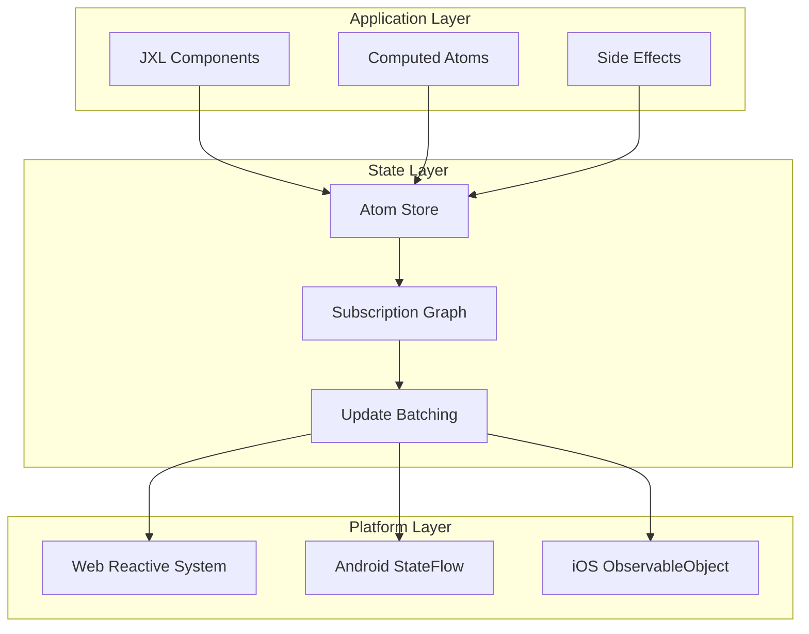

# Jepsh State Management System - Technical Specification

## Document Status

- **Target Audience**: Framework Development Team
- **Version**: Draft v1.0
- **Last Updated**: July 2025
- **Implementation Status**:
  - 🚧 **Planned**: Architecture defined, implementation pending
  - ⚡ **In Development**: Core components being built
  - ✅ **Implemented**: Available in current build

---

## 1. System Overview

The Jepsh State Management System is built around a single reactive primitive: the **Atom**. This system provides unified state management across Web, Android, and iOS platforms with zero-cost abstractions and automatic performance optimizations.

### 1.1 Core Principles

- **Single Source of Truth**: All state flows through atoms
- **Structural Sharing**: Immutable updates with minimal memory allocation
- **Automatic Dependency Tracking**: No manual subscription management
- **Frame-Coherent Updates**: Batched updates within single frame boundaries
- **Cross-Platform Consistency**: Identical behavior on all target platforms

### 1.2 Architecture Overview



---

## 2. Atom System Architecture

### 2.1 Core Atom Implementation ⚡

The `Atom<T>` is the fundamental reactive primitive:

```typescript
// Internal atom structure (conceptual - actual implementation is platform-specific)
interface AtomInternal<T> {
  readonly id: AtomId;
  value: T;
  subscribers: Set<ComponentId>;
  dependencies: Set<AtomId>;
  version: number;
  dirty: boolean;
  computeFn?: () => T;
  disposeFn?: (value: T) => void;
}

class AtomStore {
  private atoms: Map<AtomId, AtomInternal<any>> = new Map();
  private subscriptionGraph: SubscriptionGraph;
  private updateQueue: UpdateQueue;
  private frameScheduler: FrameScheduler;
}
```

### 2.2 Atom Types and Behaviors ⚡

**Basic Atoms (Mutable State)**:

```jxl
// Simple value atom
atom counter: Int = 0

// Object atom with structural sharing
atom user: User = User(name: "John", age: 30)

// Collection atom with efficient updates
atom items: Array<Item> = []
```

**Computed Atoms (Derived State)** ⚡:

```jxl
atom firstName: String = "John"
atom lastName: String = "Doe"

// Automatically tracks dependencies on firstName and lastName
atom computed fullName: String {
    return "\(firstName) \(lastName)"
}

// Complex computed atom with multiple dependencies
atom computed userSummary: UserSummary {
    let itemCount = items.count
    let isActive = user?.isActive ?? false
    return UserSummary(
        name: fullName,
        itemCount: itemCount,
        status: isActive ? .active : .inactive
    )
}
```

**Async Atoms** 🚧:

```jxl
// Async atom with automatic loading states
atom async userData: User = await fetchUser(userId)

// Atom with refresh capability
atom async refreshableData: Array<Item> = await loadItems() {
    refreshInterval: 30.seconds
    onError: { error in
        logger.error("Failed to load items: \(error)")
    }
}
```

### 2.3 Memory Management and Lifecycle ⚡

**Reference Counting and Cleanup**:

```typescript
class AtomLifecycleManager {
  // Track component subscriptions
  subscribe(atomId: AtomId, componentId: ComponentId): void {
    const atom = this.getAtom(atomId);
    atom.subscribers.add(componentId);
    this.updateReferenceCount(atomId, +1);
  }

  unsubscribe(atomId: AtomId, componentId: ComponentId): void {
    const atom = this.getAtom(atomId);
    atom.subscribers.delete(componentId);
    this.updateReferenceCount(atomId, -1);

    // Cleanup unused atoms
    if (atom.subscribers.size === 0 && !atom.isPersistent) {
      this.disposeAtom(atomId);
    }
  }

  private disposeAtom(atomId: AtomId): void {
    const atom = this.getAtom(atomId);
    if (atom.disposeFn) {
      atom.disposeFn(atom.value);
    }
    this.atoms.delete(atomId);
  }
}
```

---

## 3. Dependency Tracking System

### 3.1 Automatic Dependency Detection ⚡

The system automatically tracks which atoms are read during computed atom evaluation:

```typescript
class DependencyTracker {
  private static current: AtomId | null = null;
  private static stack: AtomId[] = [];

  static track<T>(atomId: AtomId, computeFn: () => T): T {
    // Push current computation context
    this.stack.push(this.current);
    this.current = atomId;

    try {
      return computeFn();
    } finally {
      // Pop computation context
      this.current = this.stack.pop() || null;
    }
  }

  static recordDependency(dependentId: AtomId, dependencyId: AtomId): void {
    if (this.current === dependentId) {
      const dependent = atomStore.getAtom(dependentId);
      dependent.dependencies.add(dependencyId);

      const dependency = atomStore.getAtom(dependencyId);
      dependency.subscribers.add(dependentId);
    }
  }
}
```

### 3.2 Dependency Graph Management ⚡

```typescript
class SubscriptionGraph {
  private graph: Map<AtomId, Set<AtomId>> = new Map();

  // Add dependency relationship
  addDependency(dependent: AtomId, dependency: AtomId): void {
    if (!this.graph.has(dependency)) {
      this.graph.set(dependency, new Set());
    }
    this.graph.get(dependency)!.add(dependent);
  }

  // Remove dependency relationship
  removeDependency(dependent: AtomId, dependency: AtomId): void {
    const dependents = this.graph.get(dependency);
    if (dependents) {
      dependents.delete(dependent);
      if (dependents.size === 0) {
        this.graph.delete(dependency);
      }
    }
  }

  // Get all atoms that depend on the given atom
  getDependents(atomId: AtomId): Set<AtomId> {
    return this.graph.get(atomId) || new Set();
  }

  // Topological sort for update ordering
  getUpdateOrder(changedAtoms: Set<AtomId>): AtomId[] {
    const visited = new Set<AtomId>();
    const visiting = new Set<AtomId>();
    const result: AtomId[] = [];

    const visit = (atomId: AtomId) => {
      if (visiting.has(atomId)) {
        throw new Error(`Circular dependency detected involving atom ${atomId}`);
      }
      if (visited.has(atomId)) return;

      visiting.add(atomId);

      // Visit all dependents first
      for (const dependent of this.getDependents(atomId)) {
        visit(dependent);
      }

      visiting.delete(atomId);
      visited.add(atomId);
      result.push(atomId);
    };

    for (const atomId of changedAtoms) {
      visit(atomId);
    }

    return result.reverse(); // Return in dependency order
  }
}
```

---

## 4. Update Batching and Scheduling

### 4.1 Frame-Coherent Update System ⚡

All state updates are batched and committed within a single frame to ensure UI consistency:

```typescript
class UpdateQueue {
  private pendingUpdates: Map<AtomId, any> = new Map();
  private scheduledComponents: Set<ComponentId> = new Set();
  private isFlushScheduled: boolean = false;

  // Queue an atom update
  scheduleUpdate<T>(atomId: AtomId, newValue: T): void {
    this.pendingUpdates.set(atomId, newValue);

    // Schedule flush if not already scheduled
    if (!this.isFlushScheduled) {
      this.isFlushScheduled = true;
      this.frameScheduler.schedule(() => this.flushUpdates());
    }
  }

  // Process all pending updates in a single frame
  private flushUpdates(): void {
    if (this.pendingUpdates.size === 0) {
      this.isFlushScheduled = false;
      return;
    }

    // Determine update order based on dependency graph
    const updateOrder = this.subscriptionGraph.getUpdateOrder(new Set(this.pendingUpdates.keys()));

    // Apply updates in dependency order
    for (const atomId of updateOrder) {
      if (this.pendingUpdates.has(atomId)) {
        this.applyUpdate(atomId, this.pendingUpdates.get(atomId));
      }
    }

    // Trigger component re-renders
    this.triggerComponentUpdates();

    // Clear pending updates
    this.pendingUpdates.clear();
    this.scheduledComponents.clear();
    this.isFlushScheduled = false;
  }

  private applyUpdate<T>(atomId: AtomId, newValue: T): void {
    const atom = this.atomStore.getAtom(atomId);
    const oldValue = atom.value;

    // Only update if value actually changed (structural comparison)
    if (!this.structuralEquals(oldValue, newValue)) {
      atom.value = newValue;
      atom.version++;
      atom.dirty = true;

      // Mark dependent components for re-render
      for (const componentId of atom.subscribers) {
        this.scheduledComponents.add(componentId);
      }

      // Invalidate dependent computed atoms
      this.invalidateDependents(atomId);
    }
  }
}
```

### 4.2 Frame Budget Management ⚡

```typescript
class FrameScheduler {
  private readonly FRAME_BUDGET_MS = 16; // ~60 FPS
  private taskQueue: (() => void)[] = [];
  private isProcessing: boolean = false;

  schedule(task: () => void): void {
    this.taskQueue.push(task);

    if (!this.isProcessing) {
      this.requestFrame();
    }
  }

  private requestFrame(): void {
    // Platform-specific frame scheduling
    if (typeof requestAnimationFrame !== 'undefined') {
      // Web
      requestAnimationFrame(() => this.processTasks());
    } else if (typeof process !== 'undefined') {
      // Node.js/React Native
      process.nextTick(() => this.processTasks());
    } else {
      // Fallback
      setTimeout(() => this.processTasks(), 0);
    }
  }

  private processTasks(): void {
    this.isProcessing = true;
    const startTime = performance.now();

    while (this.taskQueue.length > 0 && performance.now() - startTime < this.FRAME_BUDGET_MS) {
      const task = this.taskQueue.shift()!;
      task();
    }

    this.isProcessing = false;

    // Schedule next frame if there are remaining tasks
    if (this.taskQueue.length > 0) {
      this.requestFrame();
    }
  }
}
```

---

## 5. Structural Sharing and Immutability

### 5.1 Immutable Data Structures ⚡

```typescript
// Immutable array implementation with structural sharing
class ImmutableArray<T> {
  private readonly data: T[];
  private readonly generation: number;

  constructor(data: T[] = [], generation: number = 0) {
    this.data = data;
    this.generation = generation;
  }

  // O(1) append with structural sharing
  append(item: T): ImmutableArray<T> {
    const newData = [...this.data, item];
    return new ImmutableArray(newData, this.generation + 1);
  }

  // O(1) prepend with structural sharing
  prepend(item: T): ImmutableArray<T> {
    const newData = [item, ...this.data];
    return new ImmutableArray(newData, this.generation + 1);
  }

  // O(n) update at index (optimized for small arrays)
  set(index: number, item: T): ImmutableArray<T> {
    if (index < 0 || index >= this.data.length) {
      throw new Error(`Index ${index} out of bounds`);
    }

    const newData = [...this.data];
    newData[index] = item;
    return new ImmutableArray(newData, this.generation + 1);
  }

  // Structural equality check
  equals(other: ImmutableArray<T>): boolean {
    if (this.generation === other.generation) return true;
    if (this.data.length !== other.data.length) return false;

    for (let i = 0; i < this.data.length; i++) {
      if (!this.structuralEquals(this.data[i], other.data[i])) {
        return false;
      }
    }
    return true;
  }
}
```

### 5.2 Object Update Optimization ⚡

```typescript
// Efficient object updates with path-based optimization
class ObjectUpdater {
  static update<T extends object>(obj: T, path: string[], value: any): T {
    if (path.length === 0) return value as T;

    const [head, ...tail] = path;
    const currentValue = (obj as any)[head];

    // Recursive update with structural sharing
    const newValue = tail.length === 0 ? value : this.update(currentValue, tail, value);

    // Return same object if no change
    if (this.structuralEquals(currentValue, newValue)) {
      return obj;
    }

    // Create new object with updated property
    return {
      ...obj,
      [head]: newValue,
    };
  }

  // Lens-based updates for complex nested structures
  static lens<T, U>(getter: (obj: T) => U, setter: (obj: T, value: U) => T) {
    return {
      get: getter,
      set: setter,
      update: (obj: T, updater: (value: U) => U) => {
        const currentValue = getter(obj);
        const newValue = updater(currentValue);
        return setter(obj, newValue);
      },
    };
  }
}
```

---

## 6. Platform-Specific Implementations

### 6.1 Web Platform Integration ⚡

```typescript
// Web-specific atom implementation using Proxy for fine-grained reactivity
class WebAtom<T> implements AtomInternal<T> {
  private _value: T;
  private subscribers = new Set<ComponentId>();

  constructor(initialValue: T) {
    this._value = this.makeReactive(initialValue);
  }

  get value(): T {
    // Record dependency if we're in a computed context
    if (DependencyTracker.current) {
      DependencyTracker.recordDependency(DependencyTracker.current, this.id);
    }
    return this._value;
  }

  set value(newValue: T) {
    updateQueue.scheduleUpdate(this.id, newValue);
  }

  private makeReactive(obj: T): T {
    if (typeof obj !== 'object' || obj === null) {
      return obj;
    }

    return new Proxy(obj, {
      get: (target, prop) => {
        const value = target[prop];
        // Record nested property access
        if (DependencyTracker.current) {
          DependencyTracker.recordDependency(
            DependencyTracker.current,
            `${this.id}.${String(prop)}`
          );
        }
        return this.makeReactive(value);
      },

      set: (target, prop, value) => {
        // Schedule update for property change
        const newTarget = { ...target, [prop]: value };
        updateQueue.scheduleUpdate(this.id, newTarget);
        return true;
      },
    });
  }
}
```

### 6.2 Android Platform Integration 🚧

```kotlin
// Android-specific atom implementation using StateFlow
class AndroidAtom<T>(initialValue: T) : AtomInternal<T> {
    private val _stateFlow = MutableStateFlow(initialValue)
    val stateFlow: StateFlow<T> = _stateFlow.asStateFlow()

    override var value: T
        get() = _stateFlow.value
        set(newValue) {
            updateQueue.scheduleUpdate(id, newValue)
        }

    // Structural sharing for collections
    fun updateImmutable(updater: (T) -> T) {
        val currentValue = _stateFlow.value
        val newValue = updater(currentValue)

        // Only update if structurally different
        if (!structuralEquals(currentValue, newValue)) {
            _stateFlow.value = newValue
        }
    }

    // Integration with Compose
    @Composable
    fun collectAsState(): State<T> {
        return stateFlow.collectAsState()
    }
}

// Kotlin coroutine integration for async atoms
class AsyncAndroidAtom<T>(
    private val loader: suspend () -> T
) : AndroidAtom<AsyncState<T>>(AsyncState.Loading) {

    private var loadingJob: Job? = null

    fun refresh() {
        loadingJob?.cancel()
        loadingJob = CoroutineScope(Dispatchers.IO).launch {
            try {
                value = AsyncState.Loading
                val result = loader()
                value = AsyncState.Success(result)
            } catch (e: Exception) {
                value = AsyncState.Error(e)
            }
        }
    }
}
```

### 6.3 iOS Platform Integration 🚧

```swift
// iOS-specific atom implementation using Combine
class IOSAtom<T>: AtomInternal, ObservableObject {
    @Published private var _value: T
    private var cancellables = Set<AnyCancellable>()

    init(initialValue: T) {
        self._value = initialValue
    }

    var value: T {
        get {
            // Record dependency tracking
            if let currentComputation = DependencyTracker.current {
                DependencyTracker.recordDependency(currentComputation, self.id)
            }
            return _value
        }
        set {
            updateQueue.scheduleUpdate(self.id, newValue)
        }
    }

    // SwiftUI integration
    var projectedValue: Published<T>.Publisher {
        return $__value
    }

    // Combine integration for reactive chains
    func map<U>(_ transform: @escaping (T) -> U) -> IOSAtom<U> {
        let computedAtom = IOSAtom<U>(initialValue: transform(_value))

        $__value
            .map(transform)
            .assign(to: \.value, on: computedAtom)
            .store(in: &cancellables)

        return computedAtom
    }
}

// Swift Concurrency integration for async atoms
actor AsyncIOSAtom<T>: IOSAtom<AsyncState<T>> {
    private let loader: () async throws -> T
    private var loadingTask: Task<Void, Never>?

    init(loader: @escaping () async throws -> T) {
        self.loader = loader
        super.init(initialValue: .loading)
    }

    func refresh() {
        loadingTask?.cancel()
        loadingTask = Task {
            await MainActor.run {
                self.value = .loading
            }

            do {
                let result = try await loader()
                await MainActor.run {
                    self.value = .success(result)
                }
            } catch {
                await MainActor.run {
                    self.value = .error(error)
                }
            }
        }
    }
}
```

---

## 7. Performance Optimizations

### 7.1 Memoization and Caching ⚡

```typescript
class ComputedAtomCache {
  private cache = new Map<string, { result: any; dependencies: Set<AtomId>; version: number }>();

  // Memoized computation with dependency tracking
  memoize<T>(key: string, computeFn: () => T, dependencies: Set<AtomId>): T {
    const cached = this.cache.get(key);

    // Check if cache is still valid
    if (cached && this.isValidCache(cached.dependencies)) {
      return cached.result;
    }

    // Recompute and cache
    const result = computeFn();
    this.cache.set(key, {
      result,
      dependencies: new Set(dependencies),
      version: this.getCurrentVersion(dependencies),
    });

    return result;
  }

  private isValidCache(dependencies: Set<AtomId>): boolean {
    for (const atomId of dependencies) {
      const atom = atomStore.getAtom(atomId);
      if (atom.dirty) return false;
    }
    return true;
  }

  // Invalidate cache entries when dependencies change
  invalidate(changedAtomId: AtomId): void {
    for (const [key, cached] of this.cache.entries()) {
      if (cached.dependencies.has(changedAtomId)) {
        this.cache.delete(key);
      }
    }
  }
}
```

### 7.2 Lazy Evaluation and Cleanup ⚡

```typescript
class LazyComputedAtom<T> implements AtomInternal<T> {
  private _value: T | undefined;
  private _computed: boolean = false;
  private computeFn: () => T;

  constructor(computeFn: () => T) {
    this.computeFn = computeFn;
  }

  get value(): T {
    if (!this._computed) {
      this._value = DependencyTracker.track(this.id, this.computeFn);
      this._computed = true;
    }
    return this._value!;
  }

  // Invalidate when dependencies change
  invalidate(): void {
    this._computed = false;
    this._value = undefined;

    // Notify subscribers that this atom needs recomputation
    for (const subscriberId of this.subscribers) {
      updateQueue.scheduleUpdate(subscriberId, undefined);
    }
  }

  // Cleanup when no longer needed
  dispose(): void {
    this._value = undefined;
    this._computed = false;
    this.subscribers.clear();

    if (this.disposeFn) {
      this.disposeFn(this._value);
    }
  }
}
```

### 7.3 Memory Pool Management ⚡

```typescript
class AtomMemoryPool {
  private atomPool: AtomInternal<any>[] = [];
  private updatePool: Update[] = [];
  private subscriptionPool: Subscription[] = [];

  // Object pooling to reduce GC pressure
  borrowAtom<T>(): AtomInternal<T> {
    return this.atomPool.pop() || this.createAtom<T>();
  }

  returnAtom<T>(atom: AtomInternal<T>): void {
    // Reset atom state
    atom.value = undefined;
    atom.subscribers.clear();
    atom.dependencies.clear();
    atom.version = 0;
    atom.dirty = false;

    this.atomPool.push(atom);
  }

  // Batch allocation for performance
  preallocate(atomCount: number, updateCount: number): void {
    for (let i = 0; i < atomCount; i++) {
      this.atomPool.push(this.createAtom());
    }

    for (let i = 0; i < updateCount; i++) {
      this.updatePool.push(this.createUpdate());
    }
  }

  // Memory pressure handling
  cleanup(): void {
    // Keep only a reasonable number of pooled objects
    this.atomPool.splice(100);
    this.updatePool.splice(1000);
    this.subscriptionPool.splice(500);
  }
}
```

---

## 8. DevTools and Debugging

### 8.1 Time-Travel Debugging 🚧

```typescript
class StateHistory {
  private history: StateSnapshot[] = [];
  private currentIndex: number = -1;
  private maxHistorySize: number = 1000;

  // Capture state snapshot before updates
  captureSnapshot(): void {
    const snapshot: StateSnapshot = {
      timestamp: Date.now(),
      atoms: new Map(atomStore.getAllAtoms()),
      version: this.history.length,
    };

    // Remove future history if we're not at the end
    if (this.currentIndex < this.history.length - 1) {
      this.history.splice(this.currentIndex + 1);
    }

    this.history.push(snapshot);
    this.currentIndex = this.history.length - 1;

    // Limit history size
    if (this.history.length > this.maxHistorySize) {
      this.history.shift();
      this.currentIndex--;
    }
  }

  // Travel to previous state
  undo(): boolean {
    if (this.currentIndex > 0) {
      this.currentIndex--;
      this.restoreSnapshot(this.history[this.currentIndex]);
      return true;
    }
    return false;
  }

  // Travel to next state
  redo(): boolean {
    if (this.currentIndex < this.history.length - 1) {
      this.currentIndex++;
      this.restoreSnapshot(this.history[this.currentIndex]);
      return true;
    }
    return false;
  }

  private restoreSnapshot(snapshot: StateSnapshot): void {
    // Restore all atom values
    for (const [atomId, atomData] of snapshot.atoms) {
      const atom = atomStore.getAtom(atomId);
      if (atom) {
        atom.value = atomData.value;
        atom.version = atomData.version;
      }
    }

    // Trigger re-render of all components
    updateQueue.scheduleFullUpdate();
  }
}
```

### 8.2 State Heat Map and Profiling ⚡

```typescript
class StateProfiler {
  private updateCounts = new Map<AtomId, number>();
  private renderTimes = new Map<ComponentId, number[]>();
  private dependencyGraph = new Map<AtomId, Set<ComponentId>>();

  // Track atom update frequency
  recordAtomUpdate(atomId: AtomId): void {
    const count = this.updateCounts.get(atomId) || 0;
    this.updateCounts.set(atomId, count + 1);
  }

  // Track component render times
  recordRenderTime(componentId: ComponentId, duration: number): void {
    if (!this.renderTimes.has(componentId)) {
      this.renderTimes.set(componentId, []);
    }

    const times = this.renderTimes.get(componentId)!;
    times.push(duration);

    // Keep only recent render times
    if (times.length > 100) {
      times.shift();
    }
  }

  // Generate heat map data
  generateHeatMap(): HeatMapData {
    const hotAtoms = Array.from(this.updateCounts.entries())
      .sort(([, a], [, b]) => b - a)
      .slice(0, 20);

    const slowComponents = Array.from(this.renderTimes.entries())
      .map(([id, times]) => ({
        id,
        avgRenderTime: times.reduce((a, b) => a + b, 0) / times.length,
      }))
      .sort((a, b) => b.avgRenderTime - a.avgRenderTime)
      .slice(0, 20);

    return {
      hotAtoms,
      slowComponents,
      totalAtoms: this.updateCounts.size,
      totalComponents: this.renderTimes.size,
    };
  }
}
```

---

## 9. Persistence and Synchronization

### 9.1 Persistent Atoms 🚧

```jxl
// Atoms with automatic persistence
@Persist("user_preferences")
atom userPreferences: UserPrefs = UserPrefs.default

@Persist("shopping_cart", strategy: .immediate)
atom shoppingCart: Array<CartItem> = []

@Persist("app_settings", storage: .secure)
atom appSettings: AppSettings = AppSettings()
```

```typescript
class PersistenceManager {
  private storageAdapters = new Map<string, StorageAdapter>();

  // Register atom for persistence
  registerPersistentAtom<T>(
    atomId: AtomId,
    key: string,
    strategy: PersistenceStrategy,
    storage: StorageType = 'local'
  ): void {
    const adapter = this.getStorageAdapter(storage);

    // Load initial value
    adapter.load(key).then((value) => {
      if (value !== null) {
        atomStore.updateAtom(atomId, value);
      }
    });

    // Set up persistence based on strategy
    switch (strategy) {
      case 'immediate':
        this.setupImmediatePersistence(atomId, key, adapter);
        break;
      case 'debounced':
        this.setupDebouncedPersistence(atomId, key, adapter);
        break;
      case 'manual':
        // No automatic persistence
        break;
    }
  }

  private setupImmediatePersistence(atomId: AtomId, key: string, adapter: StorageAdapter): void {
    atomStore.subscribe(atomId, (newValue) => {
      adapter.save(key, newValue);
    });
  }

  private setupDebouncedPersistence(
    atomId: AtomId,
    key: string,
    adapter: StorageAdapter,
    delay: number = 500
  ): void {
    let timeoutId: NodeJS.Timeout | null = null;

    atomStore.subscribe(atomId, (newValue) => {
      if (timeoutId) {
        clearTimeout(timeoutId);
      }

      timeoutId = setTimeout(() => {
        adapter.save(key, newValue);
        timeoutId = null;
      }, delay);
    });
  }
}

// Storage adapter interface for different platforms
interface StorageAdapter {
  save(key: string, value: any): Promise<void>;
  load(key: string): Promise<any>;
  remove(key: string): Promise<void>;
  clear(): Promise<void>;
}

// Web storage adapter
class WebStorageAdapter implements StorageAdapter {
  constructor(private storage: Storage = localStorage) {}

  async save(key: string, value: any): Promise<void> {
    this.storage.setItem(key, JSON.stringify(value));
  }

  async load(key: string): Promise<any> {
    const item = this.storage.getItem(key);
    return item ? JSON.parse(item) : null;
  }

  async remove(key: string): Promise<void> {
    this.storage.removeItem(key);
  }

  async clear(): Promise<void> {
    this.storage.clear();
  }
}
```

### 9.2 Multi-Device Synchronization 🚧

```typescript
class SyncManager {
  private syncQueue: SyncOperation[] = [];
  private conflictResolver: ConflictResolver;
  private networkAdapter: NetworkAdapter;

  // Sync atom changes across devices
  syncAtom<T>(atomId: AtomId, value: T, version: number): void {
    const operation: SyncOperation = {
      type: 'atom_update',
      atomId,
      value,
      version,
      timestamp: Date.now(),
      deviceId: this.getDeviceId(),
    };

    this.syncQueue.push(operation);
    this.scheduleSyncBatch();
  }

  private scheduleSyncBatch(): void {
    // Debounce sync operations
    setTimeout(() => {
      if (this.syncQueue.length > 0) {
        this.processSyncBatch();
      }
    }, 100);
  }

  private async processSyncBatch(): void {
    const operations = [...this.syncQueue];
    this.syncQueue.length = 0;

    try {
      // Send changes to server
      const response = await this.networkAdapter.syncOperations(operations);

      // Apply remote changes
      for (const remoteOp of response.remoteOperations) {
        await this.applyRemoteOperation(remoteOp);
      }

      // Handle conflicts
      for (const conflict of response.conflicts) {
        await this.resolveConflict(conflict);
      }
    } catch (error) {
      // Re-queue failed operations
      this.syncQueue.unshift(...operations);
      console.error('Sync failed:', error);
    }
  }

  private async applyRemoteOperation(operation: SyncOperation): Promise<void> {
    const localAtom = atomStore.getAtom(operation.atomId);

    if (!localAtom) {
      // Create new atom from remote
      atomStore.createAtom(operation.atomId, operation.value);
      return;
    }

    // Check if remote version is newer
    if (operation.version > localAtom.version) {
      atomStore.updateAtom(operation.atomId, operation.value);
    }
  }

  private async resolveConflict(conflict: SyncConflict): Promise<void> {
    const resolution = await this.conflictResolver.resolve(conflict);

    switch (resolution.strategy) {
      case 'local_wins':
        // Keep local value, update version
        break;
      case 'remote_wins':
        atomStore.updateAtom(conflict.atomId, conflict.remoteValue);
        break;
      case 'merge':
        const merged = this.mergeValues(conflict.localValue, conflict.remoteValue);
        atomStore.updateAtom(conflict.atomId, merged);
        break;
    }
  }
}
```

---

## 10. Advanced State Patterns

### 10.1 State Machines 🚧

```jxl
// State machine integration with atoms
enum LoadingState {
    case idle
    case loading
    case success(data: Data)
    case error(message: String)
}

atom loadingState: LoadingState = .idle

// State machine transitions
func loadData() {
    loadingState = .loading

    async {
        do {
            let data = await fetchData()
            loadingState = .success(data: data)
        } catch {
            loadingState = .error(message: error.localizedDescription)
        }
    }
}

// Computed atom that depends on state machine
atom computed canRetry: Bool {
    switch loadingState {
    case .error:
        return true
    default:
        return false
    }
}
```

### 10.2 Undo/Redo System 🚧

```typescript
class UndoRedoManager<T> {
  private history: T[] = [];
  private currentIndex: number = -1;
  private maxHistorySize: number = 50;

  // Record state for undo/redo
  recordState(state: T): void {
    // Remove future history if we're not at the end
    if (this.currentIndex < this.history.length - 1) {
      this.history.splice(this.currentIndex + 1);
    }

    this.history.push(this.deepClone(state));
    this.currentIndex = this.history.length - 1;

    // Limit history size
    if (this.history.length > this.maxHistorySize) {
      this.history.shift();
      this.currentIndex--;
    }
  }

  undo(): T | null {
    if (this.canUndo()) {
      this.currentIndex--;
      return this.deepClone(this.history[this.currentIndex]);
    }
    return null;
  }

  redo(): T | null {
    if (this.canRedo()) {
      this.currentIndex++;
      return this.deepClone(this.history[this.currentIndex]);
    }
    return null;
  }

  canUndo(): boolean {
    return this.currentIndex > 0;
  }

  canRedo(): boolean {
    return this.currentIndex < this.history.length - 1;
  }

  private deepClone(obj: T): T {
    return JSON.parse(JSON.stringify(obj));
  }
}

// Integration with atoms
class UndoableAtom<T> extends Atom<T> {
  private undoManager = new UndoRedoManager<T>();

  set value(newValue: T) {
    // Record current state before changing
    this.undoManager.recordState(this.value);
    super.value = newValue;
  }

  undo(): boolean {
    const previousValue = this.undoManager.undo();
    if (previousValue !== null) {
      super.value = previousValue;
      return true;
    }
    return false;
  }

  redo(): boolean {
    const nextValue = this.undoManager.redo();
    if (nextValue !== null) {
      super.value = nextValue;
      return true;
    }
    return false;
  }
}
```

### 10.3 Derived State Optimization 🚧

```typescript
// Selector pattern for expensive computations
class SelectorSystem {
  private selectorCache = new Map<string, { result: any; inputs: any[]; version: number }>();

  // Create memoized selector
  createSelector<TInputs extends any[], TResult>(
    inputSelectors: { [K in keyof TInputs]: () => TInputs[K] },
    computeFn: (...inputs: TInputs) => TResult,
    options: { equalityFn?: (a: any, b: any) => boolean } = {}
  ): () => TResult {
    const selectorId = this.generateSelectorId();
    const equalityFn = options.equalityFn || this.shallowEqual;

    return () => {
      // Get current inputs
      const currentInputs = inputSelectors.map((selector) => selector()) as TInputs;

      // Check cache
      const cached = this.selectorCache.get(selectorId);
      if (cached && this.inputsEqual(cached.inputs, currentInputs, equalityFn)) {
        return cached.result;
      }

      // Recompute
      const result = computeFn(...currentInputs);

      // Update cache
      this.selectorCache.set(selectorId, {
        result,
        inputs: currentInputs,
        version: Date.now(),
      });

      return result;
    };
  }

  private inputsEqual(a: any[], b: any[], equalityFn: (x: any, y: any) => boolean): boolean {
    if (a.length !== b.length) return false;

    for (let i = 0; i < a.length; i++) {
      if (!equalityFn(a[i], b[i])) return false;
    }

    return true;
  }

  private shallowEqual(a: any, b: any): boolean {
    if (a === b) return true;

    if (typeof a !== 'object' || typeof b !== 'object' || a === null || b === null) {
      return false;
    }

    const keysA = Object.keys(a);
    const keysB = Object.keys(b);

    if (keysA.length !== keysB.length) return false;

    for (const key of keysA) {
      if (a[key] !== b[key]) return false;
    }

    return true;
  }
}
```

---

## 11. Error Handling and Recovery

### 11.1 Atom Error Boundaries 🚧

```typescript
class AtomErrorBoundary {
  private errorHandlers = new Map<AtomId, ErrorHandler>();
  private fallbackValues = new Map<AtomId, any>();

  // Register error handler for atom
  registerErrorHandler<T>(atomId: AtomId, handler: ErrorHandler<T>, fallbackValue?: T): void {
    this.errorHandlers.set(atomId, handler);
    if (fallbackValue !== undefined) {
      this.fallbackValues.set(atomId, fallbackValue);
    }
  }

  // Handle errors during atom computation
  handleAtomError<T>(atomId: AtomId, error: Error): T | null {
    const handler = this.errorHandlers.get(atomId);

    if (handler) {
      try {
        return handler.handle(error);
      } catch (handlerError) {
        console.error(`Error handler failed for atom ${atomId}:`, handlerError);
      }
    }

    // Use fallback value if available
    const fallback = this.fallbackValues.get(atomId);
    if (fallback !== undefined) {
      return fallback;
    }

    // Re-throw if no handler or fallback
    throw error;
  }

  // Automatic error recovery
  scheduleRecovery(atomId: AtomId, delay: number = 1000): void {
    setTimeout(() => {
      try {
        const atom = atomStore.getAtom(atomId);
        if (atom.computeFn) {
          // Retry computation
          const newValue = atom.computeFn();
          atomStore.updateAtom(atomId, newValue);
        }
      } catch (error) {
        // Exponential backoff for recovery
        this.scheduleRecovery(atomId, Math.min(delay * 2, 30000));
      }
    }, delay);
  }
}
```

### 11.2 Transaction System 🚧

```typescript
class AtomTransaction {
  private changes = new Map<AtomId, any>();
  private originalValues = new Map<AtomId, any>();
  private isCommitted = false;
  private isRolledBack = false;

  // Begin transaction
  begin(): void {
    if (this.isCommitted || this.isRolledBack) {
      throw new Error('Transaction already completed');
    }
  }

  // Set atom value within transaction
  set<T>(atomId: AtomId, value: T): void {
    if (this.isCommitted || this.isRolledBack) {
      throw new Error('Cannot modify completed transaction');
    }

    // Store original value for rollback
    if (!this.originalValues.has(atomId)) {
      const atom = atomStore.getAtom(atomId);
      this.originalValues.set(atomId, atom.value);
    }

    this.changes.set(atomId, value);
  }

  // Commit all changes atomically
  commit(): void {
    if (this.isCommitted || this.isRolledBack) {
      throw new Error('Transaction already completed');
    }

    try {
      // Apply all changes in a single batch
      updateQueue.batch(() => {
        for (const [atomId, value] of this.changes) {
          atomStore.updateAtom(atomId, value);
        }
      });

      this.isCommitted = true;
    } catch (error) {
      // Auto-rollback on commit failure
      this.rollback();
      throw error;
    }
  }

  // Rollback all changes
  rollback(): void {
    if (this.isCommitted) {
      throw new Error('Cannot rollback committed transaction');
    }

    if (!this.isRolledBack) {
      // Restore original values
      for (const [atomId, originalValue] of this.originalValues) {
        atomStore.updateAtom(atomId, originalValue);
      }

      this.isRolledBack = true;
    }
  }
}

// Transaction helper for atomic operations
function transaction<T>(operation: (tx: AtomTransaction) => T): T {
  const tx = new AtomTransaction();
  tx.begin();

  try {
    const result = operation(tx);
    tx.commit();
    return result;
  } catch (error) {
    tx.rollback();
    throw error;
  }
}
```

---

## 12. Testing and Validation

### 12.1 Atom Testing Utilities ⚡

```typescript
class AtomTestUtils {
  private mockAtoms = new Map<AtomId, any>();
  private originalValues = new Map<AtomId, any>();

  // Mock atom value for testing
  mockAtom<T>(atomId: AtomId, mockValue: T): void {
    const atom = atomStore.getAtom(atomId);

    // Store original value for restoration
    this.originalValues.set(atomId, atom.value);
    this.mockAtoms.set(atomId, mockValue);

    // Set mock value
    atom.value = mockValue;
  }

  // Restore all mocked atoms
  restoreAllMocks(): void {
    for (const [atomId, originalValue] of this.originalValues) {
      const atom = atomStore.getAtom(atomId);
      atom.value = originalValue;
    }

    this.mockAtoms.clear();
    this.originalValues.clear();
  }

  // Create isolated atom store for testing
  createIsolatedStore(): AtomStore {
    return new AtomStore();
  }

  // Wait for all pending updates to complete
  async flushUpdates(): Promise<void> {
    return new Promise((resolve) => {
      updateQueue.onFlushComplete(resolve);
      updateQueue.flush();
    });
  }

  // Simulate time passage for time-based atoms
  advanceTime(milliseconds: number): void {
    // Mock implementation for testing timers
    jest.advanceTimersByTime(milliseconds);
  }
}

// Test helpers for JXL components
class ComponentTestUtils {
  // Render component in isolation with mocked atoms
  renderWithMocks<TProps>(
    Component: ComponentType<TProps>,
    props: TProps,
    atomMocks: Record<string, any>
  ): TestRenderer {
    const testUtils = new AtomTestUtils();

    // Apply mocks
    for (const [atomId, mockValue] of Object.entries(atomMocks)) {
      testUtils.mockAtom(atomId, mockValue);
    }

    try {
      return render(Component, props);
    } finally {
      testUtils.restoreAllMocks();
    }
  }

  // Wait for component to settle after state changes
  async waitForNextUpdate(): Promise<void> {
    return new Promise((resolve) => {
      frameScheduler.schedule(resolve);
    });
  }
}
```

### 12.2 State Validation 🚧

```typescript
// Runtime validation for atom values
class AtomValidator {
  private validators = new Map<AtomId, Validator<any>>();

  // Register validator for atom
  registerValidator<T>(atomId: AtomId, validator: Validator<T>): void {
    this.validators.set(atomId, validator);

    // Validate current value
    const atom = atomStore.getAtom(atomId);
    this.validateValue(atomId, atom.value);

    // Set up validation on updates
    atomStore.subscribe(atomId, (newValue) => {
      this.validateValue(atomId, newValue);
    });
  }

  private validateValue<T>(atomId: AtomId, value: T): void {
    const validator = this.validators.get(atomId);
    if (!validator) return;

    const result = validator.validate(value);
    if (!result.isValid) {
      const error = new AtomValidationError(
        `Validation failed for atom ${atomId}: ${result.errors.join(', ')}`
      );

      // Handle validation error based on configuration
      this.handleValidationError(atomId, error, value);
    }
  }

  private handleValidationError<T>(
    atomId: AtomId,
    error: AtomValidationError,
    invalidValue: T
  ): void {
    // Different strategies for handling validation errors
    const strategy = this.getValidationStrategy(atomId);

    switch (strategy) {
      case 'throw':
        throw error;
      case 'warn':
        console.warn(error.message);
        break;
      case 'revert':
        // Revert to previous valid value
        const atom = atomStore.getAtom(atomId);
        const previousValue = this.getPreviousValidValue(atomId);
        if (previousValue !== undefined) {
          atom.value = previousValue;
        }
        break;
      case 'sanitize':
        // Attempt to sanitize the value
        const sanitized = this.sanitizeValue(atomId, invalidValue);
        if (sanitized !== invalidValue) {
          const atom = atomStore.getAtom(atomId);
          atom.value = sanitized;
        }
        break;
    }
  }
}

// Schema validation for complex atom types
interface ValidationSchema {
  type: 'string' | 'number' | 'boolean' | 'array' | 'object';
  required?: boolean;
  minLength?: number;
  maxLength?: number;
  min?: number;
  max?: number;
  pattern?: RegExp;
  properties?: Record<string, ValidationSchema>;
  items?: ValidationSchema;
}

class SchemaValidator implements Validator<any> {
  constructor(private schema: ValidationSchema) {}

  validate(value: any): ValidationResult {
    const errors: string[] = [];

    if (this.schema.required && (value === null || value === undefined)) {
      errors.push('Value is required');
    }

    if (value !== null && value !== undefined) {
      this.validateType(value, this.schema, errors);
    }

    return {
      isValid: errors.length === 0,
      errors,
    };
  }

  private validateType(value: any, schema: ValidationSchema, errors: string[]): void {
    switch (schema.type) {
      case 'string':
        this.validateString(value, schema, errors);
        break;
      case 'number':
        this.validateNumber(value, schema, errors);
        break;
      case 'boolean':
        this.validateBoolean(value, errors);
        break;
      case 'array':
        this.validateArray(value, schema, errors);
        break;
      case 'object':
        this.validateObject(value, schema, errors);
        break;
    }
  }

  private validateString(value: any, schema: ValidationSchema, errors: string[]): void {
    if (typeof value !== 'string') {
      errors.push(`Expected string, got ${typeof value}`);
      return;
    }

    if (schema.minLength && value.length < schema.minLength) {
      errors.push(`String too short, minimum length is ${schema.minLength}`);
    }

    if (schema.maxLength && value.length > schema.maxLength) {
      errors.push(`String too long, maximum length is ${schema.maxLength}`);
    }

    if (schema.pattern && !schema.pattern.test(value)) {
      errors.push(`String does not match required pattern`);
    }
  }

  // Additional validation methods for other types...
}
```

---

This comprehensive state management system documentation provides the technical foundation for implementing Jepsh's reactive state system. The next document should cover the Build System Architecture, which will detail how JXL code is compiled and optimized for each target platform.
