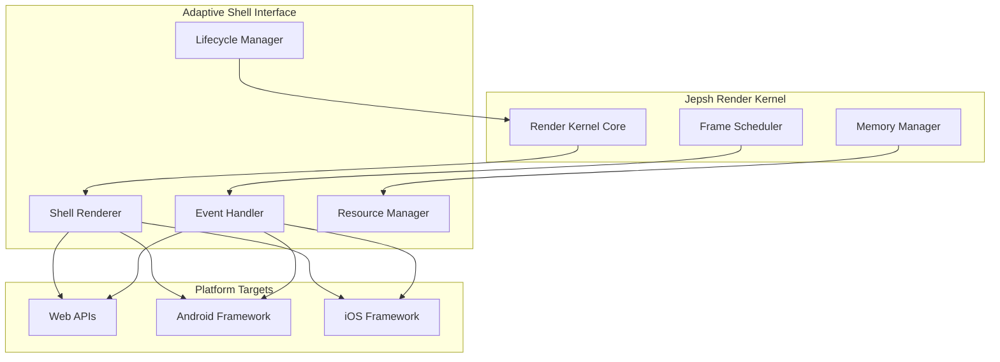

# Adaptive Shell Specifications

## Document Status

- **Target Audience**: Framework Development Team
- **Version**: Draft v1.0
- **Last Updated**: July 2025
- **Implementation Status**:
  - 🚧 **Planned**: Interface defined, not implemented
  - ⚡ **In Development**: Currently being built
  - ✅ **Implemented**: Available in current build

---

## 1. Overview

Adaptive Shells are platform-specific abstraction layers that bridge the Jepsh Render Kernel with native platform UI systems. Each shell maintains consistent API contracts while implementing platform-optimized rendering, event handling, and lifecycle management.

### 1.1 Design Principles

- **Unified Interface**: All shells implement identical kernel-facing APIs
- **Native Performance**: Platform-specific optimizations with zero abstraction penalty
- **OS Integration**: Respect platform conventions (motion, accessibility, theming)
- **Memory Efficiency**: Minimal overhead with aggressive resource pooling

### 1.2 Shell Architecture



---

## 2. Core Shell Interface

### 2.1 Base Shell Contract ⚡

All adaptive shells must implement the `AdaptiveShell` interface:

```typescript
interface AdaptiveShell {
  // Core rendering methods
  render(tree: RenderTree): Promise<void>;
  commit(updates: RenderUpdate[]): void;
  flush(): void;

  // Event handling
  handleEvent(event: UnifiedEvent): EventResult;
  subscribeToEvents(callback: EventCallback): UnsubscribeFn;

  // Lifecycle management
  mount(container: PlatformContainer): void;
  unmount(): void;
  pause(): void;
  resume(): void;

  // Resource management
  allocateTexture(spec: TextureSpec): TextureHandle;
  deallocateTexture(handle: TextureHandle): void;
  createRenderTarget(spec: RenderTargetSpec): RenderTarget;

  // Performance monitoring
  getMetrics(): PerformanceMetrics;
  setPerformanceBudget(budget: FrameBudget): void;
}
```

### 2.2 Render Tree Structure ⚡

The render tree is the primary data structure passed from kernel to shell:

```typescript
interface RenderTree {
  readonly root: RenderNode;
  readonly version: number;
  readonly changeFlags: ChangeFlags;
}

interface RenderNode {
  readonly id: NodeId;
  readonly type: ComponentType;
  readonly props: NodeProps;
  readonly children: RenderNode[];
  readonly layout: LayoutInfo;
  readonly style: ComputedStyle;
  readonly eventHandlers: EventHandlerMap;
}

interface LayoutInfo {
  readonly x: number;
  readonly y: number;
  readonly width: number;
  readonly height: number;
  readonly transform: Transform3D;
  readonly opacity: number;
  readonly clipBounds?: Rectangle;
}
```

### 2.3 Event System ⚡

Unified event handling across all platforms:

```typescript
interface UnifiedEvent {
  readonly type: EventType;
  readonly target: NodeId;
  readonly timestamp: number;
  readonly phase: EventPhase;
  readonly data: EventData;
}

enum EventType {
  // Touch/Mouse events
  POINTER_DOWN = 'pointer_down',
  POINTER_MOVE = 'pointer_move',
  POINTER_UP = 'pointer_up',
  POINTER_CANCEL = 'pointer_cancel',

  // Gesture events
  TAP = 'tap',
  LONG_PRESS = 'long_press',
  SWIPE = 'swipe',
  PINCH = 'pinch',

  // Keyboard events
  KEY_DOWN = 'key_down',
  KEY_UP = 'key_up',

  // Lifecycle events
  FOCUS = 'focus',
  BLUR = 'blur',
  SCROLL = 'scroll',
}

interface EventResult {
  readonly handled: boolean;
  readonly stopPropagation: boolean;
  readonly preventDefault: boolean;
  readonly updates?: RenderUpdate[];
}
```

---

## 3. Web Shell Implementation

### 3.1 Web Shell Architecture ⚡

The Web Shell targets modern browsers with WebAssembly and Web Workers support:

```typescript
class WebShell implements AdaptiveShell {
  private canvas: HTMLCanvasElement;
  private gl: WebGL2RenderingContext;
  private worker: Worker;
  private renderQueue: RenderCommand[];
  private texturePool: TexturePool;

  constructor(container: HTMLElement) {
    this.initializeCanvas(container);
    this.initializeWebGL();
    this.initializeWorker();
    this.setupEventListeners();
  }

  async render(tree: RenderTree): Promise<void> {
    // Batch render commands for worker execution
    const commands = this.compileRenderTree(tree);
    await this.executeOnWorker(commands);
  }

  private initializeCanvas(container: HTMLElement): void {
    this.canvas = document.createElement('canvas');
    this.canvas.style.cssText = `
            position: absolute;
            top: 0; left: 0;
            width: 100%; height: 100%;
            touch-action: none;
        `;
    container.appendChild(this.canvas);
  }
}
```

### 3.2 WebGL Rendering Pipeline 🚧

**Render Command Generation**:

```typescript
interface RenderCommand {
  type: CommandType;
  nodeId: NodeId;
  geometry?: GeometryData;
  material?: MaterialData;
  transform?: Matrix4;
}

enum CommandType {
  DRAW_RECT = 'draw_rect',
  DRAW_TEXT = 'draw_text',
  DRAW_IMAGE = 'draw_image',
  DRAW_SHADOW = 'draw_shadow',
  SET_CLIP = 'set_clip',
  CLEAR_CLIP = 'clear_clip',
}

class WebGLRenderer {
  private commandBuffer: RenderCommand[] = [];
  private shaderPrograms: Map<string, WebGLProgram> = new Map();

  compileRenderTree(tree: RenderTree): RenderCommand[] {
    this.commandBuffer.length = 0;
    this.traverseNode(tree.root, Matrix4.identity());
    return [...this.commandBuffer];
  }

  private traverseNode(node: RenderNode, parentTransform: Matrix4): void {
    const transform = parentTransform.multiply(node.layout.transform);

    // Generate render commands based on node type
    switch (node.type) {
      case ComponentType.RECTANGLE:
        this.commandBuffer.push({
          type: CommandType.DRAW_RECT,
          nodeId: node.id,
          geometry: this.createRectGeometry(node.layout),
          material: this.createMaterial(node.style),
          transform,
        });
        break;

      case ComponentType.TEXT:
        this.commandBuffer.push({
          type: CommandType.DRAW_TEXT,
          nodeId: node.id,
          geometry: this.createTextGeometry(node.props.text, node.style),
          transform,
        });
        break;
    }

    // Process children
    for (const child of node.children) {
      this.traverseNode(child, transform);
    }
  }
}
```

### 3.3 Web Worker Integration ⚡

**Off-Main-Thread Rendering**:

```typescript
// Main thread (WebShell)
class WebShellWorkerProxy {
  private worker: Worker;
  private pendingCommands: Map<number, Promise<void>> = new Map();
  private commandId = 0;

  async executeRenderCommands(commands: RenderCommand[]): Promise<void> {
    const id = ++this.commandId;

    return new Promise((resolve, reject) => {
      this.pendingCommands.set(id, { resolve, reject });

      this.worker.postMessage({
        type: 'RENDER_COMMANDS',
        id,
        commands,
        transferables: this.extractTransferables(commands),
      });
    });
  }
}

// Worker thread (web-worker.ts)
class WebShellWorker {
  private renderer: OffscreenWebGLRenderer;

  onMessage(event: MessageEvent): void {
    const { type, id, commands } = event.data;

    switch (type) {
      case 'RENDER_COMMANDS':
        this.executeRenderCommands(commands)
          .then(() => {
            self.postMessage({ type: 'RENDER_COMPLETE', id });
          })
          .catch((error) => {
            self.postMessage({ type: 'RENDER_ERROR', id, error });
          });
        break;
    }
  }

  private async executeRenderCommands(commands: RenderCommand[]): Promise<void> {
    for (const command of commands) {
      await this.renderer.executeCommand(command);
    }
    await this.renderer.present();
  }
}
```

### 3.4 DOM Integration Fallback 🚧

For compatibility with older browsers or when WebGL is unavailable:

```typescript
class DOMRenderer {
  private container: HTMLElement;
  private nodeElements: Map<NodeId, HTMLElement> = new Map();

  render(tree: RenderTree): void {
    this.reconcileDOM(tree.root, this.container);
  }

  private reconcileDOM(node: RenderNode, parent: HTMLElement): void {
    let element = this.nodeElements.get(node.id);

    if (!element) {
      element = this.createElement(node);
      this.nodeElements.set(node.id, element);
      parent.appendChild(element);
    }

    this.updateElement(element, node);

    // Reconcile children
    for (const child of node.children) {
      this.reconcileDOM(child, element);
    }
  }

  private createElement(node: RenderNode): HTMLElement {
    switch (node.type) {
      case ComponentType.RECTANGLE:
        return document.createElement('div');
      case ComponentType.TEXT:
        return document.createElement('span');
      case ComponentType.IMAGE:
        return document.createElement('img');
      default:
        return document.createElement('div');
    }
  }
}
```

---

## 4. Android Shell Implementation

### 4.1 Android Shell Architecture 🚧

The Android Shell integrates with both traditional Android Views and Jetpack Compose:

```kotlin
class AndroidShell : AdaptiveShell {
    private val context: Context
    private val rootView: ViewGroup
    private val composeView: ComposeView?
    private val renderEngine: AndroidRenderEngine
    private val eventDispatcher: AndroidEventDispatcher

    constructor(context: Context, container: ViewGroup) {
        this.context = context
        this.rootView = container
        this.composeView = if (isComposeAvailable()) ComposeView(context) else null
        this.renderEngine = AndroidRenderEngine(context)
        this.eventDispatcher = AndroidEventDispatcher()

        setupRenderTarget()
    }

    override suspend fun render(tree: RenderTree) {
        when {
            composeView != null -> renderWithCompose(tree)
            else -> renderWithViews(tree)
        }
    }

    private suspend fun renderWithCompose(tree: RenderTree) {
        composeView?.setContent {
            JepshComposable(tree = tree)
        }
    }

    private suspend fun renderWithViews(tree: RenderTree) {
        val viewCommands = renderEngine.compileToViews(tree)
        withContext(Dispatchers.Main) {
            applyViewCommands(viewCommands)
        }
    }
}
```

### 4.2 Jetpack Compose Integration 🚧

**Native Compose Component Generation**:

```kotlin
@Composable
fun JepshComposable(tree: RenderTree) {
    CompositionLocalProvider(
        LocalJepshTree provides tree
    ) {
        RenderNode(node = tree.root)
    }
}

@Composable
fun RenderNode(node: RenderNode) {
    when (node.type) {
        ComponentType.RECTANGLE -> {
            Box(
                modifier = Modifier
                    .size(node.layout.width.dp, node.layout.height.dp)
                    .offset(node.layout.x.dp, node.layout.y.dp)
                    .background(
                        color = Color(node.style.backgroundColor),
                        shape = RoundedCornerShape(node.style.borderRadius.dp)
                    )
                    .alpha(node.layout.opacity)
            ) {
                node.children.forEach { child ->
                    RenderNode(node = child)
                }
            }
        }

        ComponentType.TEXT -> {
            Text(
                text = node.props.text ?: "",
                color = Color(node.style.color),
                fontSize = node.style.fontSize.sp,
                fontWeight = node.style.fontWeight.toComposeFontWeight(),
                modifier = Modifier
                    .offset(node.layout.x.dp, node.layout.y.dp)
                    .alpha(node.layout.opacity)
            )
        }

        ComponentType.IMAGE -> {
            AsyncImage(
                model = node.props.source,
                contentDescription = node.props.alt,
                modifier = Modifier
                    .size(node.layout.width.dp, node.layout.height.dp)
                    .offset(node.layout.x.dp, node.layout.y.dp)
                    .alpha(node.layout.opacity)
            )
        }
    }
}
```

### 4.3 Android View System Integration 🚧

**Traditional View Rendering**:

```kotlin
class AndroidViewRenderer {
    private val viewPool: ViewPool = ViewPool()
    private val nodeToView: MutableMap<NodeId, View> = mutableMapOf()

    fun applyViewCommands(commands: List<ViewCommand>) {
        commands.forEach { command ->
            when (command.type) {
                ViewCommandType.CREATE_VIEW -> createView(command)
                ViewCommandType.UPDATE_VIEW -> updateView(command)
                ViewCommandType.REMOVE_VIEW -> removeView(command)
                ViewCommandType.MOVE_VIEW -> moveView(command)
            }
        }
    }

    private fun createView(command: ViewCommand): View {
        val view = when (command.nodeType) {
            ComponentType.RECTANGLE -> {
                val view = viewPool.acquire<View>() ?: View(context)
                view.background = createDrawable(command.style)
                view
            }

            ComponentType.TEXT -> {
                val textView = viewPool.acquire<TextView>() ?: TextView(context)
                textView.text = command.props.text
                textView.setTextColor(command.style.color)
                textView.textSize = command.style.fontSize
                textView
            }

            ComponentType.IMAGE -> {
                val imageView = viewPool.acquire<ImageView>() ?: ImageView(context)
                loadImage(command.props.source, imageView)
                imageView
            }

            else -> View(context)
        }

        // Apply layout parameters
        val layoutParams = ViewGroup.LayoutParams(
            command.layout.width.toInt(),
            command.layout.height.toInt()
        )
        view.layoutParams = layoutParams
        view.x = command.layout.x
        view.y = command.layout.y
        view.alpha = command.layout.opacity

        nodeToView[command.nodeId] = view
        return view
    }
}
```

### 4.4 Performance Optimizations ⚡

**View Recycling and Pooling**:

```kotlin
class ViewPool {
    private val pools: MutableMap<Class<*>, MutableList<View>> = mutableMapOf()

    inline fun <reified T : View> acquire(): T? {
        val pool = pools[T::class.java] ?: return null
        return if (pool.isNotEmpty()) {
            pool.removeAt(pool.size - 1) as T
        } else null
    }

    fun release(view: View) {
        // Reset view state
        view.visibility = View.VISIBLE
        view.alpha = 1.0f
        view.scaleX = 1.0f
        view.scaleY = 1.0f
        view.rotation = 0.0f
        view.translationX = 0.0f
        view.translationY = 0.0f

        // Add to appropriate pool
        val pool = pools.getOrPut(view::class.java) { mutableListOf() }
        if (pool.size < MAX_POOL_SIZE) {
            pool.add(view)
        }
    }

    companion object {
        private const val MAX_POOL_SIZE = 50
    }
}
```

**Hardware Acceleration**:

```kotlin
class HardwareAcceleratedRenderer {
    private val renderNode: RenderNode = RenderNode("jepsh_root")

    fun renderToHardwareLayer(tree: RenderTree): HardwareRenderer.FrameDrawingCallback {
        return HardwareRenderer.FrameDrawingCallback { frame ->
            val canvas = frame.canvas

            // Set up hardware acceleration
            canvas.save()
            canvas.enableZ()

            // Render with GPU acceleration
            renderTreeToCanvas(tree.root, canvas)

            canvas.restore()
        }
    }

    private fun renderTreeToCanvas(node: RenderNode, canvas: RecordingCanvas) {
        // Use hardware-accelerated drawing operations
        when (node.type) {
            ComponentType.RECTANGLE -> {
                val paint = Paint().apply {
                    color = node.style.backgroundColor
                    isAntiAlias = true
                }
                canvas.drawRoundRect(
                    node.layout.x,
                    node.layout.y,
                    node.layout.x + node.layout.width,
                    node.layout.y + node.layout.height,
                    node.style.borderRadius,
                    node.style.borderRadius,
                    paint
                )
            }
        }

        // Render children
        node.children.forEach { child ->
            renderTreeToCanvas(child, canvas)
        }
    }
}
```

---

## 5. iOS Shell Implementation

### 5.1 iOS Shell Architecture 🚧

The iOS Shell provides integration with both UIKit and SwiftUI:

```swift
class IOSShell: AdaptiveShell {
    private let rootViewController: UIViewController
    private let hostingController: UIHostingController<JepshView>?
    private let renderEngine: IOSRenderEngine
    private let eventDispatcher: IOSEventDispatcher

    init(rootViewController: UIViewController) {
        self.rootViewController = rootViewController
        self.renderEngine = IOSRenderEngine()
        self.eventDispatcher = IOSEventDispatcher()

        if #available(iOS 13.0, *) {
            self.hostingController = UIHostingController(rootView: JepshView())
        } else {
            self.hostingController = nil
        }

        setupRenderTarget()
    }

    func render(tree: RenderTree) async {
        if #available(iOS 13.0, *), let hostingController = hostingController {
            await renderWithSwiftUI(tree: tree)
        } else {
            await renderWithUIKit(tree: tree)
        }
    }

    @available(iOS 13.0, *)
    private func renderWithSwiftUI(tree: RenderTree) async {
        await MainActor.run {
            hostingController?.rootView = JepshView(tree: tree)
        }
    }

    private func renderWithUIKit(tree: RenderTree) async {
        let viewCommands = renderEngine.compileToUIViews(tree)
        await MainActor.run {
            applyViewCommands(viewCommands)
        }
    }
}
```

### 5.2 SwiftUI Integration 🚧

**Native SwiftUI Component Generation**:

```swift
@available(iOS 13.0, *)
struct JepshView: View {
    let tree: RenderTree

    var body: some View {
        RenderNodeView(node: tree.root)
            .environmentObject(JepshContext(tree: tree))
    }
}

@available(iOS 13.0, *)
struct RenderNodeView: View {
    let node: RenderNode
    @EnvironmentObject var context: JepshContext

    var body: some View {
        Group {
            switch node.type {
            case .rectangle:
                Rectangle()
                    .fill(Color(node.style.backgroundColor))
                    .cornerRadius(node.style.borderRadius)
                    .frame(
                        width: node.layout.width,
                        height: node.layout.height
                    )
                    .position(
                        x: node.layout.x + node.layout.width / 2,
                        y: node.layout.y + node.layout.height / 2
                    )
                    .opacity(node.layout.opacity)
                    .overlay {
                        ForEach(node.children, id: \.id) { child in
                            RenderNodeView(node: child)
                        }
                    }

            case .text:
                Text(node.props.text ?? "")
                    .foregroundColor(Color(node.style.color))
                    .font(.system(size: node.style.fontSize))
                    .fontWeight(node.style.fontWeight.toSwiftUIFontWeight())
                    .position(
                        x: node.layout.x,
                        y: node.layout.y
                    )
                    .opacity(node.layout.opacity)

            case .image:
                AsyncImage(url: URL(string: node.props.source ?? "")) { image in
                    image
                        .resizable()
                        .aspectRatio(contentMode: .fit)
                } placeholder: {
                    ProgressView()
                }
                .frame(
                    width: node.layout.width,
                    height: node.layout.height
                )
                .position(
                    x: node.layout.x + node.layout.width / 2,
                    y: node.layout.y + node.layout.height / 2
                )
                .opacity(node.layout.opacity)
            }
        }
    }
}
```

### 5.3 UIKit Integration 🚧

**Traditional UIView Rendering**:

```swift
class IOSViewRenderer {
    private let viewPool = ViewPool()
    private var nodeToView: [NodeId: UIView] = [:]

    func applyViewCommands(_ commands: [ViewCommand]) {
        commands.forEach { command in
            switch command.type {
            case .createView:
                createView(command)
            case .updateView:
                updateView(command)
            case .removeView:
                removeView(command)
            case .moveView:
                moveView(command)
            }
        }
    }

    private func createView(_ command: ViewCommand) -> UIView {
        let view: UIView

        switch command.nodeType {
        case .rectangle:
            view = viewPool.acquire(UIView.self) ?? UIView()
            view.backgroundColor = UIColor(command.style.backgroundColor)
            view.layer.cornerRadius = command.style.borderRadius

        case .text:
            let label = viewPool.acquire(UILabel.self) ?? UILabel()
            label.text = command.props.text
            label.textColor = UIColor(command.style.color)
            label.font = UIFont.systemFont(ofSize: command.style.fontSize)
            view = label

        case .image:
            let imageView = viewPool.acquire(UIImageView.self) ?? UIImageView()
            loadImage(from: command.props.source, into: imageView)
            view = imageView

        default:
            view = UIView()
        }

        // Apply layout
        view.frame = CGRect(
            x: command.layout.x,
            y: command.layout.y,
            width: command.layout.width,
            height: command.layout.height
        )
        view.alpha = command.layout.opacity
        view.transform = command.layout.transform.toCGAffineTransform()

        nodeToView[command.nodeId] = view
        return view
    }
}
```

### 5.4 Metal Rendering Integration 🚧

**Hardware-Accelerated Rendering**:

```swift
class MetalRenderer {
    private let device: MTLDevice
    private let commandQueue: MTLCommandQueue
    private let renderPipelineState: MTLRenderPipelineState

    init() throws {
        guard let device = MTLCreateSystemDefaultDevice() else {
            throw RendererError.metalNotSupported
        }

        self.device = device
        self.commandQueue = device.makeCommandQueue()!
        self.renderPipelineState = try createRenderPipelineState()
    }

    func render(tree: RenderTree, to drawable: CAMetalDrawable) {
        guard let commandBuffer = commandQueue.makeCommandBuffer() else { return }

        let renderPassDescriptor = MTLRenderPassDescriptor()
        renderPassDescriptor.colorAttachments[0].texture = drawable.texture
        renderPassDescriptor.colorAttachments[0].loadAction = .clear
        renderPassDescriptor.colorAttachments[0].clearColor = MTLClearColor(red: 0, green: 0, blue: 0, alpha: 1)

        guard let renderEncoder = commandBuffer.makeRenderCommandEncoder(descriptor: renderPassDescriptor) else { return }

        renderEncoder.setRenderPipelineState(renderPipelineState)

        // Render tree nodes using Metal
        renderNode(tree.root, encoder: renderEncoder)

        renderEncoder.endEncoding()
        commandBuffer.present(drawable)
        commandBuffer.commit()
    }

    private func renderNode(_ node: RenderNode, encoder: MTLRenderCommandEncoder) {
        switch node.type {
        case .rectangle:
            renderRectangle(node, encoder: encoder)
        case .text:
            renderText(node, encoder: encoder)
        case .image:
            renderImage(node, encoder: encoder)
        }

        // Render children
        for child in node.children {
            renderNode(child, encoder: encoder)
        }
    }
}
```

---

## 6. Performance Optimizations

### 6.1 Memory Management ⚡

**Object Pooling Strategy**:

```typescript
class ResourcePool<T> {
  private available: T[] = [];
  private inUse: Set<T> = new Set();
  private factory: () => T;
  private reset: (item: T) => void;
  private maxSize: number;

  constructor(factory: () => T, reset: (item: T) => void, maxSize = 100) {
    this.factory = factory;
    this.reset = reset;
    this.maxSize = maxSize;
  }

  acquire(): T {
    let item = this.available.pop();
    if (!item) {
      item = this.factory();
    }

    this.inUse.add(item);
    return item;
  }

  release(item: T): void {
    if (this.inUse.has(item)) {
      this.inUse.delete(item);
      this.reset(item);

      if (this.available.length < this.maxSize) {
        this.available.push(item);
      }
    }
  }

  clear(): void {
    this.available.length = 0;
    this.inUse.clear();
  }
}

// Platform-specific pools
const texturePool = new ResourcePool(
  () => createTexture(),
  (texture) => resetTexture(texture),
  50
);

const renderTargetPool = new ResourcePool(
  () => createRenderTarget(),
  (target) => resetRenderTarget(target),
  20
);
```

### 6.2 Batch Processing ⚡

**Render Command Batching**:

```typescript
class RenderBatcher {
  private batches: Map<BatchKey, RenderCommand[]> = new Map();
  private currentFrame = 0;

  addCommand(command: RenderCommand): void {
    const key = this.createBatchKey(command);
    const batch = this.batches.get(key) || [];
    batch.push(command);
    this.batches.set(key, batch);
  }

  flush(): BatchedRenderCommands {
    const result = new Map(this.batches);
    this.batches.clear();
    this.currentFrame++;

    return {
      batches: result,
      frame: this.currentFrame,
    };
  }

  private createBatchKey(command: RenderCommand): BatchKey {
    // Group commands by material, shader, and render state
    return {
      material: command.material?.id || 'default',
      shader: command.shader?.id || 'default',
      blendMode: command.blendMode || 'normal',
      renderTarget: command.renderTarget?.id || 'screen',
    };
  }
}
```

### 6.3 Frame Budget Management ⚡

**Adaptive Quality System**:

```typescript
class FrameBudgetManager {
  private targetFrameTime = 16.67; // 60 FPS
  private recentFrameTimes: number[] = [];
  private qualityLevel = 1.0;

  startFrame(): void {
    this.frameStartTime = performance.now();
  }

  endFrame(): void {
    const frameTime = performance.now() - this.frameStartTime;
    this.recentFrameTimes.push(frameTime);

    if (this.recentFrameTimes.length > 10) {
      this.recentFrameTimes.shift();
    }

    this.adjustQuality();
  }

  private adjustQuality(): void {
    const avgFrameTime =
      this.recentFrameTimes.reduce((a, b) => a + b, 0) / this.recentFrameTimes.length;

    if (avgFrameTime > this.targetFrameTime * 1.2) {
      // Frame time too high, reduce quality
      this.qualityLevel = Math.max(0.5, this.qualityLevel * 0.9);
    } else if (avgFrameTime < this.targetFrameTime * 0.8) {
      // Frame time acceptable, can increase quality
      this.qualityLevel = Math.min(1.0, this.qualityLevel * 1.05);
    }
  }

  getQualityLevel(): number {
    return this.qualityLevel;
  }

  shouldSkipExpensiveOperations(): boolean {
    return this.qualityLevel < 0.8;
  }

  getAdaptiveSettings(): AdaptiveSettings {
    return {
      shadowQuality: this.qualityLevel > 0.8 ? 'high' : this.qualityLevel > 0.6 ? 'medium' : 'low',
      textureFiltering: this.qualityLevel > 0.7 ? 'trilinear' : 'bilinear',
      antiAliasing: this.qualityLevel > 0.9,
      particleCount: Math.floor(100 * this.qualityLevel),
      lodBias: 1.0 - this.qualityLevel * 0.3,
    };
  }
}
```

---

## 7. Platform-Specific Event Handling

### 7.1 Web Event System ⚡

**Touch and Pointer Events**:

```typescript
class WebEventHandler {
  private eventListeners: Map<string, EventListener[]> = new Map();
  private activePointers: Map<number, PointerState> = new Map();
  private gestureRecognizer: GestureRecognizer;

  constructor(canvas: HTMLCanvasElement) {
    this.setupEventListeners(canvas);
    this.gestureRecognizer = new GestureRecognizer();
  }

  private setupEventListeners(canvas: HTMLCanvasElement): void {
    // Modern Pointer Events API
    canvas.addEventListener('pointerdown', this.handlePointerDown.bind(this));
    canvas.addEventListener('pointermove', this.handlePointerMove.bind(this));
    canvas.addEventListener('pointerup', this.handlePointerUp.bind(this));
    canvas.addEventListener('pointercancel', this.handlePointerCancel.bind(this));

    // Fallback for older browsers
    if (!window.PointerEvent) {
      this.setupTouchFallback(canvas);
      this.setupMouseFallback(canvas);
    }

    // Keyboard events
    document.addEventListener('keydown', this.handleKeyDown.bind(this));
    document.addEventListener('keyup', this.handleKeyUp.bind(this));

    // Prevent default browser behaviors
    canvas.addEventListener('contextmenu', (e) => e.preventDefault());
    canvas.addEventListener('selectstart', (e) => e.preventDefault());
  }

  private handlePointerDown(event: PointerEvent): void {
    event.preventDefault();

    const pointer: PointerState = {
      id: event.pointerId,
      x: event.offsetX,
      y: event.offsetY,
      pressure: event.pressure,
      timestamp: performance.now(),
      type: event.pointerType as 'mouse' | 'pen' | 'touch',
    };

    this.activePointers.set(event.pointerId, pointer);

    const unifiedEvent: UnifiedEvent = {
      type: EventType.POINTER_DOWN,
      target: this.hitTest(pointer.x, pointer.y),
      timestamp: pointer.timestamp,
      phase: EventPhase.BEGAN,
      data: {
        pointerId: pointer.id,
        x: pointer.x,
        y: pointer.y,
        pressure: pointer.pressure,
        pointerType: pointer.type,
      },
    };

    this.dispatchEvent(unifiedEvent);
    this.gestureRecognizer.processPointerEvent(pointer, 'down');
  }

  private hitTest(x: number, y: number): NodeId {
    // Traverse render tree from front to back to find topmost hit
    return this.hitTestNode(this.renderTree.root, x, y) || 'root';
  }

  private hitTestNode(node: RenderNode, x: number, y: number): NodeId | null {
    // Check if point is within node bounds
    const layout = node.layout;
    if (
      x >= layout.x &&
      x <= layout.x + layout.width &&
      y >= layout.y &&
      y <= layout.y + layout.height
    ) {
      // Check children first (front to back)
      for (let i = node.children.length - 1; i >= 0; i--) {
        const childHit = this.hitTestNode(node.children[i], x, y);
        if (childHit) return childHit;
      }

      // If no child hit, this node is the target
      return node.id;
    }

    return null;
  }
}
```

### 7.2 Android Event System 🚧

**Touch and Gesture Handling**:

```kotlin
class AndroidEventHandler(private val shell: AndroidShell) {
    private val gestureDetector: GestureDetectorCompat
    private val scaleDetector: ScaleGestureDetector
    private val activePointers = mutableMapOf<Int, PointerState>()

    init {
        gestureDetector = GestureDetectorCompat(shell.context, GestureListener())
        scaleDetector = ScaleGestureDetector(shell.context, ScaleListener())
    }

    fun handleTouchEvent(event: MotionEvent): Boolean {
        gestureDetector.onTouchEvent(event)
        scaleDetector.onTouchEvent(event)

        when (event.actionMasked) {
            MotionEvent.ACTION_DOWN, MotionEvent.ACTION_POINTER_DOWN -> {
                handlePointerDown(event)
            }
            MotionEvent.ACTION_MOVE -> {
                handlePointerMove(event)
            }
            MotionEvent.ACTION_UP, MotionEvent.ACTION_POINTER_UP -> {
                handlePointerUp(event)
            }
            MotionEvent.ACTION_CANCEL -> {
                handlePointerCancel(event)
            }
        }

        return true
    }

    private fun handlePointerDown(event: MotionEvent) {
        val pointerIndex = event.actionIndex
        val pointerId = event.getPointerId(pointerIndex)

        val pointer = PointerState(
            id = pointerId,
            x = event.getX(pointerIndex),
            y = event.getY(pointerIndex),
            pressure = event.getPressure(pointerIndex),
            timestamp = event.eventTime,
            type = when (event.getToolType(pointerIndex)) {
                MotionEvent.TOOL_TYPE_FINGER -> PointerType.TOUCH
                MotionEvent.TOOL_TYPE_STYLUS -> PointerType.PEN
                MotionEvent.TOOL_TYPE_MOUSE -> PointerType.MOUSE
                else -> PointerType.UNKNOWN
            }
        )

        activePointers[pointerId] = pointer

        val unifiedEvent = UnifiedEvent(
            type = EventType.POINTER_DOWN,
            target = hitTest(pointer.x, pointer.y),
            timestamp = pointer.timestamp,
            phase = EventPhase.BEGAN,
            data = EventData.PointerData(
                pointerId = pointer.id,
                x = pointer.x,
                y = pointer.y,
                pressure = pointer.pressure,
                pointerType = pointer.type
            )
        )

        shell.dispatchEvent(unifiedEvent)
    }

    private inner class GestureListener : GestureDetector.SimpleOnGestureListener() {
        override fun onSingleTapConfirmed(e: MotionEvent): Boolean {
            val unifiedEvent = UnifiedEvent(
                type = EventType.TAP,
                target = hitTest(e.x, e.y),
                timestamp = e.eventTime,
                phase = EventPhase.ENDED,
                data = EventData.TapData(
                    x = e.x,
                    y = e.y,
                    tapCount = 1
                )
            )

            shell.dispatchEvent(unifiedEvent)
            return true
        }

        override fun onLongPress(e: MotionEvent) {
            val unifiedEvent = UnifiedEvent(
                type = EventType.LONG_PRESS,
                target = hitTest(e.x, e.y),
                timestamp = e.eventTime,
                phase = EventPhase.ENDED,
                data = EventData.LongPressData(
                    x = e.x,
                    y = e.y,
                    duration = 500 // Standard long press duration
                )
            )

            shell.dispatchEvent(unifiedEvent)
        }

        override fun onFling(
            e1: MotionEvent?,
            e2: MotionEvent,
            velocityX: Float,
            velocityY: Float
        ): Boolean {
            val unifiedEvent = UnifiedEvent(
                type = EventType.SWIPE,
                target = hitTest(e2.x, e2.y),
                timestamp = e2.eventTime,
                phase = EventPhase.ENDED,
                data = EventData.SwipeData(
                    startX = e1?.x ?: 0f,
                    startY = e1?.y ?: 0f,
                    endX = e2.x,
                    endY = e2.y,
                    velocityX = velocityX,
                    velocityY = velocityY
                )
            )

            shell.dispatchEvent(unifiedEvent)
            return true
        }
    }

    private inner class ScaleListener : ScaleGestureDetector.SimpleOnScaleGestureListener() {
        override fun onScale(detector: ScaleGestureDetector): Boolean {
            val unifiedEvent = UnifiedEvent(
                type = EventType.PINCH,
                target = hitTest(detector.focusX, detector.focusY),
                timestamp = System.currentTimeMillis(),
                phase = EventPhase.CHANGED,
                data = EventData.PinchData(
                    centerX = detector.focusX,
                    centerY = detector.focusY,
                    scale = detector.scaleFactor,
                    velocity = detector.timeDelta.let { if (it > 0) detector.scaleFactor / it else 0f }
                )
            )

            shell.dispatchEvent(unifiedEvent)
            return true
        }
    }
}
```

### 7.3 iOS Event System 🚧

**Touch and Gesture Recognition**:

```swift
class IOSEventHandler {
    private weak var shell: IOSShell?
    private var activePointers: [UITouch: PointerState] = [:]
    private var gestureRecognizers: [UIGestureRecognizer] = []

    init(shell: IOSShell, view: UIView) {
        self.shell = shell
        setupGestureRecognizers(on: view)
    }

    private func setupGestureRecognizers(on view: UIView) {
        // Tap gesture
        let tapGesture = UITapGestureRecognizer(target: self, action: #selector(handleTap(_:)))
        view.addGestureRecognizer(tapGesture)
        gestureRecognizers.append(tapGesture)

        // Long press gesture
        let longPressGesture = UILongPressGestureRecognizer(target: self, action: #selector(handleLongPress(_:)))
        view.addGestureRecognizer(longPressGesture)
        gestureRecognizers.append(longPressGesture)

        // Pan gesture
        let panGesture = UIPanGestureRecognizer(target: self, action: #selector(handlePan(_:)))
        view.addGestureRecognizer(panGesture)
        gestureRecognizers.append(panGesture)

        // Pinch gesture
        let pinchGesture = UIPinchGestureRecognizer(target: self, action: #selector(handlePinch(_:)))
        view.addGestureRecognizer(pinchGesture)
        gestureRecognizers.append(pinchGesture)

        // Allow simultaneous recognition
        for recognizer in gestureRecognizers {
            if let gesture = recognizer as? UIGestureRecognizer {
                gesture.delegate = self
            }
        }
    }

    func handleTouches(_ touches: Set<UITouch>, with event: UIEvent?, phase: UITouch.Phase) {
        for touch in touches {
            let location = touch.location(in: touch.view)
            let timestamp = touch.timestamp * 1000 // Convert to milliseconds

            let pointer = PointerState(
                id: touch.hash,
                x: Float(location.x),
                y: Float(location.y),
                pressure: Float(touch.force / touch.maximumPossibleForce),
                timestamp: Int64(timestamp),
                type: touch.type == .pencil ? .pen : .touch
            )

            let eventType: EventType
            let eventPhase: EventPhase

            switch phase {
            case .began:
                eventType = .pointerDown
                eventPhase = .began
                activePointers[touch] = pointer

            case .moved:
                eventType = .pointerMove
                eventPhase = .changed
                activePointers[touch] = pointer

            case .ended:
                eventType = .pointerUp
                eventPhase = .ended
                activePointers.removeValue(forKey: touch)

            case .cancelled:
                eventType = .pointerCancel
                eventPhase = .cancelled
                activePointers.removeValue(forKey: touch)

            default:
                continue
            }

            let unifiedEvent = UnifiedEvent(
                type: eventType,
                target: hitTest(x: pointer.x, y: pointer.y),
                timestamp: pointer.timestamp,
                phase: eventPhase,
                data: EventData.pointerData(
                    pointerId: pointer.id,
                    x: pointer.x,
                    y: pointer.y,
                    pressure: pointer.pressure,
                    pointerType: pointer.type
                )
            )

            shell?.dispatchEvent(unifiedEvent)
        }
    }

    @objc private func handleTap(_ gesture: UITapGestureRecognizer) {
        let location = gesture.location(in: gesture.view)

        let unifiedEvent = UnifiedEvent(
            type: .tap,
            target: hitTest(x: Float(location.x), y: Float(location.y)),
            timestamp: Int64(Date().timeIntervalSince1970 * 1000),
            phase: .ended,
            data: EventData.tapData(
                x: Float(location.x),
                y: Float(location.y),
                tapCount: gesture.numberOfTapsRequired
            )
        )

        shell?.dispatchEvent(unifiedEvent)
    }

    @objc private func handleLongPress(_ gesture: UILongPressGestureRecognizer) {
        guard gesture.state == .began else { return }

        let location = gesture.location(in: gesture.view)

        let unifiedEvent = UnifiedEvent(
            type: .longPress,
            target: hitTest(x: Float(location.x), y: Float(location.y)),
            timestamp: Int64(Date().timeIntervalSince1970 * 1000),
            phase: .ended,
            data: EventData.longPressData(
                x: Float(location.x),
                y: Float(location.y),
                duration: Int64(gesture.minimumPressDuration * 1000)
            )
        )

        shell?.dispatchEvent(unifiedEvent)
    }

    @objc private func handlePan(_ gesture: UIPanGestureRecognizer) {
        let location = gesture.location(in: gesture.view)
        let velocity = gesture.velocity(in: gesture.view)

        let eventPhase: EventPhase
        switch gesture.state {
        case .began:
            eventPhase = .began
        case .changed:
            eventPhase = .changed
        case .ended:
            eventPhase = .ended
        case .cancelled:
            eventPhase = .cancelled
        default:
            return
        }

        let unifiedEvent = UnifiedEvent(
            type: .swipe,
            target: hitTest(x: Float(location.x), y: Float(location.y)),
            timestamp: Int64(Date().timeIntervalSince1970 * 1000),
            phase: eventPhase,
            data: EventData.swipeData(
                startX: Float(location.x),
                startY: Float(location.y),
                endX: Float(location.x),
                endY: Float(location.y),
                velocityX: Float(velocity.x),
                velocityY: Float(velocity.y)
            )
        )

        shell?.dispatchEvent(unifiedEvent)
    }

    @objc private func handlePinch(_ gesture: UIPinchGestureRecognizer) {
        let location = gesture.location(in: gesture.view)

        let eventPhase: EventPhase
        switch gesture.state {
        case .began:
            eventPhase = .began
        case .changed:
            eventPhase = .changed
        case .ended:
            eventPhase = .ended
        case .cancelled:
            eventPhase = .cancelled
        default:
            return
        }

        let unifiedEvent = UnifiedEvent(
            type: .pinch,
            target: hitTest(x: Float(location.x), y: Float(location.y)),
            timestamp: Int64(Date().timeIntervalSince1970 * 1000),
            phase: eventPhase,
            data: EventData.pinchData(
                centerX: Float(location.x),
                centerY: Float(location.y),
                scale: Float(gesture.scale),
                velocity: Float(gesture.velocity)
            )
        )

        shell?.dispatchEvent(unifiedEvent)
    }

    private func hitTest(x: Float, y: Float) -> NodeId {
        return shell?.hitTest(x: x, y: y) ?? "root"
    }
}

extension IOSEventHandler: UIGestureRecognizerDelegate {
    func gestureRecognizer(_ gestureRecognizer: UIGestureRecognizer, shouldRecognizeSimultaneouslyWith otherGestureRecognizer: UIGestureRecognizer) -> Bool {
        // Allow simultaneous recognition for most gestures
        return true
    }
}
```

---

## 8. Cross-Platform Testing Framework

### 8.1 Shell Testing Interface 🚧

**Automated Testing Infrastructure**:

```typescript
interface ShellTestInterface {
  // Render testing
  renderComponent(component: JXLComponent): Promise<RenderResult>;
  captureScreenshot(): Promise<ImageData>;
  compareScreenshots(expected: ImageData, actual: ImageData): ComparisonResult;

  // Event simulation
  simulateTouch(x: number, y: number, duration?: number): Promise<void>;
  simulateGesture(gesture: GestureSequence): Promise<void>;
  simulateKeyboard(keys: KeySequence): Promise<void>;

  // Performance measurement
  measureFrameRate(duration: number): Promise<FrameRateMetrics>;
  measureMemoryUsage(): Promise<MemoryMetrics>;
  measureRenderTime(): Promise<RenderTimeMetrics>;

  // State inspection
  getComponentTree(): ComponentTree;
  getNodeByTestId(testId: string): RenderNode | null;
  queryNodes(selector: NodeSelector): RenderNode[];
}
```

**Cross-Platform Test Runner**:

```typescript
class JepshTestRunner {
  private webShell: WebShell;
  private androidShell?: AndroidShell;
  private iosShell?: IOSShell;

  async runCrossPlatformTest(testCase: TestCase): Promise<TestResult[]> {
    const results: TestResult[] = [];

    // Run on Web
    if (this.webShell) {
      const webResult = await this.runTestOnShell(testCase, this.webShell, 'web');
      results.push(webResult);
    }

    // Run on Android
    if (this.androidShell) {
      const androidResult = await this.runTestOnShell(testCase, this.androidShell, 'android');
      results.push(androidResult);
    }

    // Run on iOS
    if (this.iosShell) {
      const iosResult = await this.runTestOnShell(testCase, this.iosShell, 'ios');
      results.push(iosResult);
    }

    return results;
  }

  private async runTestOnShell(
    testCase: TestCase,
    shell: AdaptiveShell,
    platform: Platform
  ): Promise<TestResult> {
    const startTime = performance.now();

    try {
      // Render component
      await shell.render(testCase.renderTree);

      // Execute test steps
      for (const step of testCase.steps) {
        await this.executeTestStep(step, shell);
      }

      // Validate results
      const validation = await this.validateTestCase(testCase, shell);

      return {
        platform,
        success: validation.success,
        duration: performance.now() - startTime,
        errors: validation.errors,
        metrics: await shell.getMetrics(),
      };
    } catch (error) {
      return {
        platform,
        success: false,
        duration: performance.now() - startTime,
        errors: [error.message],
        metrics: null,
      };
    }
  }
}
```

### 8.2 Visual Regression Testing 🚧

**Pixel-Perfect Comparison**:

```typescript
class VisualRegressionTester {
  private baselineImages: Map<string, ImageData> = new Map();
  private threshold = 0.02; // 2% difference threshold

  async captureBaseline(testId: string, shell: AdaptiveShell): Promise<void> {
    const screenshot = await shell.captureScreenshot();
    this.baselineImages.set(testId, screenshot);
  }

  async compareWithBaseline(testId: string, shell: AdaptiveShell): Promise<ComparisonResult> {
    const currentScreenshot = await shell.captureScreenshot();
    const baseline = this.baselineImages.get(testId);

    if (!baseline) {
      throw new Error(`No baseline found for test: ${testId}`);
    }

    return this.compareImages(baseline, currentScreenshot);
  }

  private compareImages(expected: ImageData, actual: ImageData): ComparisonResult {
    const diff = this.pixelDiff(expected, actual);
    const totalPixels = expected.width * expected.height;
    const diffPercentage = diff.differentPixels / totalPixels;

    return {
      match: diffPercentage <= this.threshold,
      diffPercentage,
      differentPixels: diff.differentPixels,
      diffImage: diff.diffImage,
      summary: `${(diffPercentage * 100).toFixed(2)}% different`,
    };
  }

  private pixelDiff(img1: ImageData, img2: ImageData): PixelDiffResult {
    if (img1.width !== img2.width || img1.height !== img2.height) {
      throw new Error('Images must have the same dimensions');
    }

    const diffData = new ImageData(img1.width, img1.height);
    let differentPixels = 0;

    for (let i = 0; i < img1.data.length; i += 4) {
      const r1 = img1.data[i];
      const g1 = img1.data[i + 1];
      const b1 = img1.data[i + 2];
      const a1 = img1.data[i + 3];

      const r2 = img2.data[i];
      const g2 = img2.data[i + 1];
      const b2 = img2.data[i + 2];
      const a2 = img2.data[i + 3];

      const rDiff = Math.abs(r1 - r2);
      const gDiff = Math.abs(g1 - g2);
      const bDiff = Math.abs(b1 - b2);
      const aDiff = Math.abs(a1 - a2);

      const isDifferent = rDiff > 5 || gDiff > 5 || bDiff > 5 || aDiff > 5;

      if (isDifferent) {
        differentPixels++;
        // Highlight difference in red
        diffData.data[i] = 255;
        diffData.data[i + 1] = 0;
        diffData.data[i + 2] = 0;
        diffData.data[i + 3] = 255;
      } else {
        // Keep original pixel
        diffData.data[i] = r1;
        diffData.data[i + 1] = g1;
        diffData.data[i + 2] = b1;
        diffData.data[i + 3] = a1;
      }
    }

    return {
      differentPixels,
      diffImage: diffData,
    };
  }
}
```

---

## 9. Debugging and Development Tools

### 9.1 Shell Inspector 🚧

**Real-time Shell State Inspection**:

```typescript
class ShellInspector {
  private shells: Map<Platform, AdaptiveShell> = new Map();
  private inspectorUI: InspectorUI;

  constructor() {
    this.inspectorUI = new InspectorUI();
    this.setupInspectorAPI();
  }

  registerShell(platform: Platform, shell: AdaptiveShell): void {
    this.shells.set(platform, shell);
    this.setupShellMonitoring(platform, shell);
  }

  private setupShellMonitoring(platform: Platform, shell: AdaptiveShell): void {
    // Monitor render calls
    const originalRender = shell.render;
    shell.render = async (tree: RenderTree) => {
      const startTime = performance.now();
      await originalRender.call(shell, tree);
      const endTime = performance.now();

      this.inspectorUI.logRenderCall(platform, {
        duration: endTime - startTime,
        nodeCount: this.countNodes(tree.root),
        timestamp: Date.now(),
      });
    };

    // Monitor memory usage
    setInterval(() => {
      const metrics = shell.getMetrics();
      this.inspectorUI.updateMetrics(platform, metrics);
    }, 1000);
  }

  async captureShellState(platform: Platform): Promise<ShellState> {
    const shell = this.shells.get(platform);
    if (!shell) throw new Error(`Shell not found for platform: ${platform}`);

    return {
      platform,
      renderTree: await this.getCurrentRenderTree(shell),
      metrics: await shell.getMetrics(),
      activeEvents: this.getActiveEvents(shell),
      resourceUsage: this.getResourceUsage(shell),
    };
  }

  exportShellComparison(): ShellComparison {
    const states = Array.from(this.shells.entries()).map(([platform, shell]) => ({
      platform,
      state: this.captureShellState(platform),
    }));

    return {
      timestamp: Date.now(),
      platforms: states,
      differences: this.analyzeDifferences(states),
    };
  }
}
```

### 9.2 Performance Profiler 🚧

**Cross-Platform Performance Analysis**:

```typescript
class PerformanceProfiler {
  private profiles: Map<Platform, PerformanceProfile> = new Map();
  private isRecording = false;

  startProfiling(): void {
    this.isRecording = true;
    this.profiles.clear();

    for (const [platform, shell] of this.shells) {
      this.startPlatformProfiling(platform, shell);
    }
  }

  stopProfiling(): ProfileReport {
    this.isRecording = false;

    const report: ProfileReport = {
      duration: this.getProfilingDuration(),
      platforms: new Map(),
      comparison: this.generateComparison(),
    };

    for (const [platform, profile] of this.profiles) {
      report.platforms.set(platform, {
        frameRate: profile.calculateAverageFrameRate(),
        memoryUsage: profile.getMemoryUsageStats(),
        renderTimes: profile.getRenderTimeStats(),
        eventLatency: profile.getEventLatencyStats(),
        bottlenecks: profile.identifyBottlenecks(),
      });
    }

    return report;
  }

  private startPlatformProfiling(platform: Platform, shell: AdaptiveShell): void {
    const profile = new PerformanceProfile(platform);
    this.profiles.set(platform, profile);

    // Hook into shell methods for profiling
    this.profileRenderCalls(shell, profile);
    this.profileEventHandling(shell, profile);
    this.profileMemoryUsage(shell, profile);
  }

  private profileRenderCalls(shell: AdaptiveShell, profile: PerformanceProfile): void {
    const originalRender = shell.render;
    shell.render = async (tree: RenderTree) => {
      const startTime = performance.now();
      const startMemory = this.getMemoryUsage();

      await originalRender.call(shell, tree);

      const endTime = performance.now();
      const endMemory = this.getMemoryUsage();

      profile.recordRender({
        duration: endTime - startTime,
        memoryDelta: endMemory - startMemory,
        nodeCount: this.countNodes(tree.root),
        timestamp: startTime,
      });
    };
  }
}
```

---

## 10. Migration and Compatibility

### 10.1 Legacy System Integration 🚧

**Gradual Migration Strategy**:

```typescript
class MigrationAdapter {
  private legacyComponents: Map<string, LegacyComponent> = new Map();
  private jepshShell: AdaptiveShell;

  constructor(shell: AdaptiveShell) {
    this.jepshShell = shell;
  }

  // Wrap legacy React components
  wrapReactComponent(Component: React.ComponentType, name: string): void {
    const wrapper = this.createReactWrapper(Component);
    this.legacyComponents.set(name, {
      type: 'react',
      component: wrapper,
      converter: this.createReactConverter(),
    });
  }

  // Wrap legacy Angular components
  wrapAngularComponent(component: any, name: string): void {
    const wrapper = this.createAngularWrapper(component);
    this.legacyComponents.set(name, {
      type: 'angular',
      component: wrapper,
      converter: this.createAngularConverter(),
    });
  }

  // Wrap legacy Vue components
  wrapVueComponent(component: any, name: string): void {
    const wrapper = this.createVueWrapper(component);
    this.legacyComponents.set(name, {
      type: 'vue',
      component: wrapper,
      converter: this.createVueConverter(),
    });
  }

  private createReactWrapper(Component: React.ComponentType): LegacyWrapper {
    return {
      render: async (props: any) => {
        const reactElement = React.createElement(Component, props);
        const rendered = await this.renderReactElement(reactElement);
        return this.convertToJepshTree(rendered);
      },
      cleanup: () => {
        // Cleanup React-specific resources
      },
    };
  }

  async renderLegacyComponent(name: string, props: any): Promise<RenderTree> {
    const legacy = this.legacyComponents.get(name);
    if (!legacy) {
      throw new Error(`Legacy component not found: ${name}`);
    }

    const rendered = await legacy.component.render(props);
    return legacy.converter.convert(rendered);
  }
}
```

### 10.2 Platform Feature Detection 🚧

**Runtime Capability Detection**:

```typescript
class PlatformCapabilities {
    private capabilities: Map<string, boolean> = new Map();

    constructor(shell: AdaptiveShell) {
        this.detectCapabilities(shell);
    }

    private async detectCapabilities(shell: AdaptiveShell): Promise<void> {
        // Graphics capabilities
        this.capabilities.set('webgl2', await this.hasWebGL2());
        this.capabilities.set('canvas2d', await this.hasCanvas2D());
        this.capabilities.set('hardwareAcceleration', await this.hasHardwareAcceleration());

        // Input capabilities
        this.capabilities.set('touch', this.hasTouchSupport());
        this.capabilities.set('multiTouch', this.hasMultiTouchSupport());
        this.capabilities.set('pressure', this.hasPressureSupport());
        this.capabilities.set('stylus', this.hasStylusSupport());

        // Platform features
        this.capabilities.set('offMainThreadRendering', await this.hasOffMainThreadRendering());
        this.capabilities.set('sharedArrayBuffer', this.hasSharedArrayBuffer());
        this.capabilities.set('webAssembly', this.hasWebAssembly());

        // Performance features
        this.capabilities.set('performanceObserver', this.hasPerformanceObserver());
        this.capabilities.set('intersectionObserver', this.hasIntersectionObserver());
        this.capabilities.set('resizeObserver', this.hasResizeObserver());
    }

    hasCapability(capability: string): boolean {
        return this.capabilities.get(capability) || false;
    }

    getOptimalRenderingStrategy(): RenderingStrategy {
        if (this.hasCapability('webgl2') && this.hasCapability('offMainThreadRendering')) {
            return RenderingStrategy.WEBGL_WORKER;
        } else if (this.hasCapability('webgl2')) {
            return RenderingStrategy.WEBGL_MAIN;
        } else if (this.hasCapability('canvas2d')) {
            return RenderingStrategy.CANVAS_2D;
        } else {
            return RenderingStrategy.DOM;
        }

    private async hasWebGL2(): Promise<boolean> {
        try {
            const canvas = document.createElement('canvas');
            const gl = canvas.getContext('webgl2');
            return gl !== null;
        } catch {
            return false;
        }
    }

    private hasTouchSupport(): boolean {
        return 'ontouchstart' in window || navigator.maxTouchPoints > 0;
    }

    private hasSharedArrayBuffer(): boolean {
        return typeof SharedArrayBuffer !== 'undefined';
    }
}
```

---

## 11. Security and Sandboxing

### 11.1 Shell Security Model 🚧

**Cross-Platform Security Enforcement**:

```typescript
class ShellSecurityManager {
  private securityPolicy: SecurityPolicy;
  private sandboxes: Map<NodeId, Sandbox> = new Map();

  constructor(policy: SecurityPolicy) {
    this.securityPolicy = policy;
  }

  createSecureSandbox(nodeId: NodeId, permissions: Permission[]): Sandbox {
    const sandbox = new Sandbox({
      nodeId,
      permissions: this.validatePermissions(permissions),
      restrictions: this.securityPolicy.getRestrictions(nodeId),
    });

    this.sandboxes.set(nodeId, sandbox);
    return sandbox;
  }

  validateRenderOperation(operation: RenderOperation): SecurityResult {
    const sandbox = this.sandboxes.get(operation.nodeId);
    if (!sandbox) {
      return { allowed: false, reason: 'No sandbox found' };
    }

    // Validate against security policy
    const checks = [
      this.validateMemoryAccess(operation),
      this.validateNetworkAccess(operation),
      this.validateFileSystemAccess(operation),
      this.validateCameraAccess(operation),
      this.validateLocationAccess(operation),
    ];

    const failed = checks.find((check) => !check.allowed);
    return failed || { allowed: true };
  }

  private validateMemoryAccess(operation: RenderOperation): SecurityResult {
    if (operation.type === 'ALLOCATE_MEMORY') {
      const requestedSize = operation.data.size;
      const maxAllowed = this.securityPolicy.maxMemoryPerComponent;

      if (requestedSize > maxAllowed) {
        return {
          allowed: false,
          reason: `Memory request ${requestedSize} exceeds limit ${maxAllowed}`,
        };
      }
    }

    return { allowed: true };
  }

  private validateNetworkAccess(operation: RenderOperation): SecurityResult {
    if (operation.type === 'NETWORK_REQUEST') {
      const url = operation.data.url;
      const allowedDomains = this.securityPolicy.allowedDomains;

      const domain = new URL(url).hostname;
      if (!allowedDomains.includes(domain)) {
        return {
          allowed: false,
          reason: `Domain ${domain} not in allowed list`,
        };
      }
    }

    return { allowed: true };
  }
}
```

### 11.2 Content Security Policy Integration 🚧

**CSP-Aware Rendering**:

```typescript
class CSPAwareRenderer {
  private cspPolicy: ContentSecurityPolicy;
  private violationHandler: CSPViolationHandler;

  constructor(policy: ContentSecurityPolicy) {
    this.cspPolicy = policy;
    this.violationHandler = new CSPViolationHandler();
    this.setupViolationReporting();
  }

  validateInlineStyles(styles: ComputedStyle): ValidationResult {
    if (!this.cspPolicy.allowsInlineStyles()) {
      // Convert inline styles to external stylesheet
      return this.createExternalStylesheet(styles);
    }

    return { valid: true, styles };
  }

  validateScriptExecution(script: string): ValidationResult {
    if (!this.cspPolicy.allowsInlineScripts()) {
      return {
        valid: false,
        reason: 'Inline scripts not allowed by CSP',
      };
    }

    // Check script content against CSP rules
    if (this.containsUnsafeOperations(script)) {
      return {
        valid: false,
        reason: 'Script contains unsafe operations',
      };
    }

    return { valid: true };
  }

  private createExternalStylesheet(styles: ComputedStyle): ValidationResult {
    const styleSheet = this.generateStylesheet(styles);
    const hash = this.calculateCSPHash(styleSheet);

    // Add to CSP-approved stylesheets
    this.cspPolicy.addApprovedStylesheet(hash);

    return {
      valid: true,
      styles: { ...styles, external: true, hash },
    };
  }

  private setupViolationReporting(): void {
    document.addEventListener('securitypolicyviolation', (event) => {
      this.violationHandler.handleViolation({
        violatedDirective: event.violatedDirective,
        blockedURI: event.blockedURI,
        lineNumber: event.lineNumber,
        columnNumber: event.columnNumber,
        sourceFile: event.sourceFile,
      });
    });
  }
}
```

---

## 12. Deployment and Distribution

### 12.1 Shell Packaging 🚧

**Platform-Specific Build Process**:

```typescript
class ShellPackager {
  private buildConfig: BuildConfiguration;

  constructor(config: BuildConfiguration) {
    this.buildConfig = config;
  }

  async packageForWeb(): Promise<WebPackage> {
    const assets = await this.collectWebAssets();
    const optimized = await this.optimizeForWeb(assets);

    return {
      type: 'web',
      files: {
        'jepsh-shell.wasm': optimized.wasmBinary,
        'jepsh-shell.js': optimized.jsBootstrap,
        'jepsh-shell.css': optimized.styleSheet,
        'manifest.json': this.generateWebManifest(),
      },
      entryPoint: 'jepsh-shell.js',
      size: this.calculatePackageSize(optimized),
      dependencies: this.getWebDependencies(),
    };
  }

  async packageForAndroid(): Promise<AndroidPackage> {
    const assets = await this.collectAndroidAssets();
    const optimized = await this.optimizeForAndroid(assets);

    return {
      type: 'android',
      files: {
        'jepsh-shell.aar': optimized.androidArchive,
        'proguard-rules.pro': optimized.proguardRules,
        'AndroidManifest.xml': this.generateAndroidManifest(),
      },
      gradle: this.generateGradleConfig(),
      permissions: this.getRequiredPermissions(),
      minSdkVersion: this.buildConfig.android.minSdkVersion,
    };
  }

  async packageForIOS(): Promise<IOSPackage> {
    const assets = await this.collectIOSAssets();
    const optimized = await this.optimizeForIOS(assets);

    return {
      type: 'ios',
      files: {
        'JepshShell.framework': optimized.framework,
        'JepshShell.bundle': optimized.resources,
        'Info.plist': this.generateIOSPlist(),
      },
      xcconfig: this.generateXCConfig(),
      podspec: this.generatePodspec(),
      minIOSVersion: this.buildConfig.ios.minIOSVersion,
    };
  }

  private async optimizeForWeb(assets: WebAssets): Promise<OptimizedWebAssets> {
    // WASM optimization
    const optimizedWasm = await this.optimizeWasm(assets.wasmBinary);

    // JavaScript minification and tree shaking
    const optimizedJS = await this.optimizeJavaScript(assets.jsFiles);

    // CSS optimization and purging
    const optimizedCSS = await this.optimizeCSS(assets.cssFiles);

    // Asset compression
    const compressedAssets = await this.compressAssets(assets.staticAssets);

    return {
      wasmBinary: optimizedWasm,
      jsBootstrap: optimizedJS,
      styleSheet: optimizedCSS,
      assets: compressedAssets,
    };
  }
}
```

### 12.2 Performance Monitoring in Production 🚧

**Runtime Telemetry Collection**:

```typescript
class ProductionTelemetry {
  private telemetry: TelemetryCollector;
  private config: TelemetryConfig;

  constructor(config: TelemetryConfig) {
    this.config = config;
    this.telemetry = new TelemetryCollector(config);
    this.setupMonitoring();
  }

  private setupMonitoring(): void {
    // Performance monitoring
    this.monitorFrameRate();
    this.monitorMemoryUsage();
    this.monitorRenderTimes();

    // Error monitoring
    this.monitorRenderErrors();
    this.monitorJavaScriptErrors();
    this.monitorNetworkErrors();

    // User experience monitoring
    this.monitorInteractionLatency();
    this.monitorLoadTimes();
    this.monitorCrashes();
  }

  private monitorFrameRate(): void {
    let frameCount = 0;
    let lastTime = performance.now();

    const measureFPS = () => {
      const currentTime = performance.now();
      frameCount++;

      if (currentTime - lastTime >= 1000) {
        const fps = (frameCount * 1000) / (currentTime - lastTime);

        this.telemetry.record('frame_rate', {
          fps,
          timestamp: currentTime,
          platform: this.getPlatform(),
        });

        frameCount = 0;
        lastTime = currentTime;
      }

      requestAnimationFrame(measureFPS);
    };

    requestAnimationFrame(measureFPS);
  }

  private monitorMemoryUsage(): void {
    if ('memory' in performance) {
      setInterval(() => {
        const memory = (performance as any).memory;

        this.telemetry.record('memory_usage', {
          used: memory.usedJSHeapSize,
          total: memory.totalJSHeapSize,
          limit: memory.jsHeapSizeLimit,
          timestamp: Date.now(),
          platform: this.getPlatform(),
        });
      }, 5000);
    }
  }

  private monitorRenderTimes(): void {
    const observer = new PerformanceObserver((list) => {
      for (const entry of list.getEntries()) {
        if (entry.name.includes('jepsh-render')) {
          this.telemetry.record('render_time', {
            duration: entry.duration,
            renderType: entry.detail?.renderType || 'unknown',
            nodeCount: entry.detail?.nodeCount || 0,
            timestamp: entry.startTime,
            platform: this.getPlatform(),
          });
        }
      }
    });

    observer.observe({ entryTypes: ['measure'] });
  }

  recordCustomMetric(name: string, value: number, tags?: Record<string, string>): void {
    this.telemetry.record(name, {
      value,
      tags,
      timestamp: Date.now(),
      platform: this.getPlatform(),
    });
  }

  flush(): void {
    this.telemetry.flush();
  }
}
```

---

## 13. Future Extensions and Roadmap

### 13.1 Planned Shell Enhancements 🚧

**Advanced Features Timeline**:

**Phase 1 (Q4 2025 - α Release)**:

- ✅ Basic Web Shell with Canvas/WebGL rendering
- ⚡ Core event handling and gesture recognition
- ⚡ Memory management and resource pooling
- 🚧 Performance monitoring and debugging tools

**Phase 2 (Q2 2026 - β Release)**:

- 🚧 Android Shell with View/Compose integration
- 🚧 iOS Shell with UIKit/SwiftUI integration
- 🚧 Cross-platform testing framework
- 🚧 Advanced performance optimizations

**Phase 3 (Q4 2026 - GA Release)**:

- 🚧 Production telemetry and monitoring
- 🚧 Advanced security and sandboxing
- 🚧 Migration tools for legacy frameworks
- 🚧 Developer tooling and IDE integration

**Phase 4 (2027 - v2.0)**:

- 🚧 Server-driven UI capabilities
- 🚧 Edge rendering and caching
- 🚧 AI-powered optimization
- 🚧 Extended platform support (Desktop, TV, VR/AR)

### 13.2 Experimental Features 🚧

**Research and Development Areas**:

```typescript
// Experimental: GPU Compute Integration
interface GPUComputeShell extends AdaptiveShell {
  executeComputeShader(shader: ComputeShader, data: ArrayBuffer): Promise<ArrayBuffer>;
  createComputePipeline(source: string): ComputePipeline;
  dispatchCompute(pipeline: ComputePipeline, workgroups: [number, number, number]): void;
}

// Experimental: Neural Network Rendering
interface AIOptimizedShell extends AdaptiveShell {
  enableAIOptimization(model: RenderingModel): void;
  predictOptimalRenderPath(tree: RenderTree): Promise<RenderPath>;
  adaptiveQualityScaling(metrics: PerformanceMetrics): QualitySettings;
}

// Experimental: Collaborative Rendering
interface CollaborativeShell extends AdaptiveShell {
  enableCollaborativeMode(sessionId: string): void;
  syncRenderState(peers: Peer[]): Promise<void>;
  handleRemoteUpdates(updates: RemoteUpdate[]): void;
}
```

---

## 14. Conclusion

The Adaptive Shell specifications define a comprehensive, high-performance abstraction layer that enables Jepsh applications to run consistently across Web, Android, and iOS platforms while maintaining native performance and platform-specific optimizations.

### Key Achievements:

- **Unified Interface**: Single API contract across all platforms
- **Performance Focus**: Zero-cost abstractions with aggressive optimization
- **Platform Integration**: Deep integration with native UI systems
- **Developer Experience**: Comprehensive debugging and testing tools
- **Security**: Built-in sandboxing and content security policy support

### Implementation Priority:

1. **Web Shell** (α phase) - Foundation for cross-platform development
2. **Mobile Shells** (β phase) - Complete platform coverage
3. **Production Tools** (GA phase) - Enterprise-ready deployment
4. **Advanced Features** (v2.0) - Next-generation capabilities

This specification provides the technical foundation for implementing Jepsh's adaptive shell system, enabling true cross-platform consistency while maintaining the performance characteristics expected from native applications.

---

**Next Steps**:

- Begin Web Shell implementation focusing on WebGL rendering pipeline
- Define detailed render command specifications
- Implement performance monitoring and debugging infrastructure
- Create comprehensive test suites for cross-platform validation
