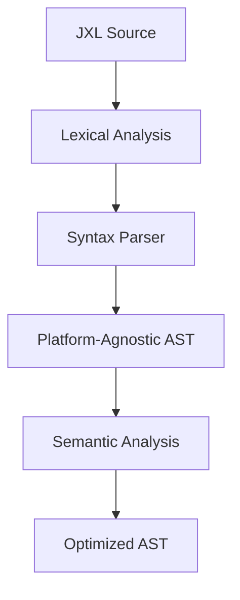

# JXL (Jepsh eXtensible Language) - Language Specification

## Document Status

- **Target Audience**: Framework Development Team
- **Version**: Draft v1.0
- **Last Updated**: July 2025
- **Implementation Status**:
  - 🚧 **Planned**: Specification defined, not implemented
  - ⚡ **In Development**: Currently being built
  - ✅ **Implemented**: Available in current parser

---

## 1. Language Overview

JXL is a domain-specific language designed as a strict subset intersection of TypeScript, Kotlin, and Swift. It compiles to each target platform's native language while maintaining semantic consistency across all platforms.

### 1.1 Design Goals

- **Write Once, Run Everywhere**: Single codebase for Web, Android, iOS
- **Zero-Cost Abstractions**: Compile-time optimizations with no runtime overhead
- **Type Safety**: Strong static typing with compile-time verification
- **Performance by Default**: Built-in performance optimizations

### 1.2 Language Philosophy

JXL adopts the **most restrictive common subset** approach - if a feature isn't available or performant on all three target platforms, it's excluded from the language.

---

## 2. Syntax Foundation

### 2.1 Basic Syntax Rules ⚡

JXL uses a C-family syntax that maps cleanly to all target languages:

```jxl
// Comments: C-style single and multi-line
/* Multi-line comment */

// Variable declarations (immutable by default)
let name: String = "Jepsh"
var count: Int = 0  // Mutable when needed

// Function declarations
func greet(name: String): String {
    return "Hello, \(name)!"
}

// Type annotations are mandatory for public APIs
public func calculate(x: Int, y: Int): Int {
    return x + y
}
```

**Compilation Targets**:

```typescript
// TypeScript output
const name: string = 'Jepsh';
let count: number = 0;

function greet(name: string): string {
  return `Hello, ${name}!`;
}
```

```kotlin
// Kotlin output
val name: String = "Jepsh"
var count: Int = 0

fun greet(name: String): String {
    return "Hello, $name!"
}
```

```swift
// Swift output
let name: String = "Jepsh"
var count: Int = 0

func greet(name: String) -> String {
    return "Hello, \(name)!"
}
```

### 2.2 Type System ⚡

JXL employs a nominal type system with structural compatibility for interfaces.

**Primitive Types**:

```jxl
// Numeric types (platform-native sizes)
let smallInt: Int8 = 127
let normalInt: Int = 42
let bigInt: Int64 = 9223372036854775807
let decimal: Float = 3.14
let precise: Double = 3.141592653589793

// Text and boolean
let text: String = "Hello"
let flag: Bool = true

// Collections (immutable by default)
let numbers: Array<Int> = [1, 2, 3]
let mapping: Map<String, Int> = ["a": 1, "b": 2]
```

**Custom Types**:

```jxl
// Structs (value types)
struct Point {
    let x: Double
    let y: Double

    func distance(): Double {
        return sqrt(x * x + y * y)
    }
}

// Classes (reference types, limited inheritance)
class Counter {
    var value: Int = 0

    func increment() {
        value += 1
    }
}

// Interfaces (structural typing)
interface Drawable {
    func draw(): Void
}
```

### 2.3 Optionals and Null Safety ⚡

JXL uses a unified optional syntax compatible with all platforms:

```jxl
// Optional declaration
var user: User? = nil

// Optional binding
if let actualUser = user {
    print(actualUser.name)
}

// Null coalescing
let name = user?.name ?? "Unknown"

// Force unwrapping (compile-time warnings)
let forcedName = user!.name  // Warning: potential runtime crash
```

---

## 3. Reactive Primitives

### 3.1 Atom System ⚡

The core reactive primitive in JXL is the `atom`:

```jxl
// Basic atom declaration
atom counter: Int = 0
atom user: User? = nil
atom theme: Theme = .system

// Computed atoms (derived state)
atom computed fullName: String {
    return "\(firstName) \(lastName)"
}

// Atom with custom setter
atom temperature: Double = 20.0 {
    didSet {
        if temperature > 40 {
            print("Warning: High temperature!")
        }
    }
}
```

**Compilation Strategy**:

- **Web**: Compiles to reactive primitives using Proxy-based observation
- **Android**: Uses Kotlin StateFlow with structural sharing
- **iOS**: Leverages SwiftUI's @State and @ObservableObject

### 3.2 Signals and Effects 🚧

```jxl
// Signal for imperative updates
signal refreshData: Void

// Effect for side effects
effect {
    // Runs when dependent atoms change
    if user != nil {
        analytics.track("user_active")
    }
}

// Cleanup effect
effect onCleanup {
    websocket.disconnect()
}
```

### 3.3 Reactivity Rules ⚡

**Automatic Dependency Tracking**:

```jxl
atom firstName: String = "John"
atom lastName: String = "Doe"

// Automatically depends on firstName and lastName
atom computed displayName: String {
    return "\(firstName) \(lastName)"
}

view UserCard {
    render {
        // View automatically re-renders when displayName changes
        Text(displayName)
    }
}
```

**Performance Optimizations**:

- **Batched Updates**: Multiple atom changes in single frame are batched
- **Structural Sharing**: Immutable updates with minimal memory allocation
- **Dead Dependency Elimination**: Unused reactive chains are pruned at compile time

---

## 4. Component System

### 4.1 View Declaration ⚡

JXL components are declared using the `view` keyword:

```jxl
view Button {
    // Properties (immutable inputs)
    let title: String
    let action: () -> Void

    // Local state
    atom isPressed: Bool = false

    // Lifecycle hooks
    onMount {
        print("Button mounted")
    }

    onUnmount {
        print("Button unmounted")
    }

    // Render method
    render {
        Pressable(
            onPress: action,
            onPressIn: { isPressed = true },
            onPressOut: { isPressed = false }
        ) {
            Text(title)
                .style(isPressed ? .pressed : .normal)
        }
    }
}
```

### 4.2 Component Composition ⚡

```jxl
view UserProfile {
    let user: User

    atom showDetails: Bool = false

    render {
        VStack(spacing: 16) {
            Avatar(user: user, size: .large)

            Text(user.name)
                .font(.headline)

            Button("Show Details") {
                showDetails.toggle()
            }

            if showDetails {
                UserDetails(user: user)
            }
        }
        .padding(20)
    }
}
```

### 4.3 Layout System ⚡

JXL provides a unified layout system based on Flexbox:

```jxl
view LayoutExample {
    render {
        // Vertical stack (flex-direction: column)
        VStack(alignment: .leading, spacing: 8) {
            Text("Header")

            // Horizontal stack (flex-direction: row)
            HStack(spacing: 12) {
                Image("icon")
                    .size(24, 24)

                Text("Content")
                    .flex(1)  // flex-grow: 1

                Button("Action") { }
            }

            Spacer()  // flex-grow: 1
        }
        .padding(.horizontal, 16)
        .padding(.vertical, 8)
    }
}
```

---

## 5. Platform Integration

### 5.1 Native Bridge Interface 🚧

JXL provides controlled access to platform-specific APIs:

```jxl
// Platform-specific implementations
#if web
import { Camera } from "web-camera-api"
#elseif android
import android.hardware.Camera2
#elseif ios
import AVFoundation
#endif

class CameraManager {
    #if web
    private var camera: Camera?
    #elseif android
    private var camera: CameraManager?
    #elseif ios
    private var camera: AVCaptureSession?
    #endif

    func startCamera() {
        #if web
        camera = Camera.requestPermission()
        #elseif android
        camera = CameraManager.getInstance()
        #elseif ios
        camera = AVCaptureSession()
        camera?.startRunning()
        #endif
    }
}
```

### 5.2 Design Token Integration ⚡

```jxl
// Design tokens are first-class citizens
view ThemedButton {
    let title: String

    render {
        Button(title) { }
            .backgroundColor(Color.token(.primary))
            .foregroundColor(Color.token(.onPrimary))
            .cornerRadius(Radius.token(.button))
            .padding(Spacing.token(.buttonPadding))
    }
}

// Token definitions (external YAML/JSON)
// color.primary: '#3B82F6'
// radius.button: 8
// spacing.buttonPadding: '12px 24px'
```

---

## 6. Memory Management

### 6.1 Automatic Memory Management ⚡

JXL uses platform-appropriate memory management:

```jxl
view DataLoader {
    atom data: Array<Item> = []
    atom isLoading: Bool = false

    onMount {
        loadData()
    }

    // Automatic cleanup when view unmounts
    onUnmount {
        cancelRequests()  // Automatically generated cleanup
    }

    render {
        if isLoading {
            LoadingSpinner()
        } else {
            ItemList(items: data)  // Automatic reference management
        }
    }
}
```

**Platform-Specific Behavior**:

- **Web**: Automatic WeakMap-based cleanup for DOM references
- **Android**: Automatic lifecycle-aware cleanup with Kotlin coroutines
- **iOS**: ARC-compatible reference management

### 6.2 Resource Management 🚧

```jxl
// Resource management with automatic disposal
class ImageCache {
    private var cache: Map<String, Image> = [:]

    func getImage(url: String): Image? {
        return cache[url] ?? loadImage(url)
    }

    // Compiler generates appropriate cleanup
    deinit {
        cache.clear()
    }
}

// Disposable resources
atom disposable imageLoader: ImageLoader = ImageLoader() {
    onDispose { loader in
        loader.cancelAllRequests()
    }
}
```

---

## 7. Performance Optimizations

### 7.1 Compile-Time Optimizations ⚡

**Dead Code Elimination**:

```jxl
// Only used components are included in final bundle
view UnusedComponent { ... }  // Eliminated at compile time

view UsedComponent {
    render {
        Text("Hello")  // Only this path is compiled
    }
}
```

**Static Layout Pre-computation**:

```jxl
view StaticLayout {
    render {
        // Layout calculated at compile time
        VStack(spacing: 16) {  // spacing: 16 -> precomputed offsets
            Text("Header")
            Text("Content")
        }
    }
}
```

### 7.2 Runtime Optimizations ⚡

**Lazy Evaluation**:

```jxl
atom computed expensiveCalculation: Double {
    // Only computed when accessed
    return heavyMathOperation()
}

view ConditionalRender {
    atom showExpensive: Bool = false

    render {
        VStack {
            Button("Toggle") {
                showExpensive.toggle()
            }

            // Only rendered when showExpensive is true
            if showExpensive {
                ExpensiveComponent()
            }
        }
    }
}
```

**Structural Sharing**:

```jxl
atom items: Array<Item> = []

func addItem(item: Item) {
    // Structural sharing - only new item allocated
    items = items + [item]  // O(1) operation, not O(n)
}
```

---

## 8. Error Handling

### 8.1 Result Types 🚧

```jxl
// Unified error handling across platforms
enum Result<T, E> {
    case success(T)
    case failure(E)
}

func fetchUser(id: String): Result<User, NetworkError> {
    // Platform-specific implementation
    switch networkRequest(id) {
    case .success(let userData):
        return .success(User(userData))
    case .failure(let error):
        return .failure(.networkUnavailable)
    }
}

// Usage with pattern matching
view UserLoader {
    let userId: String
    atom userResult: Result<User, NetworkError>? = nil

    render {
        switch userResult {
        case .success(let user):
            UserView(user: user)
        case .failure(let error):
            ErrorView(error: error)
        case nil:
            LoadingView()
        }
    }
}
```

### 8.2 Error Boundaries 🚧

```jxl
view ErrorBoundary {
    let content: () -> View
    atom error: Error? = nil

    render {
        if let currentError = error {
            ErrorView(error: currentError) {
                // Reset error state
                error = nil
            }
        } else {
            content()
        }
    }

    // Automatic error catching
    onError { thrownError in
        error = thrownError
    }
}
```

---

## 9. Standard Library

### 9.1 Core Collections ⚡

```jxl
// Immutable by default, with efficient updates
let numbers: Array<Int> = [1, 2, 3]
let moreNumbers = numbers.append(4)  // O(1) structural sharing

let mapping: Map<String, Int> = ["a": 1, "b": 2]
let updatedMapping = mapping.set("c", 3)  // O(log n) persistent data structure

let uniqueItems: Set<String> = ["apple", "banana", "apple"]  // ["apple", "banana"]
```

### 9.2 Async Operations 🚧

```jxl
// Unified async/await syntax
async func fetchData(): Array<Item> {
    let response = await networkRequest("/api/items")
    return response.data
}

// Atom integration with async
atom async items: Array<Item> = await fetchData()

view AsyncDataView {
    render {
        AsyncContent(items) { loadedItems in
            ItemList(items: loadedItems)
        } placeholder: {
            LoadingSpinner()
        } error: { error in
            ErrorMessage(error: error)
        }
    }
}
```

---

## 10. Tooling Integration

### 10.1 IDE Features 🚧

**Syntax Highlighting and IntelliSense**:

- Full semantic highlighting for JXL syntax
- Auto-completion for atoms, views, and platform APIs
- Real-time error checking and type validation

**Refactoring Support**:

- Rename symbols across all platforms
- Extract components and functions
- Convert between mutable and immutable patterns

### 10.2 Debug Support ⚡

**Breakpoint Support**:

```jxl
view DebuggableComponent {
    atom counter: Int = 0

    render {
        Button("Increment") {
            debugger  // Breakpoint in all target platforms
            counter += 1
        }
    }
}
```

**Hot Reload Integration**:

- Live editing of component render methods
- Atom value persistence across reloads
- Automatic error recovery and state restoration

---

## 11. Compilation Process

### 11.1 AST Generation ⚡



### 11.2 Platform Code Generation 🚧

**TypeScript Generation**:

```jxl
// JXL Input
atom counter: Int = 0
view Button {
    render {
        Pressable { Text("\(counter)") }
    }
}
```

```typescript
// Generated TypeScript
const counter = reactive(0);
const Button = () => {
  return h(Pressable, {}, [h(Text, { children: counter.value.toString() })]);
};
```

**Kotlin Generation**:

```kotlin
// Generated Kotlin
val counter = mutableStateOf(0)
@Composable
fun Button() {
    Pressable {
        Text(counter.value.toString())
    }
}
```

**Swift Generation**:

```swift
// Generated Swift
@State var counter: Int = 0
var body: some View {
    Button(counter.description) { }
}
```

---

## 12. Language Extensions

### 12.1 Custom Operators 🚧

```jxl
// Define custom operators for domain-specific logic
infix operator ~>  // Pipeline operator

func ~><T, U>(lhs: T, rhs: (T) -> U) -> U {
    return rhs(lhs)
}

// Usage
let result = data
    ~> processStep1
    ~> processStep2
    ~> finalizeResult
```

### 12.2 Macros and Code Generation 🚧

```jxl
// Compile-time macros for code generation
@GenerateEquatable
struct User {
    let id: String
    let name: String
    let email: String
}

// Generates equals() and hashCode() methods automatically
```

---

## 13. Future Language Features

### 13.1 Pattern Matching 🚧

```jxl
// Advanced pattern matching
func processResult(result: Result<User, Error>) {
    match result {
    case .success(let user) where user.isVerified:
        welcomeVerifiedUser(user)
    case .success(let user):
        requestVerification(user)
    case .failure(.networkError):
        showNetworkError()
    case .failure(let error):
        showGenericError(error)
    }
}
```

### 13.2 Generics and Associated Types 🚧

```jxl
// Generic types with constraints
struct Stack<T: Equatable> {
    private var items: Array<T> = []

    mutating func push(item: T) {
        items.append(item)
    }

    mutating func pop() -> T? {
        return items.removeLast()
    }
}

// Associated types for protocols
protocol Collection {
    associatedtype Element
    func count() -> Int
    func element(at: Int) -> Element?
}
```

---

This specification provides the foundation for implementing the JXL language compiler and runtime system. The next document will detail the Render Kernel Architecture that processes JXL components into platform-native UI elements.
